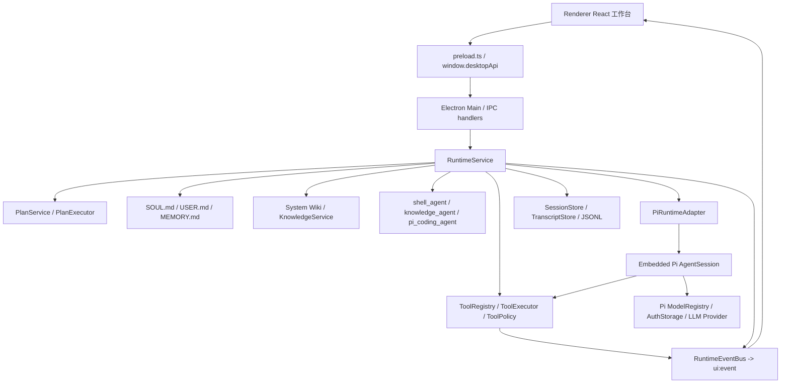
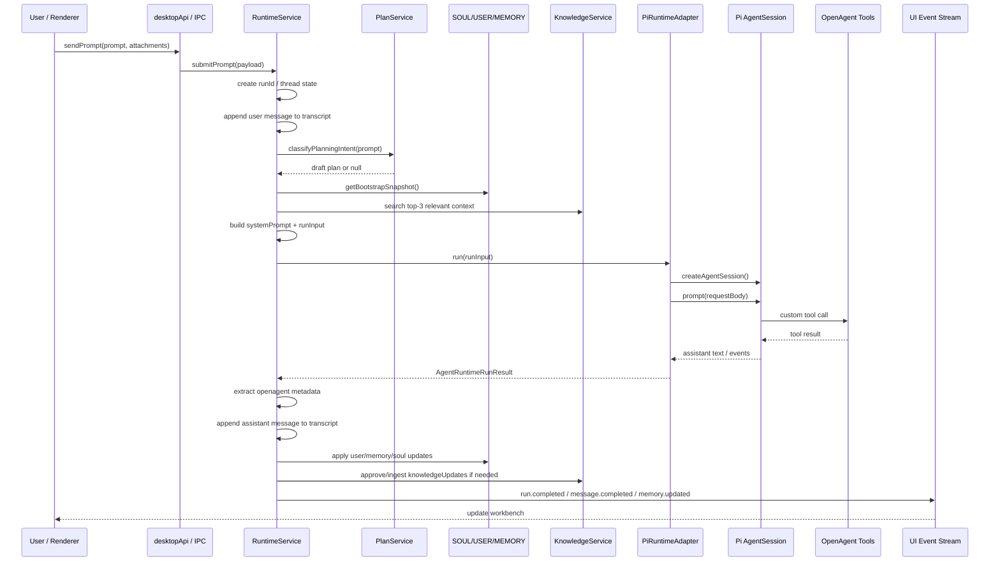

# OpenAgent 当前系统架构与 OpenClaw 对比

> 本文用于沉淀 OpenAgent 当前架构认知，并给后续 runtime、Pi 集成、工具、审批、记忆、知识库、插件系统开发提供统一入口。
>
> 当前判断基于本仓库代码、`agents.md`、`docs/pi.md`、`docs/subagents.md`、`docs/plan-mode.md`、`docs/knowledge.md`、`docs/memory.md` 以及 OpenClaw 官方 Pi Integration Architecture 文档。

## 1. 一句话结论

OpenAgent 当前架构可以概括为：

```text
Electron + React Desktop Workbench
  -> Electron IPC / desktopApi
  -> OpenAgent RuntimeService 编排层
  -> Plan / Memory / Knowledge / Tool / Approval / Session 子系统
  -> Embedded Pi AgentSession 执行层
  -> OpenAgent-controlled tools
  -> UI event stream 回写工作台
```

OpenAgent 和 OpenClaw 在 Pi 集成方向上是一致的：**都不应该把 Pi 当 CLI 子进程包壳，而是通过 `createAgentSession()` 嵌入 Pi AgentSession**。

两者的核心区别是：

- OpenClaw 是 **message gateway / 多渠道 agent 平台**，围绕 Discord、Slack、Telegram、WhatsApp、CLI/TUI、插件 action、远端消息回复和多账户 failover 展开。
- OpenAgent 是 **本地桌面 Agent 工作台**，围绕 Electron UI、foreground chat、Plan Mode、审批面板、System Wiki、长期上下文和本地 workspace 操作展开。

## 2. OpenAgent 当前总体架构



## 3. 层级职责

### 3.1 Renderer UI 层

主要目录：

- `apps/desktop/src/renderer/App.tsx`
- `apps/desktop/src/renderer/hooks/use-ui-event-stream.ts`
- `apps/desktop/src/renderer/components/`

职责：

- 展示桌面工作台 UI：会话、消息、计划、任务、审批、上下文、记忆、日志、设置等。
- 通过 `window.desktopApi` 调用 main 进程能力。
- 通过 `ui:event` 接收 runtime 状态变化。
- 不直接 import Electron main 内部模块。
- 不直接依赖 Pi SDK 类型。

### 3.2 Electron IPC 层

主要文件：

- `apps/desktop/src/main/preload.ts`
- `apps/desktop/src/main/main.ts`

职责：

- `preload.ts` 暴露 `window.desktopApi`。
- `main.ts` 注册 IPC handler。
- main 进程持有 `RuntimeService`、`ScheduledTaskService`、模型配置等长期对象。
- IPC handler 保持薄层，复杂逻辑下沉到 runtime service。

当前 agent 管理边界：

- 第一版 runtime 仍是单主智能体模型，`activeAgentId` 固定为 `main`。
- `agents:list` 只返回内置 `main` agent。
- 在真正实现多 agent runtime 切换前，`agents:create` 不得返回假成功；`agents:set-active` 只能接受当前 `main`，其他 agentId 必须明确返回未实现错误。
- 后续如果实现多 agent，需要重新实例化或路由 `RuntimeService`、`SessionStore`、`SoulManager`、`SkillService`、workspaceRoot 和 scheduled task agentId，而不是只修改 renderer 状态。

典型入口：

```text
Renderer submitPrompt()
  -> desktopApi.sendPrompt()
  -> ipcRenderer.invoke('prompt:send')
  -> ipcMain.handle('prompt:send')
  -> runtimeService.submitPrompt()
```

### 3.3 Runtime 编排层

核心文件：

- `apps/desktop/src/main/runtime/runtime-service.ts`
- `apps/desktop/src/main/runtime/runtime-types.ts`
- `apps/desktop/src/main/runtime/context-builder.ts`
- `apps/desktop/src/main/runtime/run-state.ts`
- `apps/desktop/src/main/runtime/event-bus.ts`

职责：

1. 接收 prompt 和附件。
2. 创建 run/thread 状态。
3. 写入用户消息到 OpenAgent transcript。
4. 判断是否进入 Agent Plan Mode。
5. 构建本轮 system prompt 和上下文。
6. 注入 SOUL / USER / MEMORY / System Wiki / Plan / Tools。
7. 调用 `AgentRuntimeAdapter`，当前默认实现是 `PiRuntimeAdapter`。
8. 接收 assistant 结果。
9. 清理隐藏 metadata。
10. 写回 transcript。
11. 处理 SOUL / USER / MEMORY / Knowledge 更新。
12. 通过 `RuntimeEventBus` 向 UI 推送状态。

定位：

> `RuntimeService` 是 OpenAgent 自己的 agent runtime 编排中心；Pi 只是下层可替换执行引擎。

### 3.4 Pi Runtime Adapter 层

核心文件：

- `packages/pi-adapter/src/pi-runtime-adapter.ts`
- `packages/pi-adapter/src/pi-model-registry.ts`
- `packages/pi-adapter/src/pi-tools.ts`
- `packages/pi-adapter/src/pi-errors.ts`

职责：

- 基于 OpenAgent 的 `AgentRuntimeAdapter` 契约适配 Pi。
- 使用 `@mariozechner/pi-coding-agent` 的 `createAgentSession()` 创建 AgentSession。
- 使用 Pi 的 `SessionManager`、`SettingsManager`、`DefaultResourceLoader`。
- 使用 Pi 的 `ModelRegistry` / `AuthStorage` 解析模型和认证。
- 将 OpenAgent tools 转成 Pi custom tools。
- 订阅 Pi session event，转成 OpenAgent log / UI event。
- 将最终 request body 和 raw response 记录到日志，便于审计。

重要边界：

- 不让 renderer 看到 Pi SDK 类型。
- 不让 Pi 默认工具绕过 OpenAgent 的审批、sandbox、日志和 UI 状态。
- Pi 内部 session 与 OpenAgent 可见 transcript 分离。

### 3.5 Tool / Policy / Approval 层

核心文件：

- `apps/desktop/src/main/runtime/tool-registry.ts`
- `apps/desktop/src/main/runtime/tool-executor.ts`
- `apps/desktop/src/main/runtime/tool-policy.ts`
- `apps/desktop/src/main/runtime/path-policy.ts`
- `apps/desktop/src/main/runtime/approval-service.ts`

默认工具包括：

- `ls`
- `read`
- `find`
- `grep`
- `count_files`
- `write_file`
- `shell_exec`
- `current_time`
- legacy `list_directory` / `read_file`
- knowledge tools
- subagent tools

执行链路：

```text
Pi tool call
  -> Pi ToolDefinition
  -> ToolExecutor
  -> ToolPolicy / PathPolicy
  -> ApprovalService if needed
  -> RuntimeTool.execute()
  -> Runtime log / UI event
```

原则：

- 所有 tool 必须支持 `AbortSignal`。
- shell、git、外部路径、破坏性操作必须经过 policy / approval。
- tool start/update/end/fail 必须可进入 UI event stream。
- 不允许知识库 tool 或 Pi 默认 tool 绕过 OpenAgent policy。

### 3.6 Agent Plan Mode 层

核心文件：

- `apps/desktop/src/main/runtime/planning/plan-service.ts`
- `apps/desktop/src/main/runtime/planning/plan-executor.ts`
- `apps/desktop/src/main/runtime/planning/plan-store.ts`
- `docs/plan-mode.md`

职责：

- 判断当前 prompt 是否需要 plan。
- 生成 draft plan。
- 对高风险或复杂任务请求用户审批。
- 将 active plan 注入 system prompt。
- 执行中维护 step 状态。
- 向 UI 推送 plan created / updated / approval required / completed / failed。

边界：

- 简单任务只展示 runtime progress。
- 复杂任务进入 Agent Plan Mode。
- Plan 是 OpenAgent runtime 的结构化状态，不是纯 prompt 文本。

### 3.7 Subagents 层

核心目录：

- `apps/desktop/src/main/runtime/subagents/`
- `docs/subagents.md`

当前规划/实现方向：

| 子 agent | 职责 | 边界 |
| --- | --- | --- |
| `shell_agent` | 只读、确定性文件搜索/统计 fast path | 不写代码、不运行复杂脚本、不安装依赖 |
| `knowledge_agent` | 知识检索、知识整理、System Wiki 查询 | 不绕过 KnowledgeProvider / ToolRegistry |
| `pi_coding_agent` | 编码、修复、复杂产物生成、执行型任务 | 内部可使用 Pi child session，但必须走 OpenAgent tools/policy/approval/logs/UI event |

### 3.8 长期上下文层

核心文件：

- `apps/desktop/src/main/runtime/memory/soul-manager.ts`
- `docs/memory.md`

本地布局：

```text
~/.openagent/agents/<agentId>/
├── SOUL.md
├── USER.md
├── MEMORY.md
└── history/
```

三者定位：

| 文件 | 定位 | 示例 |
| --- | --- | --- |
| `SOUL.md` | Agent 自身身份、角色、长期行为规则 | 名字、角色、安全边界、工具策略 |
| `USER.md` | 用户长期画像和协作偏好 | 沟通风格、Git 偏好、开发习惯 |
| `MEMORY.md` | 任务/项目经验 | 关键路径、已验证命令、历史根因、架构决策 |

运行机制：

- prompt 前注入 SOUL 和 USER。
- MEMORY 做任务相关筛选后注入，避免全量膨胀。
- LLM 返回隐藏 metadata。
- `SoulManager` 解析并应用 SOUL / USER / MEMORY 更新。
- SOUL 更偏强规则，更新更谨慎；USER/MEMORY 偏保守自动写回。

### 3.9 Knowledge / System Wiki 层

核心文件：

- `apps/desktop/src/main/runtime/knowledge/knowledge-service.ts`
- `apps/desktop/src/main/runtime/knowledge/knowledge-tools.ts`
- `apps/desktop/src/main/runtime/knowledge/providers/system-knowledge-provider.ts`
- `docs/knowledge.md`

当前结论：

> OpenAgent 当前只保留 System Wiki 作为系统公共知识库，不再保留 gbrain 等多后端复杂设计。

本地布局：

```text
~/.openagent/system/wiki/
├── raw/
├── wiki/
└── graph/
```

运行模式：

| 类型 | 行为 |
| --- | --- |
| 手动操作 | Settings / Knowledge 中 status、query、text ingest、file ingest、lint、graph build、browse |
| 自动检索 | prompt 前按当前任务取 top-3 相关知识注入上下文 |
| 审批写入 | LLM 返回 `knowledgeUpdates` 后，经用户审批再 ingest |

### 3.10 Session / Transcript / Log 层

核心文件：

- `apps/desktop/src/main/runtime/session-store.ts`
- `apps/desktop/src/main/runtime/transcript-store.ts`
- `apps/desktop/src/main/runtime/runtime-info-logger.ts`

当前边界：

```text
OpenAgent 可见 transcript:
~/.openagent/agents/<agentId>/sessions/<threadId>.jsonl

Pi 内部 session:
~/.openagent/agents/<agentId>/sessions/pi/<threadId>.jsonl

运行日志:
~/.openagent/logs/runtime-info.log
~/.openagent/logs/llm-response.log
```

设计原因：

- OpenAgent transcript 保持 UI 可复放、可读、语义干净。
- Pi session 保留内部 turn/tool/request 细节。
- `llm-response.log` 用于审计最终发给 LLM 的 request body 和 raw response。

### 3.11 Model / Provider 层

核心文件：

- `packages/pi-adapter/src/pi-model-registry.ts`

职责：

- 复用 Pi `ModelRegistry` / `AuthStorage`。
- 支持内置 provider 和自定义 OpenAI-compatible provider。
- 通过 `llm:set-active` 修改当前 runtime active provider/model。
- 模型选择不能只是 UI 状态，必须写入 runtime 配置并影响下一轮 run。

### 3.12 Scheduled Tasks 层

核心文件：

- `apps/desktop/src/main/runtime/scheduled-task-service.ts`
- `apps/desktop/src/main/main.ts`

职责：

- 管理本地定时任务。
- 到点后创建或复用 thread。
- 调用 `RuntimeService.submitPrompt()`。
- 向 UI 推送 `scheduled-task.updated`。

当前已知边界：

- 当前行为仍偏 transcript-first，定时任务 prompt 会作为普通用户消息进入会话。
- 后续更理想的 UX 是：前台显示任务名、摘要和结果；原始 trigger payload 放后台审计日志。

## 4. Prompt / Run 主流程



## 5. 与 OpenClaw 的架构相同点

OpenAgent 和 OpenClaw 的核心方向一致：

1. **都采用 Embedded Pi，而不是 Pi CLI 包壳**
   - 都通过 `createAgentSession()` 创建 Pi AgentSession。
   - 都希望应用自己控制 session lifecycle、event handling、tool injection 和 prompt customization。

2. **都把工具执行收回到宿主系统**
   - OpenClaw 将 messaging、sandbox、channel action 等工具注入 Pi。
   - OpenAgent 将 file、shell、knowledge、subagent、current_time 等工具注入 Pi。
   - 共同原则是：Pi 负责 agent loop，宿主负责工具边界和策略。

3. **都需要自定义 system prompt**
   - OpenClaw 按 channel/context 构建 system prompt。
   - OpenAgent 按 workspace、SOUL、USER、MEMORY、System Wiki、Plan Mode 构建 system prompt。

4. **都依赖 Pi 的模型和 session 能力**
   - 都使用 Pi 相关包提供的 AgentSession、SessionManager、ModelRegistry、AuthStorage 等能力。

5. **都追求可观测性**
   - OpenClaw 将 Pi event 转为 messaging/gateway callbacks。
   - OpenAgent 将 Pi event 转为 `ui:event`、runtime log、terminal delta、plan/tool/approval UI 状态。

## 6. 与 OpenClaw 的主要区别

| 维度 | OpenAgent | OpenClaw |
| --- | --- | --- |
| 产品定位 | 本地桌面 Agent 工作台 | 多渠道 message gateway / agent 平台 |
| 主要入口 | Electron Renderer foreground chat | Discord/Slack/Telegram/WhatsApp/CLI/TUI/API 等 channel |
| UI 形态 | React 桌面工作台，强调 Plan、审批、上下文、记忆、日志可视化 | 消息渠道回复、block reply、partial reply、TUI、本地/远端 gateway |
| Runtime 中心 | `RuntimeService` | `runEmbeddedPiAgent()` / pi embedded runner / gateway pipeline |
| Session 语义 | thread/chat 为中心 | channel session key / user/group/channel 为中心 |
| Prompt 上下文 | SOUL / USER / MEMORY / System Wiki / Plan Mode / workspace | channel context / messaging metadata / skills / docs / sandbox / reply tags / runtime metadata |
| Tool 体系 | OpenAgent ToolRegistry + ToolExecutor + ToolPolicy | OpenClaw coding tools + messaging/browser/canvas/cron/gateway/channel tools + policy filtering |
| 审批模型 | 桌面 UI approval panel，外部路径/计划/知识写入审批 | 更偏 sandbox/profile/channel policy 和 gateway 操作约束 |
| 知识体系 | System Wiki only，top-3 自动注入，写入审批 | 更偏 docs/skills/context files/channel memory 等 prompt 构建能力 |
| 长期记忆 | 明确拆为 SOUL / USER / MEMORY | 有 SOUL/USER 模板与 memory config，但核心平台更偏多渠道 agent memory/context 管理 |
| Plan Mode | OpenAgent 内建结构化 Agent Plan Mode | OpenClaw 文档重点不在桌面 Plan UI，而在 embedded run pipeline 和 channel delivery |
| 定时/自动化 | 本地 scheduled task -> thread/run | cron/gateway/channel 工具与平台任务能力更丰富 |
| 多账户 failover | 当前较轻，主要复用 Pi provider/model/auth | OpenClaw 有 auth profile rotation、cooldown、failover 体系 |
| Compaction / pruning | 已接入基础能力：OpenAgent transcript 注入裁剪、Pi internal session compaction runtime/API 入口；自动阈值和 UI 入口待完善 | OpenClaw 有更成熟的 compaction safeguard、cache TTL context pruning、history limiting |
| Provider quirks | 当前较少，主要通过 Pi ModelRegistry/AuthStorage | OpenClaw 有 Anthropic/Gemini/OpenAI 等 provider-specific handling |
| 插件系统 | `docs/plugins.md` 已设计，当前实现仍较轻 | 已有 channel plugins、action runtime、tools/plugins 更平台化 |

## 7. 更具体的差异分析

### 7.1 OpenAgent 是 Workbench-first，OpenClaw 是 Gateway-first

OpenAgent 的核心对象是：

```text
用户当前桌面会话 -> thread -> run -> UI event -> 面板状态
```

OpenClaw 的核心对象更接近：

```text
外部消息渠道 -> gateway session -> embedded run -> channel reply / block reply
```

所以 OpenAgent 更重视：

- 前台会话连续性
- 计划审批
- 本地 workspace 操作
- 长期上下文文件
- UI 可观测性

OpenClaw 更重视：

- 多渠道消息接入
- channel-specific action
- 回复分块和 streaming delivery
- auth profile failover
- sandbox / provider / channel policy

### 7.2 OpenAgent 应借鉴 OpenClaw 的 Embedded Pi，但不应复制 OpenClaw 的 gateway 结构

可以借鉴：

- `createAgentSession()` 嵌入式集成方式。
- built-in tools 置空、全部走宿主 custom tools 的策略。
- session lifecycle / event subscription / compaction / context pruning 经验。
- provider-specific bug handling 和 failover 经验。
- tool schema normalization 和 abort wrapping。

不应直接复制：

- OpenClaw 的 channel gateway 结构。
- Discord/Slack/Telegram/WhatsApp action runtime 组织方式。
- block reply / silent reply / channel reaction 等 messaging-first prompt 规则。
- 多账户 rotation 的完整复杂度，除非 OpenAgent 后续真的需要多账户池。

### 7.3 OpenAgent 的核心护城河应是桌面可观测 runtime

OpenClaw 的复杂度主要服务于“agent 作为跨渠道消息网关”。

OpenAgent 的复杂度应该服务于“agent 在桌面工作台里可观察、可审批、可恢复、可治理”。因此 OpenAgent 更应该强化：

- Run / Plan / Tool / Approval / Memory / Knowledge 的统一事件模型。
- 所有执行路径都能在 UI 中解释。
- transcript 与 Pi internal session 分离。
- SOUL / USER / MEMORY / System Wiki 的治理边界。
- 本地文件、shell、外部路径、写入操作的审批体验。

### 7.4 OpenAgent 当前比 OpenClaw 更轻，但一些底层能力还不成熟

OpenAgent 当前优势：

- 桌面 UI 结构清晰。
- RuntimeService 编排边界已经建立。
- Plan Mode、Memory、System Wiki 的产品语义更明确。
- OpenAgent transcript 与 Pi internal session 已有分离意识。
- `llm-response.log` 能审计最终 request/response。

OpenAgent 当前短板：

- Pi event streaming 已有 turn/message delta 基础映射，但更细的 tool/compaction/context-overflow UI 语义仍可继续增强。
- compaction / context pruning 已有基础能力，但自动阈值触发、UI 操作入口和更完整的恢复验收仍待完善。
- provider failover / auth profile rotation 较轻。
- plugin/channel runtime 仍处于设计或 stub 阶段。
- tool schema normalization / provider quirks 还不够系统化。
- `pi_coding_agent` 子 agent 已有 child session、parent/child meta 和运行明细，但 UI 专门样式、child transcript 浏览入口仍待完善。

## 8. 推荐演进路线

### Phase 1：巩固 OpenAgent 自己的 runtime 主线

目标：不要被 OpenClaw 的 gateway 复杂度带偏。

重点：

- 保持 `RuntimeService -> AgentRuntimeAdapter -> PiRuntimeAdapter` 的边界。
- Renderer 不接触 Pi 类型。
- Tool 全部走 OpenAgent ToolRegistry / Policy / Approval。
- 持续完善 UI event 和 runtime log。

### Phase 2：补齐 Pi embedded 关键能力

优先借鉴 OpenClaw：

- 更完整的 Pi event subscription 映射。
- tool execution start/update/end/fail 映射。
- auto-compaction start/end 映射。
- context overflow 分类。
- tool schema normalization。
- abort signal wrapping。

### Phase 3：完善 session / compaction / context pruning

重点：

- 保持 OpenAgent transcript 与 Pi internal session 分离。
- 已有 thread-level Pi session compaction runtime/API 入口；后续补自动阈值和 UI 入口。
- 增加 System Wiki / MEMORY 的按需检索，而不是 prompt 膨胀。
- 借鉴 OpenClaw cache-TTL pruning，但按桌面 thread 语义重做。

### Phase 4：推进子 agent 分层

重点：

- `shell_agent`：只读 fast path。
- `knowledge_agent`：System Wiki 和知识整理。
- `pi_coding_agent`：执行型任务，已携带 child session 和 parent/child 关联元数据，后续继续增强 UI 呈现。

### Phase 5：插件系统再平台化

当 OpenAgent 需要飞书/Slack/企业微信等入口时，再借鉴 OpenClaw channel plugin 体系。

当前不要过早把 OpenAgent 改成 OpenClaw 式 gateway 平台，否则会稀释桌面工作台主线。

## 9. 最终原则

1. OpenAgent 要学 OpenClaw 的 **Embedded Pi 技术路线**，不要复制它的 **Messaging Gateway 产品结构**。
2. OpenAgent 的 renderer 必须始终和 Pi SDK 解耦。
3. OpenAgent tools 必须始终经过 policy / approval / logs / UI event。
4. OpenAgent 的长期上下文应坚持 SOUL / USER / MEMORY / System Wiki 分层治理。
5. OpenAgent 的核心体验是本地桌面可观测 agent loop，不是多渠道消息机器人。
6. OpenClaw 的成熟能力应作为参考实现逐步吸收，尤其是 streaming、compaction、provider failover、tool schema normalization。

## 10. 参考资料

- OpenAgent 本仓库：`agents.md`
- OpenAgent 本仓库：`docs/pi.md`
- OpenAgent 本仓库：`docs/subagents.md`
- OpenAgent 本仓库：`docs/plan-mode.md`
- OpenAgent 本仓库：`docs/knowledge.md`
- OpenAgent 本仓库：`docs/memory.md`
- OpenClaw 官方文档：[Pi Integration Architecture](https://docs.openclaw.ai/pi)
