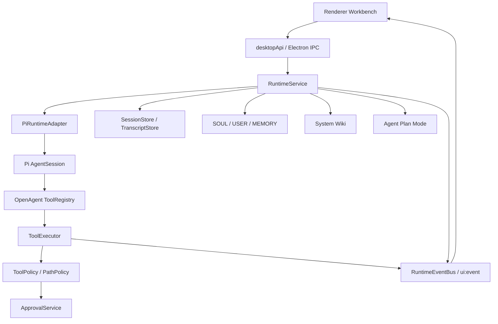

# OpenAgent Embedded Pi 技术路线修改计划

> 本文只记录后续修改计划，便于按阶段实施。当前文档不代表所有能力已经完成。
>
> 总原则：OpenAgent 应继续把 Pi 当作 **嵌入式 agent loop 引擎** 使用，而不是把 Pi CLI 当黑盒子进程调用。OpenAgent 自己负责 UI、runtime 编排、tool policy、审批、日志、长期上下文、知识库和 session 边界。

## 1. 当前判断

OpenAgent 当前已经走在 Embedded Pi 路线上。

已具备的关键基础：

- `RuntimeService` 已经作为 OpenAgent runtime 编排中心。
- `PiRuntimeAdapter` 已经直接调用 `createAgentSession()`。
- `createAgentSession()` 中已经使用：
  - `tools: []`
  - `customTools: toPiToolDefinitions(...)`
- Pi 默认工具没有直接暴露给模型。
- Pi tool call 已经回到 OpenAgent `ToolExecutor` 执行。
- `ToolExecutor` 已经接入 `ToolPolicy`、`ApprovalService`、runtime log 和 UI event。
- OpenAgent 可见 transcript 和 Pi internal session 已经有分离意识：
  - OpenAgent transcript：`~/.openagent/agents/<agentId>/sessions/<threadId>.jsonl`
  - Pi internal session：`~/.openagent/agents/<agentId>/sessions/pi/<threadId>.jsonl`
- `pi_coding_agent` 已经开始以 child Pi session 的方式运行。

因此后续重点不是“改成 Embedded Pi”，而是：

1. 让 Embedded Pi 主线更清晰。
2. 补齐 Pi event 到 OpenAgent UI event 的映射。
3. 强化 tool bridge / policy / approval。
4. 补齐 session、resume、compaction、context pruning。
5. 固化 `pi_coding_agent` 子 session 语义。

## 2. 目标架构



关键边界：

- Renderer 不直接感知 Pi。
- Main IPC 不承载复杂 runtime 逻辑。
- `RuntimeService` 负责编排 run。
- `PiRuntimeAdapter` 只负责把 OpenAgent run 转成 Pi AgentSession run。
- Pi 只负责 LLM loop 和 structured tool call。
- tool 的真实执行必须回到 OpenAgent。
- approval、sandbox、日志、UI event 都归 OpenAgent 管。

## 3. 修改阶段总览

| 阶段 | 名称 | 目标 |
| --- | --- | --- |
| M1 | 确认 Embedded Pi 主路径 | 明确 `PiRuntimeAdapter` 是默认主实现，清理 demo/placeholder 干扰 |
| M2 | 整理 Pi adapter 结构 | 把 session 创建、event 映射、prompt 构建拆清楚 |
| M3 | 补全 Pi event -> UI event | 让 turn、delta、tool、error、compaction 可观测 |
| M4 | 强化 tool bridge / policy | schema normalize、plan step 工具约束、审批收口 |
| M5 | 补 session / resume / compaction | 长会话可恢复、可压缩、上下文不过度膨胀 |
| M6 | 固化 `pi_coding_agent` child session | 子 agent 运行、事件、日志、工具权限可治理 |
| M7 | 清理文档与验收标准 | docs 与代码边界一致，形成后续开发入口 |

## 4. M1：确认 Embedded Pi 主路径

### 4.1 现状

当前默认 adapter 已经是 `PiRuntimeAdapter`，历史 demo runtime 已清理：

- `packages/pi-adapter/src/pi-session.ts` 中的 placeholder

### 4.2 修改目标

- 保留 `AgentRuntimeAdapter` 契约。
- 明确 `PiRuntimeAdapter` 是正式默认主实现。
- demo runtime 已从主线文档和默认认知中移除。
- 处理 `pi-session.ts` placeholder，避免看起来像 Pi session 仍未实现。

### 4.3 建议修改

1. `pi-session.ts` 改造成真实 session factory：
   - `createOpenAgentPiSession(input)`
   - 内部封装 `SettingsManager.create()`、`SessionManager.open()`、`DefaultResourceLoader`、`createAgentSession()`。
2. `PiRuntimeAdapter` 不再直接散落所有 session 创建细节，而是调用 `pi-session.ts`。

### 4.4 验收标准

- 新开发者能一眼看出主路径是：

```text
RuntimeService -> PiRuntimeAdapter -> createAgentSession()
```

- 仓库中不再出现“Pi session factory is not implemented yet”这类误导性错误。
- demo loop 不再被误认为后续主线。

## 5. M2：整理 Pi adapter 结构

### 5.1 现状

`PiRuntimeAdapter` 当前承担较多职责：

- model context 解析
- settings/session/resource loader 创建
- OpenAgent tools 转 Pi tools
- prompt body 构建
- session event subscription
- request/response log
- result normalize
- pseudo tool call failure detection

### 5.2 修改目标

把 adapter 拆成更清晰的内部模块，让每个文件职责单一。

### 5.3 建议结构

```text
packages/pi-adapter/src/
├── pi-runtime-adapter.ts   # run 主流程，负责串联
├── pi-session.ts           # createAgentSession / manager / loader
├── pi-events.ts            # Pi event -> OpenAgent event/log
├── pi-tools.ts             # RuntimeTool -> Pi ToolDefinition
├── pi-system-prompt.ts     # OpenAgent prompt wrapper / transcript context
├── pi-model.ts             # model/provider/auth context
├── pi-errors.ts            # error classification
└── pi-tool-schema.ts       # schema normalization，可后置
```

### 5.4 验收标准

- `pi-runtime-adapter.ts` 主要描述 run orchestration，不堆积所有细节。
- session 创建逻辑集中在 `pi-session.ts`。
- prompt wrapper 集中在 `pi-system-prompt.ts`。
- event mapping 集中在 `pi-events.ts`。

## 6. M3：补全 Pi event -> OpenAgent UI event

### 6.1 现状

当前 `PiRuntimeAdapter` 已经订阅 Pi session event，例如：

- `turn_start`
- `turn_end`
- `message_update`

但更多是写 runtime log，UI event 还不够完整。

### 6.2 修改目标

让 Pi 内部 agent loop 在 OpenAgent UI 中可观测。

### 6.3 建议事件映射

| Pi event | OpenAgent event | UI 展示 |
| --- | --- | --- |
| `turn_start` | `runtime.activity` | Thinking / 调用模型中 |
| text delta | `message.delta` 或现有 message streaming event | 助手消息流式输出 |
| tool call start | `tool.started` / `runtime.activity` | tool timeline 开始 |
| tool result | `tool.completed` / `tool.failed` | tool timeline 结果 |
| `turn_end` | `runtime.activity` completed | 当前 turn 完成 |
| abort | `run.cancelled` | 用户停止 |
| context overflow | `run.failed` + classified error | 上下文溢出提示 |
| compaction start/end | `runtime.activity` / `terminal.delta` | 压缩中/压缩完成 |

### 6.4 需要改的区域

- `packages/pi-adapter/src/pi-events.ts`
- `packages/pi-adapter/src/pi-runtime-adapter.ts`
- `apps/desktop/src/main/runtime/event-bus.ts`
- `packages/shared-types/src/events.ts`
- `apps/desktop/src/renderer/hooks/use-ui-event-stream.ts`
- `apps/desktop/src/renderer/components/panels/plan-panel.tsx`
- `apps/desktop/src/renderer/components/chat/tool-timeline.tsx`

### 6.5 验收标准

- 模型思考、工具调用、工具结果、最终消息在 UI 中能连续显示。
- `runtime-info.log` 和 UI 展示能互相对上。
- 用户停止 run 时，Pi session 和 UI 状态都正确结束。

## 7. M4：强化 tool bridge / policy

### 7.1 现状

当前工具执行已经回到 OpenAgent：

```text
Pi custom tool -> ToolExecutor -> ToolPolicy -> RuntimeTool.execute()
```

但还有几个后续增强点。

### 7.2 修改目标

- 不让 provider schema 差异破坏 tool call。
- Plan Mode 中 step 级 allowed tools 真正生效。
- shell/write/external path/destructive 操作全部可审批。
- 不依赖文本解析执行工具。

### 7.3 建议修改

#### 7.3.1 Tool schema normalize

新增：

```text
packages/pi-adapter/src/pi-tool-schema.ts
```

职责：

- 清理 provider 不支持的 JSON Schema 字段。
- 标准化 `required`、`additionalProperties`、`enum`、nested object。
- 控制 description 长度。
- 记录 schema normalize 前后差异到 debug log。

#### 7.3.2 Plan step allowed tools

当前 `ToolExecutor` 已有 `PlanExecutionContext`。后续应强化：

```text
如果 active plan step 只允许 read/grep，模型调用 shell_exec：
  -> ToolPolicy deny 或 requires_approval
```

#### 7.3.3 Pseudo tool call 处理

当前 `detectUnparsedToolCallText()` 是一种失败保护，不应成为执行路径。

保留原则：

- 可以检测并失败。
- 不要用正则解析文本并执行工具。
- 最终工具执行只能来自 structured tool call。

### 7.4 验收标准

- tool call 失败时能区分：schema 问题、provider 伪 tool call、policy deny、approval reject、tool runtime error。
- Plan Mode 的工具权限不是纯 prompt 提示，而是真能拦截。
- 所有 shell/write/external path 操作都能被 UI 审批流捕捉。

## 8. M5：补 session / resume / compaction / context pruning

### 8.1 现状

当前已经有：

- `SessionStore`
- `TranscriptStore`
- OpenAgent transcript 和 Pi internal session 分离
- request body / response body log

### 8.2 修改目标

让长会话能够可靠恢复、压缩、裁剪上下文。

### 8.3 建议修改

#### 8.3.1 Thread resume

- 选择历史 thread 后加载 OpenAgent transcript。
- 确保对应 Pi session file 存在或可重新创建。
- 验证最近历史会进入最终 LLM request body。

#### 8.3.2 Compaction

- 接入 Pi compaction 能力。
- compaction start/end 映射到 runtime activity。
- compaction 结果进入 Pi internal session，不污染 OpenAgent 可见 transcript。
- 失败时给出明确 classified error。

#### 8.3.3 Context pruning

构建 prompt 时避免无脑膨胀：

- OpenAgent transcript 只取最近 N 条。
- MEMORY 按任务相关性筛选。
- System Wiki 只取 top-k。
- 附件只注入必要摘要，二进制/图片走 attachment channel。

### 8.4 验收标准

- 同一 thread 中“继续/好的/就这样”能正确利用历史上下文。
- 长会话不会无限增长 prompt。
- compaction 可观测、可失败恢复。
- Pi internal session 和 OpenAgent transcript 边界清晰。

## 9. M6：固化 `pi_coding_agent` child session

### 9.1 现状

`pi_coding_agent` 已经通过 `PiRuntimeAdapter` 创建 child run。

当前方向正确：

```text
parent run
  -> tool call pi_coding_agent
  -> child PiRuntimeAdapter.run()
  -> child session file
  -> child tools
  -> result summary back to parent
```

### 9.2 修改目标

让 child Pi session 成为可治理、可观测、可恢复的系统子 agent。

### 9.3 建议修改

1. 子 session 文件路径规范化：

```text
~/.openagent/agents/<agentId>/sessions/subagents/pi-coding/<parentRunId>-<toolCallId>.jsonl
```

2. UI event 增加 parent/child 关联字段：

```ts
{
  parentRunId,
  parentToolCallId,
  childRunId,
  childSessionFile,
  subagentId: 'pi_coding_agent'
}
```

3. 子 agent tool allowlist 更严格：

- 默认允许 read/search/write/shell/current_time。
- 禁止递归调用 `pi_coding_agent`。
- 安装依赖、外部路径、破坏性操作必须审批。

4. 子 agent final summary 标准化：

- 修改了哪些文件。
- 执行了哪些命令。
- 验证结果是什么。
- 失败原因是什么。

### 9.4 验收标准

- UI 能看出某个 tool timeline 是 child agent 执行。
- child run 的日志能关联回 parent run。
- child agent 不能绕过 OpenAgent policy。
- child result 能给 parent agent 继续推理。

## 10. M7：文档、测试和验收

### 10.1 文档更新

后续改动完成后，应同步更新：

- `docs/architecture.md`
- `docs/pi.md`
- `docs/subagents.md`
- `docs/plan-mode.md`
- `docs/runtime-activity.md`
- `agents.md` 中的快速入口，如有目录职责变化

### 10.2 验收命令

每次修改至少运行：

```bash
pnpm typecheck
```

如果改动包含 Electron main、preload、Vite 配置、共享类型，优先再跑：

```bash
pnpm build
```

### 10.3 手动验收场景

建议准备以下场景逐项验证：

1. 普通聊天：模型正常回答，message 写入 transcript。
2. 读文件：模型调用 `read`，UI 显示 tool timeline。
3. 写文件：模型调用 `write_file`，根据 policy 触发审批或执行。
4. shell 命令：模型调用 `shell_exec`，审批和日志正确。
5. 当前时间：模型必须调用 `current_time`，不能猜。
6. Plan Mode：复杂任务生成 plan，审批后执行。
7. System Wiki：prompt 前自动检索 top-k，显式写入知识库需要审批。
8. 同 thread 继续：用户说“继续”能利用历史上下文。
9. 停止 run：abort 后 Pi session 和 UI 状态一致。
10. `pi_coding_agent`：child run 可见、可审计、不能绕过 policy。

## 11. 不做事项

在当前阶段不要做：

- 不要把 OpenClaw 的 gateway/channel 结构整体搬进 OpenAgent。
- 不要让 renderer 直接 import Pi SDK。
- 不要恢复 Pi 默认 shell/write/edit 工具绕过 OpenAgent。
- 不要用文本匹配解析工具调用并执行。
- 不要全量注入所有 skills/docs/memory/wiki。
- 不要为了多渠道场景提前引入过重的 plugin/channel runtime。

## 12. 优先级建议

如果只能先做一小段，建议顺序是：

1. **M1 + M2**：清理主线结构，让 Pi adapter 边界清楚。
2. **M3**：补 Pi event 到 UI event，提升可观测性。
3. **M4**：强化 tool policy，避免安全边界不稳。
4. **M5**：补 session/resume/compaction，解决长会话稳定性。
5. **M6**：固化 `pi_coding_agent`，再扩展复杂执行任务。


## 13. 当前开发进度记录

### 2026-05-13：M1/M2 第一轮落地

已完成：

- 将 Pi session 创建逻辑从 `pi-runtime-adapter.ts` 抽到 `packages/pi-adapter/src/pi-session.ts`。
- `pi-session.ts` 不再是 placeholder，提供：
  - `createOpenAgentPiSession()`
  - `resolveAgentDir()`
  - `resolvePiSessionFile()`
- 将 OpenAgent prompt wrapper 从 `pi-runtime-adapter.ts` 抽到 `packages/pi-adapter/src/pi-system-prompt.ts`。
- 将 Pi session prompt、turn event 订阅、assistant text 收集、abort/maxIterations 处理从 `pi-runtime-adapter.ts` 抽到 `packages/pi-adapter/src/pi-events.ts`。
- `PiRuntimeAdapter` 现在主要负责 orchestration：
  1. 解析 model context。
  2. 构建 OpenAgent `ToolExecutor` 和 Pi custom tools。
  3. 创建 OpenAgent Pi session。
  4. 构建 request body。
  5. 调用 Pi prompt session。
  6. 归一化 assistant result。
- demo runtime 分支已移除，不再维护。
- `RuntimeService` 默认主路径继续是 `PiRuntimeAdapter`。

验证：

```bash
pnpm typecheck
```

已通过。

后续继续：

- M3：把 `pi-events.ts` 中已有的 turn/message_update 订阅进一步映射为更完整的 `runtime.activity` / message streaming UI event。
- M4：增加 `pi-tool-schema.ts` 做 tool schema normalize，并强化 Plan step allowed tools 的真实拦截。

### 2026-05-13：M3 第一轮落地

已完成：

- 扩展 runtime/shared UI event 类型，新增 `message.delta`。
- `promptOpenAgentPiSession()` 现在会把 Pi turn 生命周期映射为 `runtime.activity`：
  - prompt started / resolved
  - LLM loop request started
  - LLM loop reply completed
- Pi `message_update` 的 text delta 会发送 `message.delta`，携带当前累计 assistant content。
- Renderer `useUiEventStream()` 已支持 `message.delta`：
  - 首个 delta 创建临时 assistant streaming message。
  - 后续 delta 更新同一条 streaming message。
  - `message.completed` 到达后，用最终 assistant message 替换 streaming message，避免重复显示。

验证：

```bash
pnpm typecheck
```

已通过。

后续继续：

- M3 第二轮：如果 Pi 暴露更细的 tool call / compaction / context overflow event，再映射为专门的 `runtime.activity` 或 tool timeline event。
- M4：开始 tool schema normalize 与 Plan step allowed tools 的强约束。

### 2026-05-13：M4 第一轮落地

已完成：

- 新增 `packages/pi-adapter/src/pi-tool-schema.ts`，在 RuntimeTool 转 Pi ToolDefinition 前执行参数 schema normalize。
- `toPiToolDefinitions()` 现在通过 `normalizePiToolParameters()` 输出更稳定的 Pi tool schema。
- schema normalize 当前处理：
  - 保留常用 JSON Schema 字段。
  - 过滤未知字段，降低 provider/tool schema 兼容风险。
  - 规范 `type`，遇到 `['string', 'null']` 这类 nullable type 时取非 null 类型。
  - 规范 `required` 去重。
  - 递归处理 `properties`、`items`、`oneOf`、`anyOf`、`allOf`、`definitions`。
  - 限制超长 description。
- 强化 Plan step allowed tools 别名匹配：
  - `list` 可匹配 `ls` / `list_directory`。
  - `read` 可匹配 `read` / `read_file`。
  - `search` 可匹配 `find` / `grep` / `count_files`。
- 保留现有真实拦截逻辑：`ToolPolicy` 仍会基于当前 `PlanExecutionContext.allowedTools` deny 未允许工具。

验证：

```bash
pnpm typecheck
```

已通过。

后续继续：

- M4 第二轮：补充 tool schema normalize debug log / 单元级用例，或在 ToolPolicy 中细化 `tool-executor` 的风险语义。
- M5：开始 session resume / compaction / context pruning。

### 2026-05-13：M5 第一轮落地

已完成：

- `TranscriptStore.readMessages()` 新增 `limit` 参数，支持运行时只读取最近 N 条 OpenAgent transcript 消息。
- `TranscriptStore.getStats()` 新增 transcript 统计信息，用于日志中审计 context pruning 是否发生。
- `RuntimeService` 构建 run input 时只注入最近 `MAX_RUN_CONTEXT_MESSAGES=32` 条 OpenAgent transcript 消息。
- 每次 run 会写入 `transcript context pruned for run` 日志，包含：
  - transcript 总消息数
  - 实际注入消息数
  - 最大注入消息数
  - first/last message 时间
- `pi-system-prompt.ts` 明确导出 prompt 层裁剪常量：
  - `MAX_RECENT_TRANSCRIPT_MESSAGES=16`
  - `MAX_TRANSCRIPT_MESSAGE_CHARS=12000`
  - `MAX_TEXT_ATTACHMENT_PREVIEW_CHARS=2000`
- `buildPiPrompt()` 对最近 transcript 和文本附件 preview 做字符级裁剪，避免单条消息或附件把 prompt 撑爆。
- `PiRuntimeAdapter` 在 prompt session 和 LLM request body 日志中记录 `piPromptRecentTranscriptLimit`。

当前边界：

- OpenAgent transcript 文件仍保留完整历史。
- Pi request 只注入裁剪后的最近上下文。
- Pi internal session 仍保持在 `sessions/pi/<threadId>.jsonl`，不污染 OpenAgent 可见 transcript。
- 本轮还没有实现真正的 Pi compaction 调用，只先完成 resume/context pruning 的低风险基础。

验证：

```bash
pnpm typecheck
```

已通过。

后续继续：

- M5 第二轮：调研 Pi 当前 package 暴露的 compaction API，再接入 compaction start/end/error event。
- 增强 resume 验证：从历史 thread 切换后，确认 `llm-response.log` 中 request body 包含最近 OpenAgent session context。

### 2026-05-13：M5 第二轮落地

已完成：

- 确认当前 `@mariozechner/pi-coding-agent@0.64.0` 已导出 compaction 能力：
  - `AgentSession.compact(customInstructions?)`
  - `AgentSession.abortCompaction()`
  - `compaction_start` / `compaction_end` session event
  - `CompactionResult`
- 扩展 `AgentRuntimeAdapter.compact()` 契约，新增 `AgentRuntimeCompactInput` / `AgentRuntimeCompactResult`。
- `PiRuntimeAdapter.compact()` 已接入真实 `AgentSession.compact()`：
  - 创建 OpenAgent Pi session。
  - 订阅 `compaction_start` / `compaction_end`。
  - 向 `runtime.activity` 发送 compact running / completed / failed。
  - 将 compaction 过程写入 `runtime-info.log` / terminal delta。
  - compaction 完成后 dispose session。
- `RuntimeService.compactThread(threadId?)` 已提供 runtime 入口。
- Main/preload 已暴露 IPC：
  - `threads:compact`
  - `desktopApi.compactThread(payload?)`

当前边界：

- 这是 runtime/API 层能力，UI 还没有放独立按钮。
- compaction 目标是 Pi internal session，不修改 OpenAgent 可见 transcript。
- compaction 失败会记录 `runtime.activity` failed 和 terminal delta。

验证：

```bash
pnpm typecheck
```

已通过。

后续继续：

- M5 第三轮：在 UI 合适位置补一个“压缩当前 Pi Session”的显式入口，或只在 context overflow / usage threshold 时自动触发。
- M6：固化 `pi_coding_agent` child session 的 UI 可观测性和 session 文件布局。

### 2026-05-13：M6 第一轮落地

已完成：

- `pi_coding_agent` child session 增强 parent/child 元数据：
  - `subagentId`
  - `parentRunId`
  - `parentThreadId`
  - `parentToolCallId`
  - `childRunId`
  - `childSessionFile`
  - `workingDirectory`
- child run 的 log 和 UI event 现在都会携带上述 parent/child 关联字段。
- `pi_coding_agent` 开始和结束时会显式发送 `runtime.activity`，但 UI 标题统一展示为中性的 coding agent：
  - `coding agent child session started`
  - `coding agent child session completed/failed`
- child session fallback 路径从 workspace 下隐藏目录调整为 OpenAgent agent 数据目录：
  - `~/.openagent/agents/<agentId>/sessions/subagents/pi-coding/<parentRunId>-<toolCallId>.jsonl`
- parent session 存在时，仍优先落在当前 OpenAgent session 目录旁：
  - `~/.openagent/agents/<agentId>/sessions/subagents/pi-coding/...`
- child final summary 标准化，至少包含：
  - status
  - childRunId
  - sessionFile
  - workingDirectory
  - tools
  - child summary 原文

验证：

```bash
pnpm typecheck
```

已通过。

后续继续：

- M6 第二轮：如果 UI 需要更明显的 child-agent 展示，可在 PlanPanel/ToolTimeline 中读取 `meta.subagentId` 做专门样式。
- 可增加 child session browse/read 入口，便于从 UI 打开子 agent transcript。


### 2026-05-13：M7 收尾验收

已完成：

- 同步更新 `docs/architecture.md` 当前状态：
  - compaction/context pruning 从“设计中”更新为“已有基础能力，自动阈值和 UI 入口待完善”。
  - Pi event streaming 从“短板”更新为“已有 turn/message delta 基础映射”。
  - `pi_coding_agent` 从“需要固化”更新为“已有 child session 和 parent/child meta，UI 呈现待完善”。
- 完成生产构建验证。

验证：

```bash
pnpm typecheck
pnpm build
```

均已通过。

当前遗留项：

- UI 上还没有显式“压缩当前 Pi Session”按钮。
- compaction 还没有接 usage threshold / context overflow 自动触发。
- Pi 更细粒度 tool call event 如果后续可用，可继续映射到专门 UI timeline。
- `pi_coding_agent` child transcript 还没有 UI 浏览入口。
- tool schema normalize 还没有单元测试或 debug diff 日志。

### 2026-05-13：遗留项收口

已完成：

- 增加 UI 显式压缩入口：右侧 `上下文` 面板新增“压缩当前会话”按钮，调用 `desktopApi.compactThread()`。
- 增加自动 compaction 调度：当 OpenAgent transcript 消息数达到 `AUTO_COMPACT_TRANSCRIPT_MESSAGES=96` 且距离上次同 thread compaction 超过 30 分钟，会在本轮 assistant 消息落盘后后台触发 Pi internal session compaction。
- 自动 compaction 只作用于 Pi internal session，不改 OpenAgent 可见 transcript。
- `RuntimeActivityItem` 增加 `meta` 字段，支持 UI 展示 child-agent 关联信息。
- Plan/运行明细 UI 会展示 child-agent badge、activity detail，并在存在 `childSessionFile` 时提供“打开子会话”入口。
- `pi_coding_agent` child transcript 现在可以通过运行明细中的“打开子会话”在 Finder 中定位。

验证：

```bash
pnpm typecheck
pnpm build
```

均已通过。

仍可后续增强但不阻塞当前路线：

- tool schema normalize 可继续补专门单元测试和 normalize diff debug log。
- 如果 Pi 后续暴露更细粒度 tool call event，可继续映射到更精细的 tool timeline。

### 2026-05-13：遗留项二次收口

已完成：

- `pi-tool-schema.ts` 增加 normalize report：`normalizePiToolParametersWithReport()`。
- `toPiToolDefinitions()` 在 schema 被 normalize 时写入 `tool schema normalized for AgentSession` runtime log，包含 toolName、beforeLength、afterLength。
- 保留 normalized schema 输出给 Pi ToolDefinition，便于后续排查 provider schema 兼容问题。

验证：

```bash
pnpm typecheck
pnpm build
```

均已通过。

当前已处理的原遗留项：

- UI 压缩入口：已处理。
- 自动 compaction threshold：已处理，按 transcript 消息数阈值后台触发。
- child-agent UI 展示：已处理，运行明细显示 subagent badge、detail，并可打开子会话文件位置。
- child transcript 浏览入口：已处理，运行明细提供“打开子会话”。
- tool schema debug log：已处理。

后续仅剩增强项：

- 如果需要更严格保障，可补专门测试框架下的 schema normalize 单元测试。
- 如果 Pi 后续暴露更细粒度 tool call event，可继续映射到更精细的 tool timeline。
