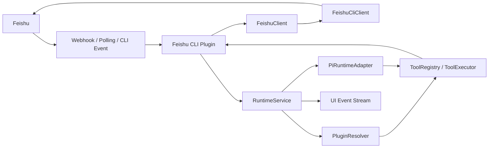
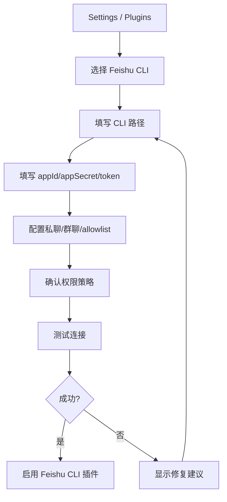

# OpenAgent Feishu CLI 集成设计

> 目标：在不破坏 OpenAgent runtime 主权、tool policy、approval、日志和 UI event 的前提下，把飞书 CLI 作为第一版飞书插件的底层实现之一，用于验证飞书消息入口、飞书回复、基础 IM / Docs / Calendar / Bitable tools，以及后续 Remote UI 能力。

## 1. 结论

飞书 CLI 可以集成，但不能直接成为 OpenAgent runtime 的一部分。推荐边界是：

```text
OpenAgent Feishu Plugin
  -> FeishuClient interface
    -> FeishuCliClient implementation
      -> feishu/lark CLI process
```

也就是说：

- 对 OpenAgent core 来说，飞书只是一个插件。
- 对 agent 来说，飞书能力只是 OpenAgent `RuntimeTool`。
- 对 channel 来说，飞书消息只是一种 `PluginPromptInput.source`。
- 对 CLI 来说，它只是 Feishu plugin 内部的一个 adapter，可以后续替换成官方 SDK。

## 2. 集成目标

### 第一版 MVP

1. 在 Settings / Plugins 中配置 Feishu CLI 插件。
2. 校验 CLI 是否可用、版本是否满足要求。
3. 保存普通配置到 `~/.openagent/settings/plugins/openagent-plugin-feishu-cli.json`。
4. 保存 app secret / token 到 `PluginSecretStore`。
5. 提供基础连接测试。
6. 注册飞书 IM tools，例如发送文本消息。
7. 支持飞书私聊消息进入 OpenAgent run。
8. 将 OpenAgent run 完成结果回发到飞书。
9. 写入 plugin log、runtime log 和 UI event。

### 后续增强

- 群聊 allowlist。
- 飞书 interactive card streaming。
- approval card。
- Docs / Calendar / Bitable tools。
- OAuth 授权与 token refresh。
- CLI adapter 替换为 SDK adapter。

## 3. 非目标

第一版不做：

- 不把飞书 CLI 参数设计暴露给 renderer 或 shared types。
- 不让 agent 直接拼 CLI 命令。
- 不让 CLI 输出原样进入 prompt，需要脱敏、摘要、体积控制。
- 不绕过 OpenAgent approval 发送外部消息或写飞书数据。
- 不把飞书卡片当作 run 状态事实源。
- 不把 OpenClaw 的 ChannelPlugin 类型或 SDK 注册协议引入 OpenAgent core。

## 4. 总体架构



## 5. 推荐目录结构

```text
plugins/feishu-cli/
├── plugin.json
├── README.md
├── src/
│   ├── index.ts
│   ├── config.ts
│   ├── client/
│   │   ├── feishu-client.ts
│   │   ├── feishu-cli-client.ts
│   │   └── feishu-client-errors.ts
│   ├── channel/
│   │   ├── feishu-channel.ts
│   │   ├── webhook-server.ts
│   │   ├── event-normalizer.ts
│   │   └── thread-mapper.ts
│   ├── tools/
│   │   ├── im-tools.ts
│   │   ├── doc-tools.ts
│   │   ├── calendar-tools.ts
│   │   └── bitable-tools.ts
│   ├── remote-ui/
│   │   ├── card-renderer.ts
│   │   ├── streaming-card.ts
│   │   └── approval-card.ts
│   ├── policy/
│   │   ├── feishu-policy.ts
│   │   └── permission-check.ts
│   └── test/
│       └── connection-test.ts
└── dist/
    └── index.js
```

## 6. plugin.json

```json
{
  "schemaVersion": "openagent.plugin.v1",
  "id": "openagent-plugin-feishu-cli",
  "name": "Feishu CLI",
  "version": "0.1.0",
  "description": "Feishu channel and tools integration backed by a local Feishu CLI adapter.",
  "main": "dist/index.js",
  "capabilities": [
    "channel",
    "tools",
    "skills",
    "remote_ui",
    "settings",
    "policy"
  ],
  "configSchema": {
    "type": "object",
    "properties": {
      "enabled": { "type": "boolean", "default": false },
      "cliPath": { "type": "string", "default": "feishu" },
      "enableDirectMessageChannel": { "type": "boolean", "default": true },
      "enableGroupChannel": { "type": "boolean", "default": false },
      "allowedChatIds": {
        "type": "array",
        "items": { "type": "string" },
        "default": []
      },
      "replyMode": {
        "type": "string",
        "enum": ["text", "card"],
        "default": "text"
      },
      "requireApprovalForExternalSend": {
        "type": "boolean",
        "default": true
      }
    },
    "additionalProperties": false
  },
  "secretSchema": {
    "type": "object",
    "properties": {
      "appId": { "type": "string" },
      "appSecret": { "type": "string" },
      "verificationToken": { "type": "string" },
      "encryptKey": { "type": "string" },
      "accessToken": { "type": "string" },
      "refreshToken": { "type": "string" }
    },
    "additionalProperties": false
  }
}
```

## 7. FeishuClient 抽象

不要在 tool 和 channel 内到处直接拼 CLI 命令。先定义稳定接口：

```ts
export interface FeishuClient {
  testConnection(signal?: AbortSignal): Promise<FeishuConnectionTestResult>;

  sendTextMessage(input: {
    receiveIdType: 'chat_id' | 'open_id' | 'user_id' | 'email';
    receiveId: string;
    text: string;
  }, signal?: AbortSignal): Promise<FeishuMessageResult>;

  getMessage(input: {
    messageId: string;
  }, signal?: AbortSignal): Promise<FeishuMessage>;

  searchDocs?(input: {
    query: string;
    limit?: number;
  }, signal?: AbortSignal): Promise<FeishuDocSearchResult[]>;

  readDoc?(input: {
    docToken: string;
  }, signal?: AbortSignal): Promise<FeishuDocContent>;
}
```

第一版 `FeishuCliClient` 通过子进程调用 CLI。后续可新增：

```text
FeishuSdkClient implements FeishuClient
```

只要 interface 不变，OpenAgent 插件层、tool 层、channel 层都不用重写。

## 8. CLI 执行约束

CLI adapter 必须统一走一个安全执行器：

```ts
export interface FeishuCliExecutor {
  run(args: string[], options: {
    timeoutMs: number;
    signal?: AbortSignal;
    redact?: string[];
  }): Promise<{
    exitCode: number;
    stdout: string;
    stderr: string;
  }>;
}
```

要求：

- 使用 `spawn(file, args)`，不要拼 shell 字符串。
- 不允许 agent 直接传完整 CLI 命令。
- args 必须由 tool schema 和插件代码构造。
- 必须支持 `AbortSignal` 和 timeout。
- stdout/stderr 写日志前必须脱敏。
- CLI 失败要分类成可读错误：认证失败、权限不足、网络失败、限流、参数错误、CLI 不存在。

## 9. Channel 设计

飞书 channel 是“飞书消息进入 OpenAgent”的入口，和 `feishu.send_text_message` 这类 tools 是两个方向：

- **Channel 入站**：飞书用户/群聊消息 -> OpenAgent run。
- **Tool 出站**：OpenAgent run -> 飞书消息回复或外发。

第一版 Channel MVP 优先使用 **飞书开放平台事件订阅 Webhook**，不要依赖轮询消息列表作为主路径。轮询可以作为本地调试 fallback，但正式链路应走事件推送，原因是：

- 飞书事件订阅有明确的事件 ID、重试语义、验签/加密机制。
- channel 需要实时触发 run，而不是靠定时扫描。
- 后续 remote UI、卡片回调、审批按钮都天然来自事件回调。

整体链路：

```text
Feishu Open Platform Event
  -> OpenAgent local webhook server
  -> verify token / decrypt / url verification
  -> normalize event
  -> deduplicate eventId
  -> map chatId/messageId to threadId
  -> ctx.runtime.submitPrompt()
  -> wait for run result or stream updates
  -> send reply through FeishuClient / feishu.send_text_message
```

飞书开放平台需要配置：

1. **事件订阅 Request URL**：本地开发通过 `cloudflared`、`ngrok`、`frp` 等暴露 OpenAgent 本地 webhook。
2. **Verification Token**：写入 OpenAgent 飞书插件密钥配置，用于校验事件来源。
3. **Encrypt Key**：建议开启事件加密，写入插件密钥配置。
4. **订阅事件**：第一版只需要文本消息相关事件，例如 `im.message.receive_v1`；后续再加卡片回调、机器人进群等事件。
5. **权限**：至少需要消息接收事件权限与发消息权限；Docs、Calendar、Bitable 等继续走当前 user OAuth scopes。

本地开发 URL 示例：

```bash
cloudflared tunnel --url http://127.0.0.1:8789
```

飞书事件订阅 URL 示例：

```text
https://<cloudflared-domain>/openagent/plugins/feishu/events
```

当前仓库内置飞书插件已经声明了 `channel` capability，但实际代码还没有注册可启动的 `FeishuChannel`。落地时优先补下面结构：

```text
src/main/plugins/builtins/feishu/
├── feishu-channel.ts          # registerChannel 的具体实现
├── feishu-webhook-server.ts   # 本地 webhook server / route
├── feishu-event-normalizer.ts # 飞书事件 -> NormalizedFeishuEvent
├── feishu-thread-mapper.ts    # chatId -> OpenAgent threadId 持久化
└── feishu-crypto.ts           # verification token / encrypt key / decrypt
```

`feishu-cli-plugin.ts` 中只负责注册：

```ts
ctx.registerChannel(new FeishuChannel({
  pluginId: ctx.pluginId,
  runtime: ctx.runtime,
  config: ctx.config,
  secrets: ctx.secrets,
  logger: ctx.logger,
  sendText: async (input) => {
    // 内部复用 FeishuClient 或 feishu.send_text_message 的受控实现，
    // 不允许绕过 OpenAgent policy / approval / logs。
  }
}));
```

### 9.1 事件归一化

```ts
export interface NormalizedFeishuEvent {
  eventId: string;
  eventType: 'message.created' | 'card.action' | 'url.verification';
  chatId?: string;
  messageId?: string;
  senderId?: string;
  text?: string;
  raw?: unknown;
}
```

### 9.2 Thread 映射

```ts
export interface FeishuThreadMapper {
  getOrCreateThreadId(input: {
    chatId: string;
    messageId?: string;
    senderId?: string;
  }): Promise<string>;
}
```

推荐映射：

```text
~/.openagent/state/plugins/openagent-plugin-feishu-cli/threads.json
```

示例：

```json
{
  "chat:oc_xxx": {
    "threadId": "thread_feishu_oc_xxx",
    "lastMessageId": "om_xxx",
    "updatedAt": "2026-05-14T10:00:00.000Z"
  }
}
```

### 9.3 submitPrompt 输入

```ts
await ctx.runtime.submitPrompt({
  prompt: normalized.text,
  threadId,
  source: {
    type: 'plugin_channel',
    pluginId: 'openagent-plugin-feishu-cli',
    channelId: 'feishu.direct_message',
    externalThreadId: normalized.chatId,
    externalUserId: normalized.senderId,
    metadata: {
      messageId: normalized.messageId
    }
  }
});
```

### 9.4 回复飞书

Channel 收到飞书消息并提交 run 后，第一版只回发最终 assistant 文本，不做 streaming card：

```text
RuntimeService.submitPrompt()
  -> collect final assistant text
  -> FeishuChannel.sendText(chatId, text)
  -> FeishuClient / lark-cli im +messages-send
```

回复必须遵守：

- 出站发送仍按 `external_send` 风险处理，记录 plugin log、runtime log 和 UI event。
- 私聊可以默认允许；群聊必须支持 allowlist，避免机器人被拉入任意群后自动回复。
- `reply_to_current_chat` 不能要求模型手填 `chatId`；应从 channel source metadata 中读取当前 `chatId`。
- 机器人自己发送的消息必须被忽略，避免“自己回复自己”的循环。

### 9.5 安全与幂等

第一版必须实现这些 guardrails：

| 项 | 要求 |
| --- | --- |
| URL verification | 飞书配置 Request URL 时返回 challenge。 |
| Verification Token | 明确校验事件来源。 |
| Encrypt Key | 如果开启加密，先解密再 normalize。 |
| eventId 去重 | 同一个飞书事件只触发一次 run。 |
| 自消息过滤 | sender 是当前 bot/user 自己时跳过。 |
| 群聊 allowlist | 未配置 allowlist 的群聊默认不自动回复。 |
| 日志脱敏 | 不记录 app secret、encrypt key、完整 token。 |
| 错误可观测 | webhook 接收、normalize、submitPrompt、send reply 都写 plugin log。 |

### 9.6 本地调试与验收

本地调试步骤：

1. 启动 OpenAgent，本地 webhook 监听例如 `http://127.0.0.1:8789/openagent/plugins/feishu/events`。
2. 用 `cloudflared` 暴露本地端口。
3. 在飞书开放平台配置事件订阅 URL。
4. 完成 URL verification。
5. 订阅文本消息事件。
6. 给机器人私聊发送一句测试消息。
7. 在 OpenAgent plugin log 中看到 eventId、chatId、threadId 和 runId。
8. 飞书侧收到 OpenAgent 的文本回复。

验收标准：

```text
用户在飞书发：你好，介绍一下自己
  -> OpenAgent 创建/复用 feishu thread
  -> RuntimeService 收到 source.type = plugin_channel
  -> Agent 生成回答
  -> 飞书收到回答文本
```

失败时优先检查：

- 飞书事件订阅 URL 是否公网可访问。
- verification token / encrypt key 是否和飞书后台一致。
- `im.message.receive_v1` 事件和发消息权限是否已启用。
- OpenAgent 插件是否 enabled / loaded。
- plugin log 是否记录到 webhook 请求。
- 群聊是否被 allowlist 拦截。

## 10. Tools 设计

### 10.1 第一版 tools

| Tool | 风险 | 说明 |
| --- | --- | --- |
| `feishu.send_text_message` | `external_send` | 向指定 chat/open user 发送文本 |
| `feishu.get_message` | `read` | 读取指定消息详情 |
| `feishu.reply_to_current_chat` | `external_send` | 回复当前 channel 上下文 |
| `feishu.test_connection` | `read` | 测试 CLI、认证和基础 API |
| `feishu.calendar_list` | `read` | 列出当前用户可访问的主日历、共享/订阅日历 |
| `feishu.calendar_agenda` | `read` | 读取指定日历日程；未指定 `calendarId` 时聚合读取所有可访问日历 |

### 10.2 后续 tools

| Tool | 风险 | 说明 |
| --- | --- | --- |
| `feishu.search_docs` | `read` | 搜索飞书文档 |
| `feishu.read_doc` | `read` | 读取文档内容，需要体积控制 |
| `feishu.create_bitable_record` | `external_write` | 创建多维表格记录，默认审批 |
| `feishu.update_bitable_record` | `external_write` | 更新多维表格记录，默认审批 |
| `feishu.create_calendar_event` | `external_write` | 创建日程，默认审批 |

### 10.3 工具定义示例

```ts
ctx.registerTool({
  name: 'feishu.send_text_message',
  description: 'Send a text message to an allowed Feishu chat or user.',
  inputSchema: {
    type: 'object',
    properties: {
      receiveIdType: {
        type: 'string',
        enum: ['chat_id', 'open_id', 'user_id', 'email']
      },
      receiveId: { type: 'string' },
      text: { type: 'string', maxLength: 4000 }
    },
    required: ['receiveIdType', 'receiveId', 'text'],
    additionalProperties: false
  },
  risk: 'external_send',
  async execute(input, toolCtx) {
    return client.sendTextMessage(input, toolCtx.signal);
  }
});
```

## 11. 权限与审批策略

默认策略：

```ts
export const feishuPolicy = {
  tools: {
    'feishu.test_connection': {
      risk: 'read',
      requiresApproval: false
    },
    'feishu.get_message': {
      risk: 'read',
      requiresApproval: false
    },
    'feishu.send_text_message': {
      risk: 'external_send',
      requiresApproval: true,
      allowlistConfigKey: 'allowedChatIds'
    },
    'feishu.create_bitable_record': {
      risk: 'external_write',
      requiresApproval: true
    }
  }
};
```

用户启用飞书插件时显示：

```text
该插件将获得以下能力：

✅ 接收飞书私聊消息
✅ 读取当前消息上下文
⚠️ 向飞书会话发送消息：需要审批或命中 allowlist
⚠️ 修改飞书多维表格：默认每次审批
```

## 12. Remote UI 设计

第一版可以只回文本。后续支持飞书卡片：

```text
run.started      -> 创建 / 更新“OpenAgent 正在处理”卡片
message.delta    -> 流式更新摘要
approval.requested -> 渲染审批按钮
approval.resolved  -> 更新审批状态
run.completed    -> 最终答案卡片
run.failed       -> 错误卡片
```

约束：

- 卡片只投影 OpenAgent run state。
- 卡片按钮回调必须进入 OpenAgent approval API。
- 卡片状态不能直接修改 transcript 或 run result。

## 13. 用户配置流程



连接测试包含：

1. `cliPath` 是否存在且可执行。
2. CLI version 是否满足最低要求。
3. appId/appSecret 或 token 是否存在。
4. 调用飞书基础接口是否成功。
5. 发送测试消息能力是否可用；默认不真实发送，除非用户提供测试 chatId。
6. webhook 验签 / 解密是否配置完整。
7. 写入 plugin log。

## 14. 日志与脱敏

日志位置：

```text
~/.openagent/logs/plugins/openagent-plugin-feishu-cli.log
```

日志内容：

- plugin 加载、注册、启用、禁用。
- CLI 路径、版本，不记录 secret。
- 每次 tool 调用的 tool name、risk、approval result、耗时、错误分类。
- channel 收到消息的 eventId/chatId/messageId，不记录完整原文，或只记录脱敏摘要。
- CLI stdout/stderr 脱敏后的摘要。

必须脱敏：

```text
appSecret
accessToken
refreshToken
verificationToken
encryptKey
Authorization header
```

## 15. 错误分类

```ts
export type FeishuCliErrorCode =
  | 'CLI_NOT_FOUND'
  | 'CLI_VERSION_UNSUPPORTED'
  | 'AUTH_MISSING'
  | 'AUTH_FAILED'
  | 'PERMISSION_DENIED'
  | 'RATE_LIMITED'
  | 'NETWORK_ERROR'
  | 'INVALID_ARGUMENT'
  | 'COMMAND_FAILED'
  | 'OUTPUT_PARSE_FAILED'
  | 'UNKNOWN';
```

用户可见错误示例：

```text
飞书连接失败：CLI 不存在
当前配置路径：/usr/local/bin/feishu
建议：
1. 确认 Feishu CLI 已安装
2. 在插件设置中填写正确 cliPath
3. 点击“重新测试连接”
```

## 16. 与插件系统的关系

飞书 CLI 集成不定义新架构，只是插件系统的一个实现：

| 插件系统概念 | 飞书 CLI 对应实现 |
| --- | --- |
| `PluginRegistry` | 发现 `openagent-plugin-feishu-cli` |
| `PluginConfigStore` | 保存 cliPath、allowlist、能力开关 |
| `PluginSecretStore` | 保存 appSecret、token、encryptKey |
| `PluginChannel` | 飞书私聊 / 群聊入口 |
| `RuntimeTool` | `feishu.send_text_message` 等 |
| `PluginPolicy` | 飞书外部发送、外部写入审批策略 |
| `RemoteUiRenderer` | 飞书交互卡片 |
| `PluginResolver` | 当前 run 是否注入飞书 tools/skills |

## 17. 插件提供 Subagent

飞书插件需要提供自己的插件子 Agent。当前推荐形态是：

```text
Feishu Plugin = feishu_agent + tools + skills + policy + channel + settings
主 Agent = 由 LLM 根据用户意图和工具描述决定是否委派给 feishu_agent
```

安装并启用飞书插件后，系统应把飞书能力注册成：

- `feishu_agent`：插件提供的飞书子 Agent，负责飞书 CLI 的所有任务。
- `feishu.*` tools：底层受控工具，供 `feishu_agent` 或主 Agent 在必要时直接调用。
- skill context：告诉主 Agent 飞书任务应优先路由给 `feishu_agent`。
- policy：外部发送、外部写入、破坏性操作仍走 OpenAgent approval。

飞书任务路由不使用字符串匹配。插件只声明 agent、tools、能力说明和约束，主 Agent 由 LLM 根据当前任务语义决定是否调用 `feishu_agent`。

授权流程由插件设置页统一发起：用户点击“授权所有能力”后，OpenAgent 调用 `lark-cli auth login --domain all --no-wait --json` 获取授权 URL 和 `device_code`，立即在设置页显示授权 URL，并自动用系统默认浏览器打开该 URL；随后后台继续调用 `lark-cli auth login --device-code <DEVICE_CODE> --json` 轮询授权结果，最长等待 5 分钟。用户完成网页授权后，CLI 会把用户 token 写入 `openagent` profile，后续 `feishu_agent` 才能以 `--as user` 调用日程等用户态 API。

```text
Feishu Plugin
  -> declares agents[] / tools[] / skills[]
  -> PluginService injects available plugin context
  -> LLM reads task + plugin descriptions
  -> LLM decides whether to call feishu_agent
  -> feishu_agent uses only plugin declared/authorized Feishu tools
```

插件注册关系：

```text
Feishu Plugin
  -> declares agents[]
  -> PluginService reads manifest.agents
  -> SubagentRegistry registers feishu_agent
  -> 主 Agent 遇到飞书任务时路由给 feishu_agent
  -> feishu_agent 只能使用该插件声明/授权的飞书 tools
```

### 17.1 Manifest 扩展建议

后续可在 `plugin.json` 增加 `agents` 字段：

```json
{
  "schemaVersion": "openagent.plugin.v1",
  "id": "openagent-plugin-feishu-cli",
  "name": "Feishu CLI",
  "agents": [
    {
      "id": "feishu_agent",
      "name": "飞书助手",
      "description": "负责飞书日程、消息、文档、多维表格和审批相关任务。",
      "tools": [
        "feishu.calendar_list",
        "feishu.calendar_agenda",
        "feishu.send_text_message",
        "feishu.reply_to_current_chat",
        "feishu.search_docs",
        "feishu.read_doc"
      ],
      "routingHints": [
        "飞书",
        "Lark",
        "日程",
        "会议",
        "群消息",
        "飞书文档",
        "多维表格",
        "审批"
      ],
      "constraints": [
        "不能绕过 OpenAgent ToolPolicy 和 approval。",
        "不能直接拼接或执行 lark-cli 命令。",
        "只能通过插件注册的 RuntimeTool 访问飞书。",
        "写操作、外部发送和审批类动作默认需要用户确认。"
      ]
    }
  ]
}
```

### 17.2 Subagent 运行边界

`feishu_agent` 不应该接管 OpenAgent runtime，也不应该自己启动独立 LLM loop 绕过系统治理。它的边界应是：

| 项 | 约束 |
| --- | --- |
| 创建来源 | 由 Feishu plugin manifest 声明 |
| 注册位置 | `SubagentRegistry` 或后续 `PluginSubagentRegistry` |
| 可用工具 | 只能使用插件 manifest/registration 声明且已启用的飞书 tools |
| 审批 | 继续走 OpenAgent `ToolPolicy` / approval |
| 日志 | 继续进入 runtime log、plugin log、UI event |
| Prompt 注入 | 只注入飞书相关 skill/subagent 摘要，不全量注入所有插件内容 |
| Channel 入口 | 飞书消息仍通过 `ctx.runtime.submitPrompt()` 进入主 runtime |

### 17.3 路由策略

当前策略是：**由 LLM 判断是否把任务交给 `feishu_agent`**。系统不做“飞书/日程/Lark”等字符串匹配来强制路由。

如果 LLM 判断当前任务属于飞书插件能力范围，则应调用 `feishu_agent`，不要再让主 Agent 通过 `.env`、环境变量或工作区配置文件自行寻找飞书凭证，也不要委托 `pi_coding_agent` 重新实现飞书 API 调用。

推荐路由顺序：

1. PluginService 注入已启用插件的 agent/tool 描述。
2. LLM 结合用户任务和插件描述判断是否调用 `feishu_agent`。
3. `feishu_agent` 根据 `operation` 调用受控 lark-cli adapter：
   - `calendar_agenda`
   - `calendar_list`
   - `send_text_message`
   - `reply_to_current_chat`
   - `cli` 通用 Feishu CLI 子命令
4. read 操作直接执行；external_send / external_write / destructive 操作进入 approval。

路由时必须记录：

```text
runId
threadId
sourceAgent: main_agent
targetSubagent: feishu_agent
reason
enabledTools
approvalPolicySnapshot
```

### 17.4 推荐实现入口

后续实现时建议新增/扩展：

```text
src/main/plugins/plugin-types.ts
  - PluginManifest.agents
  - PluginProvidedAgent

src/main/plugins/plugin-service.ts
  - getPluginProvidedAgents()
  - 启用插件时同步刷新 agent 声明

src/main/runtime/subagents/
  - subagent-registry.ts
  - plugin-subagent-adapter.ts

src/main/runtime/plugin-resolver.ts
  - 按 prompt 返回 relevant plugin tools + relevant plugin agents

src/main/runtime/runtime-service.ts
  - 在 system prompt / routing context 注入可用插件 subagent 摘要
  - 委派仍必须通过 OpenAgent run state、approval、logs
```

### 17.5 Feishu Agent Prompt 摘要示例

不要把完整文档塞进 prompt，只注入短摘要：

```text
Available plugin subagent:
- feishu_agent: handles Feishu/Lark calendar, IM, docs, bitable and approval tasks.
  Tools: feishu.calendar_list, feishu.calendar_agenda, feishu.send_text_message, feishu.reply_to_current_chat.
  Rules: read-only calendar/doc lookups do not require approval; sending or writing requires OpenAgent approval.
```

### 17.6 什么时候再做

只有当以下条件满足时，再把飞书插件升级成 subagent：

- 飞书 tools 数量超过基础 IM/Calendar，主 Agent prompt 开始膨胀。
- 飞书任务需要多步领域流程，例如“查日程 -> 找空档 -> 发送会议邀请 -> 通知群”。
- 需要为飞书域维护独立策略、领域记忆或错误恢复逻辑。
- Channel 场景变复杂，需要长期保持飞书上下文。

在此之前，保持“主 Agent + 插件 tools”更简单、更可控。

## 18. 实施路线

### M1：CLI client 与连接测试

- [ ] 新增 `plugins/feishu-cli/plugin.json`。
- [ ] 实现 `FeishuClient` interface。
- [ ] 实现 `FeishuCliClient`。
- [ ] 实现 CLI executor、timeout、AbortSignal、脱敏。
- [ ] 实现连接测试。

### M2：插件注册与设置页

- [ ] `register(ctx)` 注册 settings、policy、基础 tools。
- [ ] Settings / Plugins 展示 Feishu CLI。
- [ ] 支持 cliPath、secret、allowlist 配置。
- [ ] 支持测试连接、启用、禁用。

### M3：基础 IM tools

- [ ] `feishu.test_connection`。
- [ ] `feishu.send_text_message`。
- [ ] `feishu.get_message`。
- [ ] `feishu.reply_to_current_chat`。
- [ ] 工具调用进入 approval、UI event、plugin log。

### M4：Channel MVP

- [ ] 在内置飞书插件中 `ctx.registerChannel(new FeishuChannel(...))`。
- [ ] 启动本地 webhook server，提供 `/openagent/plugins/feishu/events`。
- [ ] 支持飞书 URL verification，正确返回 challenge。
- [ ] 校验 verification token；开启 encrypt key 时先解密事件。
- [ ] 实现 eventId 去重和机器人自消息过滤。
- [ ] 实现 `NormalizedFeishuEvent`，第一版只处理文本消息。
- [ ] 实现 chatId -> OpenAgent threadId mapper，落地到 `~/.openagent/state/plugins/openagent-plugin-feishu-cli/threads.json`。
- [ ] 调用 `ctx.runtime.submitPrompt()`，source 标记为 `plugin_channel`。
- [ ] 私聊默认回复；群聊必须经过 allowlist。
- [ ] run 完成后回发飞书文本。
- [ ] plugin log 记录 webhook receive / normalize / submitPrompt / reply 四段。

### M5：Remote UI 与审批

- [ ] 飞书 streaming card。
- [ ] approval card。
- [ ] card action -> OpenAgent approval API。
- [ ] run/card mapping。

### M6：Docs / Calendar / Bitable

- [ ] 飞书文档搜索与读取。
- [ ] 日历查询与创建。
- [ ] 多维表格读取与写入。
- [ ] 写操作默认审批。

### M7：插件提供 Subagent

- [x] 扩展 `PluginManifest.agents` 类型。
- [x] 新增 `PluginProvidedAgent` 数据结构。
- [x] 飞书内置 manifest 声明 `feishu_agent`。
- [x] 飞书插件注册 `feishu_agent` runtime tool。
- [x] `feishu_agent` 支持 `calendar_list` / `calendar_agenda` / `send_text_message` / `reply_to_current_chat` / `cli`。
- [x] ToolPolicy 支持按 `feishu_agent.expectedRisk` 动态审批。
- [ ] `PluginService` 暴露已启用插件提供的 subagent 声明。
- [ ] `SubagentRegistry` 支持注册 plugin-provided subagent。
- [x] `PluginResolver` 注入已启用插件声明的 plugin agents，由 LLM 决定相关性。
- [x] 主 Agent 通过 LLM 决策委派给 `feishu_agent`，不使用字符串匹配强制路由。
- [ ] 委派过程进入 run log / UI event / approval policy snapshot。

## 19. 快速判断原则

| 问题 | 判断 |
| --- | --- |
| 能不能直接让 agent 写 CLI 命令？ | 不能，必须通过受控 tool schema |
| CLI 结果能不能原样进 prompt？ | 不能，需要脱敏、摘要、体积控制 |
| 飞书消息能不能直接调 Pi？ | 不能，必须 `ctx.runtime.submitPrompt()` |
| 发送飞书消息是否需要审批？ | 默认需要，除非命中用户 allowlist |
| 后续能否从 CLI 换 SDK？ | 可以，通过 `FeishuClient` interface 替换 implementation |
| 飞书卡片是否是事实源？ | 不是，只是 OpenAgent runtime 状态投影 |
| 安装飞书插件会不会自动注册 subagent？ | 飞书内置插件已声明并注册 `feishu_agent`；后续本地插件也应通过 `manifest.agents` 显式声明 |
