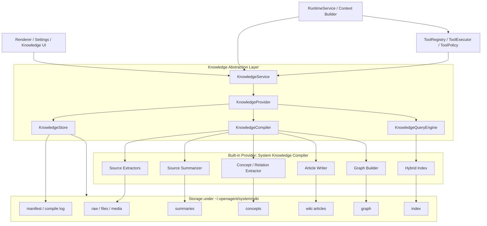

# OpenAgent Knowledge Compiler 设计与落地计划

> 目标：将当前偏静态的旧 Wiki 升级为 OpenAgent 内置知识库系统。该系统借鉴 `sage-wiki` 的“原始资料 -> 摘要 -> 概念 -> 文章 -> 图谱 -> 检索/问答”编译流程，但必须建立在 OpenAgent 自己的知识库抽象层之上，避免 runtime、renderer、Pi 或具体存储实现直接耦合。未来可以替换为其他知识库引擎，也可以接入外部知识库作为 provider。

## 1. 结论

当前知识库不应继续只作为 Markdown 归档和简单检索能力演进，而应升级为 **Knowledge Compiler**：

```text
Raw Sources
  -> Source Extraction
  -> Source Summary
  -> Concept / Entity / Relation Extraction
  -> Wiki Article Generation
  -> Graph / Provenance / Index Build
  -> Search / Query / Capture / Compile-on-demand
```

核心原则：

- **抽象层优先**：OpenAgent 只依赖 `KnowledgeService`、`KnowledgeProvider`、`KnowledgeStore`、`KnowledgeCompiler` 等稳定接口，不依赖某一个具体知识库实现。
- **内置 sage-wiki 风格实现**：第一套实现命名为 `SystemKnowledgeProvider`，复刻 sage-wiki 的知识提取和编译思想，但用 TypeScript 实现并接入 OpenAgent runtime。
- **Wiki 目录变成输出层**：`wiki/` 目录不再是唯一事实源，而是 compiler 产出的可读文章层；事实源来自 raw/source、summary、concept、relation、provenance 和 manifest。
- **工具统一由 OpenAgent 管理**：所有知识库 search/query/ingest/compile/capture 都必须走 `ToolRegistry`、`ToolPolicy`、run log 和 UI event，不允许 provider 绕过 OpenAgent 自己执行。
- **不无脑注入 prompt**：prompt 只注入与当前任务相关的短摘要；长内容、图谱扩展、原文证据通过工具按需读取。
- **可替换/可集成**：未来可以把 provider 换成 SQLite 原生实现、外部 MCP 知识库、远端知识服务、企业知识库或其他 wiki compiler，而不影响 renderer 和 agent runtime 主链路。

## 2. 分层架构

OpenAgent 知识库分为五层：



### 各层职责

| 层 | 职责 | 不应该做的事 |
| --- | --- | --- |
| `KnowledgeService` | OpenAgent 内部唯一入口；路由 scope/provider；统一日志、错误、事件 | 不直接读写具体 wiki 文件格式 |
| `KnowledgeProvider` | 表示一种知识库实现，如内置 Knowledge Compiler、远端知识库、MCP 知识库 | 不绕过 OpenAgent policy 执行工具 |
| `KnowledgeStore` | 管理 source、summary、concept、article、relation、provenance、index 的持久化 | 不调用 LLM，不做业务编译决策 |
| `KnowledgeCompiler` | 执行 ingest/compile/compile-topic/capture 编译流程 | 不直接暴露给 renderer |
| `KnowledgeQueryEngine` | search/query/rerank/graph expansion/answer with citations | 不修改知识库事实源 |
| Runtime Tools | 给 agent loop 暴露 search/query/capture/compile 等能力 | 不包含 provider 私有逻辑 |

## 3. Provider 抽象契约

OpenAgent 定义自己的稳定接口，避免 Pi、renderer、UI 或具体 compiler 感知内置知识库的内部实现。

```ts
export type KnowledgeScope = 'system' | 'agent' | 'project' | 'external';

export type KnowledgeProviderKind =
  | 'openagent-system-compiler'
  | 'external-mcp'
  | 'remote-service'
  | 'custom';

export interface KnowledgeProviderDescriptor {
  id: string;
  kind: KnowledgeProviderKind;
  scope: KnowledgeScope;
  displayName: string;
  rootPath?: string;
  capabilities: KnowledgeCapability[];
}

export type KnowledgeCapability =
  | 'ingest'
  | 'ingest_file'
  | 'compile'
  | 'compile_topic'
  | 'search'
  | 'query'
  | 'capture'
  | 'provenance'
  | 'graph'
  | 'health'
  | 'lint';

export interface KnowledgeProvider {
  descriptor(): KnowledgeProviderDescriptor;
  health(): Promise<KnowledgeHealthResult>;
  ingest?(input: KnowledgeIngestInput): Promise<KnowledgeIngestResult>;
  ingestFile?(input: KnowledgeIngestFileInput): Promise<KnowledgeIngestResult>;
  compile?(input: KnowledgeCompileInput): Promise<KnowledgeCompileResult>;
  compileTopic?(input: KnowledgeCompileTopicInput): Promise<KnowledgeCompileResult>;
  search(input: KnowledgeSearchInput): Promise<KnowledgeSearchResult[]>;
  query?(input: KnowledgeQueryInput): Promise<KnowledgeAnswer>;
  capture?(input: KnowledgeCaptureInput): Promise<KnowledgeCaptureDraft[]>;
  provenance?(input: KnowledgeProvenanceInput): Promise<KnowledgeProvenance[]>;
  graph?(input: KnowledgeGraphInput): Promise<KnowledgeGraphResult>;
  lint?(): Promise<KnowledgeLintResult>;
}
```

`KnowledgeService` 负责根据 `scope/providerId/capability` 选择 provider。默认 provider 是 OpenAgent 内置的 system knowledge compiler，但调用方不能假设它一定是 Markdown 文件实现。

## 4. 核心数据模型

### Source / Compile Item

```ts
export type KnowledgeSourceKind =
  | 'markdown'
  | 'text'
  | 'pdf'
  | 'docx'
  | 'xlsx'
  | 'pptx'
  | 'image'
  | 'audio'
  | 'video'
  | 'code'
  | 'conversation'
  | 'web'
  | 'unknown';

export type KnowledgeCompileTier = 0 | 1 | 2 | 3;

export interface KnowledgeSource {
  id: string;
  kind: KnowledgeSourceKind;
  title: string;
  originalPath?: string;
  archivedPath?: string;
  rawTextPath?: string;
  hash: string;
  createdAt: string;
  updatedAt: string;
  metadata?: Record<string, unknown>;
}

export interface KnowledgeCompileItem {
  sourceId: string;
  tier: KnowledgeCompileTier;
  status: 'pending' | 'indexed' | 'summarized' | 'compiled' | 'failed' | 'skipped';
  summaryId?: string;
  conceptIds?: string[];
  articleIds?: string[];
  error?: string;
  lastCompiledAt?: string;
}
```

Tier 语义借鉴 sage-wiki，但由 OpenAgent 自己实现：

| Tier | 作用 | 适用场景 |
| --- | --- | --- |
| 0 | 只登记 source + 全文索引 | 大量低价值文件、结构化配置、暂不需要 LLM 的内容 |
| 1 | 全文索引 + chunk/embedding | 大量文档、后续可能按需编译 |
| 2 | 结构解析摘要，不走完整 LLM article | 代码、JSON/YAML、日志等可确定解析内容 |
| 3 | 完整编译：summary、concept、relation、article、graph | 核心文档、用户确认知识、项目规则、长期知识 |

### Summary

```ts
export interface KnowledgeSourceSummary {
  id: string;
  sourceId: string;
  title: string;
  language?: string;
  abstract: string;
  keyPoints: string[];
  claims: string[];
  decisions?: string[];
  openQuestions?: string[];
  terms: string[];
  entities: string[];
  citations: KnowledgeCitation[];
  confidence: 'low' | 'medium' | 'high';
  createdAt: string;
}
```

### Concept / Entity / Relation

```ts
export type KnowledgeConceptType =
  | 'concept'
  | 'entity'
  | 'decision'
  | 'rule'
  | 'workflow'
  | 'module'
  | 'api'
  | 'tool'
  | 'preference'
  | 'open_question';

export interface KnowledgeConcept {
  id: string;
  name: string;
  aliases: string[];
  type: KnowledgeConceptType;
  description: string;
  sourceIds: string[];
  confidence: 'low' | 'medium' | 'high';
  articleId?: string;
}

export type KnowledgeRelationType =
  | 'implements'
  | 'extends'
  | 'depends_on'
  | 'contradicts'
  | 'derived_from'
  | 'related_to'
  | 'trades_off'
  | 'prerequisite_of'
  | 'mentions'
  | 'supports';

export interface KnowledgeRelation {
  id: string;
  sourceConceptId: string;
  targetConceptId: string;
  type: KnowledgeRelationType;
  evidence: string;
  sourceIds: string[];
  confidence: 'low' | 'medium' | 'high';
}
```

### Article / Provenance

```ts
export interface KnowledgeArticle {
  id: string;
  conceptId: string;
  title: string;
  path: string;
  aliases: string[];
  sourceIds: string[];
  relationIds: string[];
  frontmatter: Record<string, unknown>;
  updatedAt: string;
}

export interface KnowledgeProvenance {
  id: string;
  targetId: string;
  targetType: 'summary' | 'concept' | 'relation' | 'article' | 'answer';
  sourceId: string;
  sourcePath?: string;
  quote?: string;
  location?: string;
  createdAt: string;
  confirmedByUser?: boolean;
  confidence: 'low' | 'medium' | 'high';
}
```

Provenance 是 OpenAgent 知识库的硬约束：所有 article、answer、capture draft 都必须能追溯 source 或会话上下文。

## 5. 本地数据布局

OpenAgent 业务数据仍放在 `~/.openagent`，Electron / Chromium cache 不放这里。默认 system provider 使用如下布局，但该布局属于 provider 实现细节，调用方不得直接依赖。

```text
~/.openagent/
├── agents/
│   └── <agentId>/
│       ├── workspace/
│       ├── sessions/
│       ├── MEMORY.md
│       ├── USER.md
│       └── skills/
├── system/
│   └── wiki/
│       ├── raw/                       # 抽取后的原始文本、粘贴内容、conversation capture
│       ├── files/                     # pdf/docx/xlsx/pptx 等文档或二进制原件
│       ├── media/                     # 图片、音频、视频等媒体原件
│       ├── summaries/                 # source summary JSON/Markdown
│       ├── concepts/                  # concept/entity/relation JSON
│       ├── wiki/                      # compiler 输出的可读 Markdown article
│       │   ├── index.md
│       │   ├── overview.md
│       │   ├── concepts/
│       │   ├── entities/
│       │   ├── decisions/
│       │   ├── rules/
│       │   └── syntheses/
│       ├── graph/
│       │   ├── nodes.json
│       │   ├── edges.json
│       │   └── graph.json
│       ├── index/
│       │   ├── chunks.jsonl
│       │   ├── bm25.sqlite
│       │   └── embeddings.sqlite
│       ├── manifest.json
│       └── compile-log.jsonl
├── settings/
├── state/
└── logs/
```

附件保留规则：

- 图片、音频、视频等媒体原件必须保留在 `system/wiki/media/`。
- doc/docx、pdf、xlsx、pptx 等文档或其他二进制原件必须保留在 `system/wiki/files/`。
- 可抽取的正文、图片分析、文档摘要和归档元数据写入 `system/wiki/raw/`。
- compiler 生成的摘要、概念、关系、文章和图谱分别写入 `summaries/`、`concepts/`、`wiki/`、`graph/`。
- `manifest.json` 记录每个 source 的 hash、tier、状态和产物路径，用于增量编译、去重、重建索引和按需编译。

## 6. Knowledge Compiler 流程

### 6.1 Ingest

`ingest` 不直接等于“写 wiki 文章”。它只负责把外部输入标准化为 source：

```text
text/file/conversation
  -> archive original if needed
  -> extract raw text / metadata
  -> create KnowledgeSource
  -> create KnowledgeCompileItem(status=pending)
  -> optionally trigger compile
```

### 6.2 Source Extraction

按文件类型抽取内容：

| 类型 | 第一版要求 | 后续增强 |
| --- | --- | --- |
| Markdown / Text | 解析正文和 frontmatter | 分块、标题结构、wikilink 保留 |
| Conversation | 提取决策、纠错、偏好、任务结论候选 | 接审批流和自动归档 |
| Code | 文件结构、导出符号、注释、关键 API | AST/语言特定 parser |
| PDF / DOCX / XLSX / PPTX | 可以先保留原件和 metadata | 后续接文本抽取器 |
| Image / Audio / Video | 先保留原件 | 后续 vision/audio caption |

### 6.3 Source Summary

每个 source 先生成结构化摘要，降低后续概念抽取成本：

```text
raw text
  -> LLM or deterministic summarizer
  -> KnowledgeSourceSummary
```

摘要必须包含：abstract、key points、claims、terms、entities、citations、confidence。

### 6.4 Concept / Relation Extraction

从一个或多个 summary 中抽取概念和关系：

```text
summaries
  -> concepts/entities/decisions/rules/workflows
  -> aliases
  -> relation edges
  -> evidence/provenance
```

提取时要做 dedup 和 alias merge，避免每次编译都生成重复概念。

### 6.5 Article Generation

围绕 concept 生成可读 Markdown article。文章是输出层，不是唯一事实源。

建议文章结构：

```md
---
id: concept_openagent_tool_policy
title: OpenAgent Tool Policy
aliases:
  - ToolPolicy
  - 工具审批策略
type: concept
sources:
  - source_runtime_tools_doc
confidence: high
updated_at: 2026-05-10T00:00:00+08:00
---

# OpenAgent Tool Policy

## Summary

...

## Key Points

...

## Related Concepts

- [[OpenAgent ToolRegistry]]
- [[Approval Flow]]

## Evidence

...
```

### 6.6 Index / Graph Build

编译完成后更新：

- chunk index：按段落/标题切分 article 和 raw source。
- BM25/FTS index：第一版可以先用 deterministic text scoring，后续替换 SQLite FTS5。
- embedding index：后续能力，不能阻塞第一版。
- graph：从 relation 和 wikilink 生成 nodes/edges。
- provenance：把 answer/article/relation 关联回 source。

## 7. Query/Search 设计

目标是从“简单字符串搜索”升级为可替换的 `KnowledgeQueryEngine`。

第一版查询流程：

```text
query
  -> normalize
  -> search chunks/articles/summaries
  -> score by lexical overlap + title boost + source freshness
  -> return snippets + citations
```

后续 sage-wiki 风格增强：

```text
query
  -> LLM query expansion
  -> BM25 search
  -> vector search
  -> RRF fusion
  -> graph expansion
  -> rerank
  -> answer with citations
```

`knowledge_query` 返回答案时必须包含：

```ts
export interface KnowledgeAnswer {
  answer: string;
  citations: KnowledgeCitation[];
  usedSourceIds: string[];
  usedArticleIds: string[];
  confidence: 'low' | 'medium' | 'high';
}
```

## 8. Capture 设计

Capture 是 OpenAgent 知识库区别于普通 wiki 的关键能力：从会话中抽取可沉淀知识。

```text
session transcript / selected text
  -> capture extractor
  -> drafts: decision / correction / preference / project rule / open question
  -> user approval
  -> ingest as conversation source
  -> compile into concepts/articles
```

Capture draft 不应直接写入长期知识。必须先进入审批，尤其是：

- 用户偏好。
- 项目规则。
- 架构决策。
- 对既有知识的纠错。
- 涉及安全/路径/权限/密钥的内容。

## 9. Runtime / Tool 设计

对 agent 暴露的是 OpenAgent 工具，不是 provider 私有 API。

| Tool | 作用 |
| --- | --- |
| `knowledge_ingest` | 导入文本，生成 source 和 pending compile item |
| `knowledge_ingest_file` | 归档用户显式选择的本地文件，抽取 raw text / metadata |
| `knowledge_compile` | 编译 pending sources，可指定 tier 和 limit |
| `knowledge_compile_topic` | 针对某个主题按需编译相关 source |
| `knowledge_search` | 检索 summaries/articles/chunks |
| `knowledge_query` | 问答，返回引用和证据 |
| `knowledge_capture` | 从当前对话或指定文本提取知识候选 |
| `knowledge_provenance` | 查看某条知识的来源证据 |
| `knowledge_graph` | 查询概念关系图 |
| `knowledge_health` | 检查 provider/index/manifest 状态 |
| `knowledge_lint` | 检查 broken links、orphan articles、缺失 provenance、重复概念 |

旧 `system_wiki_*` tools 和 `wiki_agent` 不再作为 runtime 主入口保留；新入口统一为 `knowledge_*` tools 和 `knowledge_agent`。如需兼容旧 UI/数据，应在 IPC 或迁移脚本层做短期 adapter，不应把旧 wiki tool 继续注入 agent prompt。

## 10. Prompt 注入规则

System prompt 只说明知识工具存在和使用边界：

- 是否在主模型调用前预检知识库，由轻量 LLM router 语义判断；不要每轮固定调用 `KnowledgeService.search()`，也不要用关键词硬判替代模型判断。
- 问 OpenAgent 架构、runtime、项目文档、公共规范、历史决策时，LLM router 可选择先通过 `KnowledgeService.search()` 注入 top-k 摘要；主模型执行中仍可按需调用 `knowledge_search` / `knowledge_query`。
- 需要沉淀知识时，优先通过 `knowledge_capture` 生成候选，再进入审批。
- 不要把 wiki、memory、skills、docs 全量塞进 prompt。
- 注入内容只允许是 LLM router 判定相关后由 `KnowledgeService` 返回的 top-k 摘要、snippet、citation，不允许 runtime 直接扫目录拼 prompt。
- 如果 query 结果显示存在未编译但相关的 source，可触发 `knowledge_compile_topic`，但应在 UI/run log 中可观测。

## 11. 安全与边界

- 知识库 provider 不直接执行 shell、git、外部路径写入或 destructive 操作。
- 外部文件导入必须来自用户显式选择/传入的路径；导入后原件归档到 OpenAgent 管理目录。
- 自动 capture 的长期知识写入必须审批。
- System knowledge 是公共知识库，不替代 agent 私有 `MEMORY.md` / `USER.md`。
- Renderer 不直接 import provider/store/compiler 实现，只通过 preload 暴露的安全 API 或 runtime IPC 调用。
- Pi adapter 不直接感知知识库实现，只看到 OpenAgent tools 和 prompt 中的工具规则。
- Provider 可替换，但必须满足 provenance、capability descriptor、health 和 tool event 约束。

## 12. 分阶段实现计划

### Phase 1：文档和抽象层

- [ ] 将 `docs/knowledge.md` 升级为 Knowledge Compiler 设计文档。
- [ ] 在 `src/main/runtime/knowledge/knowledge-types.ts` 定义 source、summary、concept、relation、article、provenance、compile item、provider descriptor。
- [ ] 将 `KnowledgeService` 调整为 provider registry + capability routing。
- [x] 剔除旧 `SystemWikiProvider` 实现，新增 `openagent-system-compiler` provider 作为第一版实现。

### Phase 2：最小 compiler

- [ ] 支持 text/markdown/conversation source ingest。
- [ ] 生成 `manifest.json` 和 `compile-log.jsonl`。
- [ ] 实现 source summary。
- [ ] 实现 concept/relation extraction。
- [ ] 生成 `wiki/concepts/*.md` article。
- [ ] 所有产物写入 provenance。

### Phase 3：替换旧 ingest/query 路径

- [x] 移除 `system_wiki_ingest` / `system_wiki_query` runtime tool，改用 `knowledge_ingest` / `knowledge_query`。
- [x] 设置页从 旧 Wiki 面板 升级为 “Knowledge Base 面板”，展示 provider、manifest、compile 状态、graph/index 健康度。
- [ ] 如需迁移历史 `wiki/sources` 页面，另写一次性 migration，把旧页面作为 raw source 重新 ingest/compile。

### Phase 4：搜索质量增强

- [ ] chunk index。
- [ ] SQLite FTS/BM25 或等价全文索引。
- [ ] embedding index。
- [ ] query expansion。
- [ ] rerank。
- [ ] graph expansion。
- [ ] answer with citations。

### Phase 5：Capture 和审批流

- [ ] 从当前 session transcript 生成 capture draft。
- [ ] 按 decision/correction/preference/rule/open-question 分类。
- [ ] 用户审批后进入 conversation source。
- [ ] 自动编译成 concept/article/relation。

### Phase 6：多 provider / 外部集成

- [ ] provider registry 支持多个知识库。
- [ ] 支持 external MCP knowledge provider。
- [ ] 支持远端 service provider。
- [ ] 支持按 scope 选择 system/project/agent/external knowledge。

## 13. 当前验收标准

文档阶段验收：

- `docs/knowledge.md` 明确 Knowledge Compiler 是目标，不再只描述静态旧 Wiki。
- 文档明确抽象层：`KnowledgeService`、`KnowledgeProvider`、`KnowledgeStore`、`KnowledgeCompiler`、`KnowledgeQueryEngine`。
- 文档明确内置 provider 只是默认实现，未来可替换或集成外部知识库。
- 文档明确 sage-wiki 风格 pipeline：source extraction、summary、concept/relation extraction、article generation、graph/index/provenance。
- 文档明确旧 `system_wiki_*` 工具和 `wiki_agent` 已退出 runtime 主入口，新入口是 `knowledge_*` 和 `knowledge_agent`。

实现阶段验收：

- `pnpm typecheck` 通过。
- `pnpm build` 通过。
- Runtime tools 只通过 `KnowledgeService` 调用 provider。
- Agent 运行前只注入相关摘要，不直接读取全量 wiki。
- Search/query/capture/compile 过程进入 run log 和 UI event。

## 14. 当前实现补齐记录

本阶段已补齐以下能力：

- 真 embedding 优先：`KnowledgeLlm.embedTexts()` 会调用当前 OpenAI-compatible `/embeddings` 接口；如果 provider 不支持或失败，自动回退到本地 hash vector。
- 批量编译调度：`knowledge_compile` 按 batch 处理 source，写入 `compile_batch_start` / `compile_batch_end` 日志，并在每批后落盘 manifest。
- 去重合并：ingest 阶段按 content hash 去重；compile 阶段按 concept name / alias 合并既有概念，避免同一概念反复生成新 id。
- 质量评估：每个 source 编译后生成 `quality/<sourceId>.json`，记录 summary、concept、relation、article、citation 等质量指标；lint 会报告低质量 source。
- 自动初始化：如果 `~/.openagent/system/wiki` 或其子目录不存在，provider 会在 health/search/ingest/compile 前自动创建 raw、files、media、summaries、concepts、provenance、quality、wiki、graph、index、manifest 等目录和文件。
