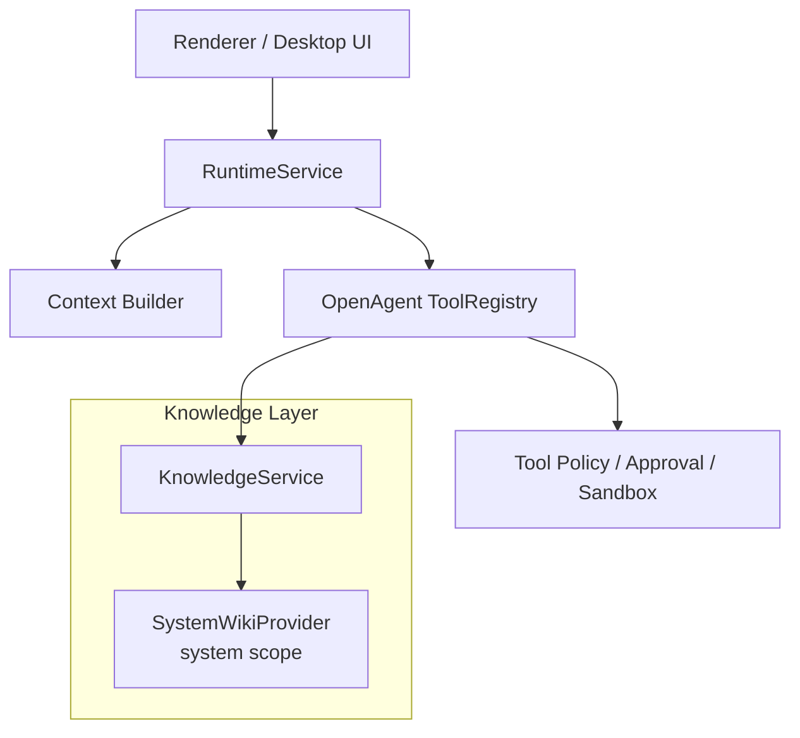

# OpenAgent System Wiki 设计与落地计划

> 目标：保留 `llm-wiki-agent` 风格的系统级 Markdown Wiki，作为 OpenAgent 的公共知识库。此前探索过的外部 agent brain 集成已移除；后续如需重新评估，应重新设计，不沿用本轮实现。

## 1. 结论

| 能力 | OpenAgent 中的定位 | 集成方式 |
| --- | --- | --- |
| System Wiki | 系统级、项目级、公共知识的 Markdown-first 结构化 Wiki | 内化 `llm-wiki-agent` 的目录结构、schema 和 workflow，作为 OpenAgent 自己的 system wiki |

核心边界：

- **System Wiki = 系统公共知识库**：沉淀 OpenAgent 产品设计、runtime 架构、Pi 集成、插件/skill 规范和公共文档。
- **Runtime 不直接依赖 Wiki 实现细节**：统一通过 OpenAgent 自己的 `KnowledgeProvider`、`KnowledgeService` 和 `RuntimeTool` 访问。
- **不无脑注入 prompt**：只按任务相关性检索摘要；长内容走工具按需读取。

## 2. 本地数据布局

OpenAgent 业务数据仍放在 `~/.openagent`，Electron / Chromium cache 不放这里。

```text
~/.openagent/
├── agents/
│   └── <agentId>/
│       ├── workspace/
│       ├── sessions/
│       ├── MEMORY.md
│       ├── USER.md
│       └── skills/
├── system/
│   └── wiki/
│       ├── raw/                     # 原始系统资料
│       ├── wiki/
│       │   ├── index.md
│       │   ├── log.md
│       │   ├── overview.md
│       │   ├── sources/
│       │   ├── entities/
│       │   ├── concepts/
│       │   └── syntheses/
│       └── graph/
├── settings/
├── state/
└── logs/
```

## 3. Runtime 架构



## 4. Provider 契约

OpenAgent 定义自己的稳定接口，避免 Pi、renderer 或 UI 直接感知 system wiki 的实现细节。

```ts
export type KnowledgeScope = 'system';

export interface KnowledgeQueryInput {
  scope: KnowledgeScope;
  query: string;
  limit?: number;
}

export interface KnowledgeResult {
  id: string;
  title: string;
  source: 'system-wiki';
  content: string;
  score?: number;
  path?: string;
  citations?: string[];
}

export interface KnowledgeProvider {
  search(input: KnowledgeQueryInput): Promise<KnowledgeResult[]>;
  ingest?(input: KnowledgeIngestInput): Promise<KnowledgeIngestResult>;
  health?(): Promise<KnowledgeHealthResult>;
}
```

## 5. Tool 设计

当前保留的工具：

| Tool | Scope | 作用 |
| --- | --- | --- |
| `knowledge_search` | `system` | system wiki 的统一检索入口 |
| `system_wiki_query` | `system` | 查询系统 Wiki |
| `system_wiki_ingest` | `system` | 把一段资料写入 system wiki 的 raw/source/index/log |
| `system_wiki_health` | `system` | 结构健康检查 |
| `system_wiki_lint` | `system` | 检查 broken wikilinks、orphan pages、sparse pages |
| `system_wiki_build_graph` | `system` | 基于 `[[WikiLink]]` 生成 graph.json / graph.html |

后续可补：

- `knowledge_promote_to_wiki`
- 文件上传进入 `system_wiki_ingest`
- 设置页 graph 可视化

## 6. Prompt 注入规则

System prompt 只说明知识工具的存在和边界：

- 问系统设计、OpenAgent 架构、项目文档、公共规范：优先查 `system_wiki_query`。
- 通用知识检索：查 `knowledge_search`。
- 不要把 wiki 全量塞入 prompt。
- 写入 system wiki 必须通过 OpenAgent 工具，不能绕过 policy。

## 7. 分阶段实现计划

### Phase 1：文档 + 最小 Knowledge Layer 骨架

- [x] 新增 `docs/knowledge.md`。
- [x] 新增 `src/main/runtime/knowledge` 目录。
- [x] 定义 `KnowledgeProvider` / `KnowledgeService` / provider path。
- [x] 实现 deterministic `SystemWikiProvider`。
- [x] 注册 system wiki runtime tools。
- [x] 在 system prompt 中加入知识库工具使用规则。

### Phase 2：System Wiki 可用化

- [x] 在设置页展示 system wiki 状态。
- [x] 支持粘贴文本进入 `system_wiki_ingest`。
- [x] 支持在设置页直接查询 `system_wiki_query` 结果。
- [ ] 支持上传文件进入 `system_wiki_ingest`。
- [x] 实现 `system_wiki_lint`。
- [x] 实现 `system_wiki_build_graph`。

### Phase 3：收敛复杂度

- [x] 删除外部 agent brain provider。
- [x] 删除 agent brain query/ingest tools。
- [x] 删除外部 SDK / sidecar / MCP / CLI 相关路径设计。
- [x] 设置页仅保留 System Wiki 面板。

### Phase 4：Knowledge Router 智能化

- [ ] 根据 prompt 意图决定是否查 system wiki。
- [ ] prompt 前只注入 top-k 相关摘要。
- [ ] 任务结束时生成“可沉淀系统知识”候选，进入审批或显式保存。

## 8. 安全与边界

- system wiki 是公共知识库，不存储 agent 私有记忆。
- 写入 system wiki 必须由明确工具触发。
- 外部路径导入必须后续接入 approval；当前阶段只接收显式传入的文本内容。
- 不再保留外部 agent brain 相关 runtime 入口。

## 9. 当前验收标准

- `pnpm typecheck` 通过。
- `pnpm build` 通过。
- Prompt 中能看到 system wiki knowledge tools。
- 设置页能查看 system wiki 状态。
- 设置页能写入并查询 system wiki 内容。
- 设置页能运行 lint 和 build graph。
