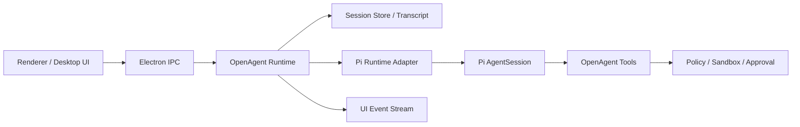
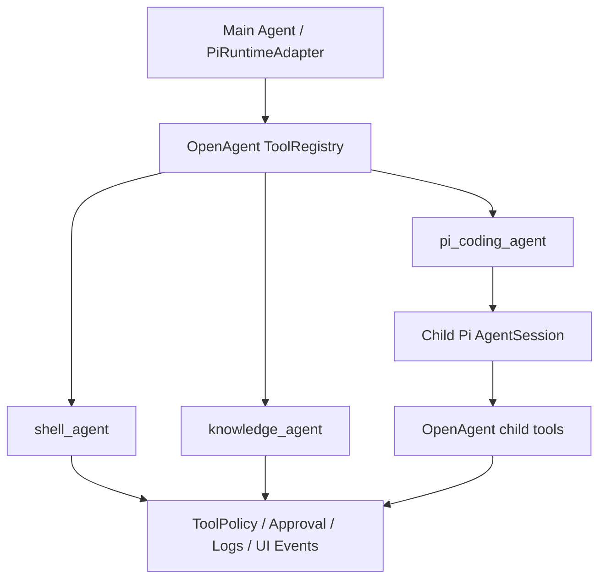

# Pi Agent 集成开发指导

> 目标：参照 OpenClaw 的 Pi 集成方式，为 OpenAgent 设计一层可落地、可替换、可观测的 agent runtime。本文是开发路线文档，不代表当前代码已经全部实现。

## 1. 参考结论

OpenClaw 的关键做法不是把 `pi` 当成外部 CLI 子进程来调用，而是把 Pi SDK 嵌入到应用运行时中：

- 使用 `@earendil-works/pi-coding-agent` 提供的 `createAgentSession()` 创建 `AgentSession`。
- 使用 `SessionManager` 管理 JSONL transcript、历史、分支和压缩。
- 由应用自己的 Gateway / Runtime 负责：会话路由、工具注入、权限策略、事件转发、UI 状态同步。
- Pi 负责核心 agent loop：LLM 调用、tool call、streaming、turn 生命周期。

OpenAgent 应采用同样的方向：**不要先做 Pi CLI 包壳；优先做 Embedded Pi Runtime Adapter**。

## 2. OpenAgent 中的目标分层



### 2.1 UI 层

职责：

- 提交 prompt、附件、模型选择、skill 选择。
- 展示 message、reasoning、tool call、approval、patch、run log。
- 不直接了解 Pi SDK 细节。

当前 OpenAgent 已有的 `desktopApi.sendPrompt()` / `onUiEvent()` 可以继续作为边界。

### 2.2 Runtime 层

职责：

- 接收 UI 请求并创建一次 run。
- 生成 `runId`、定位 `threadId`、解析当前 agent、workspace、provider、model。
- 决定本轮允许哪些 tools、skills、MCP、sandbox、审批策略。
- 调用 Pi Runtime Adapter。
- 把 Adapter 事件转换成 OpenAgent UI 事件。

建议新增目录：

```text
src/main/runtime/
├── runtime-service.ts          # prompt/run 总入口
├── run-state.ts                # active run、取消、状态机
├── event-bus.ts                # 统一 UI 事件分发
├── session-store.ts            # thread/session 文件定位与元数据
├── subagents/                  # shell_agent / knowledge_agent / pi_coding_agent
└── pi/
    ├── pi-runtime-adapter.ts   # OpenAgent -> Pi 的主适配层
    ├── pi-session.ts           # createAgentSession / SessionManager
    ├── pi-events.ts            # Pi events -> OpenAgent UiEvent
    ├── pi-tools.ts             # OpenAgent tools -> Pi ToolDefinition
    ├── pi-system-prompt.ts     # 系统提示词构建
    ├── pi-model.ts             # provider/model/auth 解析
    └── pi-errors.ts            # failover、abort、context overflow 分类
```

## 3. Runtime Adapter 契约

先定义 OpenAgent 自己的运行时契约，避免业务层直接依赖 Pi 类型。

```ts
export interface AgentRuntimeRunInput {
  runId: string;
  threadId: string;
  agentId: string;
  workspaceRoot: string;
  sessionFile: string;
  prompt: string;
  attachments?: PromptAttachmentDescriptor[];
  providerId: string;
  model: string;
  systemPrompt: string;
  tools: OpenAgentTool[];
  abortSignal: AbortSignal;
}

export interface AgentRuntimeRunResult {
  status: 'completed' | 'cancelled' | 'failed';
  summary?: string;
  error?: string;
}

export interface AgentRuntimeAdapter {
  run(input: AgentRuntimeRunInput): Promise<AgentRuntimeRunResult>;
  compact?(input: { threadId: string; sessionFile: string }): Promise<void>;
}
```

Pi 只是该接口的一个实现：`PiRuntimeAdapter`。以后如果要接 Codex、Claude Code、OpenAI Responses 原生 loop，也不会污染 UI 和业务状态机。

## 4. Pi Session 创建流程

OpenAgent 的 `PiRuntimeAdapter.run()` 建议流程：

1. 解析 `workspaceRoot`，确保只落在当前 agent workspace 或用户授权路径内。
2. 打开或创建当前 thread 对应的 `sessionFile`。
3. 初始化 Pi 的：
   - `SessionManager`
   - `SettingsManager`
   - `DefaultResourceLoader`
   - `AuthStorage`
   - `ModelRegistry`
4. 构建 OpenAgent 自己的 tools，并适配为 Pi `ToolDefinition`。
5. 调用 `createAgentSession()`。
6. 覆盖/追加系统提示词。
7. 订阅 Pi session 事件。
8. 调用 `session.prompt(prompt, { images })`。
9. 在完成、取消或失败时清理订阅和 active run 状态。

伪代码：

```ts
const sessionManager = SessionManager.open(input.sessionFile);
const resourceLoader = new DefaultResourceLoader({
  cwd: input.workspaceRoot,
  agentDir,
  settingsManager,
  additionalExtensionPaths,
});
await resourceLoader.reload();

const { session } = await createAgentSession({
  cwd: input.workspaceRoot,
  agentDir,
  authStorage,
  modelRegistry,
  model,
  tools: [],
  customTools: toPiToolDefinitions(input.tools),
  sessionManager,
  settingsManager,
  resourceLoader,
});

applySystemPromptOverrideToSession(session, input.systemPrompt);
subscribePiEvents(session, openAgentEventBus, input.runId);
await session.prompt(input.prompt, { images });
```

## 5. Tool 策略

参考 OpenClaw，OpenAgent 不应直接暴露 Pi 默认工具，而应该统一走自己的工具策略：

1. 基础工具：read、write、edit、shell、apply_patch。
2. OpenAgent 工具：workspace、git、browser、plugin、memory、task、approval。
3. MCP 工具：由已启用插件或 MCP server 注入。
4. 策略过滤：根据 agent、workspace、sandbox、审批要求过滤。
5. Schema 归一化：对不同 provider 的 tool schema 兼容做清洗。
6. Abort 包装：所有长任务都必须尊重 `AbortSignal`。

建议默认：

- `tools: []`
- `customTools: toPiToolDefinitions(openAgentTools)`

也就是**完全由 OpenAgent 管理工具集合**，不要混用 Pi 内置工具和 OpenAgent 工具，避免权限绕过和 UI 状态不可控。

当前 OpenAgent 对 Pi 的工具接入规则：

- Pi `tools` 必须传空数组，避免默认启用 Pi 内置 `read/bash/edit/write` 或同名内置工具。
- OpenAgent 工具只通过 `customTools: toPiToolDefinitions(openAgentTools)` 注入。
- 创建 session 后显式 `setActiveToolsByName(openAgentTools.map(name))`，确保 `shell_agent`、`knowledge_agent`、`write_file` 这类非 Pi 内置工具也处于 active 状态。
- `shell_agent` 只做只读命令型文件任务，例如 count/find/find-containing；不得承担写文件。
- 写文件统一使用 `write_file`，实际执行仍走 `ToolExecutor -> ToolPolicy -> Approval -> fs.writeFile`。
- 需要“写程序并执行程序完成任务”时，先用 `write_file` 写脚本/源文件，再用 `shell_exec` 执行；`shell_exec` 必须走审批、日志和 UI event。

### 5.1 子 Agent 与 Pi Coding Agent

OpenAgent 的子 agent 位于 runtime `subagents/` 层，和 Pi 主 runtime adapter 是不同边界：

- `shell_agent`：确定性只读 fast path，内部不是 Pi，只负责文件统计、文件查找、文件名+内容查找。
- `knowledge_agent`：知识库能力入口，内部使用 OpenAgent `KnowledgeService`。
- `pi_coding_agent`：计划新增的通用执行型子 agent，内部使用子级 Pi `AgentSession`，负责写代码、写脚本、运行脚本、调用 API、生成复杂产物和根据失败迭代修复。

三者是同层并列关系，不应把 `shell_agent` 当成 Pi Coding 的替代品，也不应把所有确定性搜索任务都交给 Pi Coding。



`pi_coding_agent` 的关键约束：

1. 子 Pi session 仍然传 `tools: []`，只能通过 `customTools` 使用 OpenAgent tools。
2. 子 agent 可用 tools 初版建议限制为 `read`、`grep`、`find`、`write_file`、`shell_exec`。
3. 子 agent tools 不包含 `pi_coding_agent` 本身，避免递归。
4. 子 agent 的 `write_file`、`shell_exec`、依赖安装、外部路径写入仍必须走 OpenAgent `ToolPolicy` 和审批。
5. 父 run 停止时，子 Pi session 和其内部工具执行必须随 `AbortSignal` 一起停止。
6. 子 agent 的日志和 UI event 必须带 `subagentId` / `parentToolCallId`，便于审计。
7. 子 agent 由 `SubagentService` 统一注册和调用，`pi_coding_agent` 不应绕开该层单独实例化。
8. `workingDirectory`、`maxIterations` 等执行参数必须在 runtime 层生效，不能只依赖提示词约束。

详细职责边界和开发计划见 `docs/subagents.md`。

### 5.2 伪 tool_call 保护

OpenAgent 只承认 provider / Pi runtime 产生的结构化工具调用事件。模型在普通文本里输出的内容，例如：

```text
call:find{pattern:<|"|>src/main/runtime/planning/*<|"|>}<tool_call|>
<|tool_call>call:ls{path:<|"|>..<|"|>}<tool_call|>
```

都属于 **未解析的伪工具调用文本**，不是已经执行的工具调用。

处理规则：

- 检测到文本形式工具调用后，runtime 先创建一个隔离的短上下文 repair session，只放协议修复 system、单条 repair user message 和当前 OpenAgent tools，要求模型把同一操作重发为真实结构化 tool call；repair prompt 只给目标 toolName/args，不混入自然语言参数解释或坏样本。若 repair session 产生结构化 tool result，再把结果摘要交回主 session 继续原任务。
- 文本工具调用本地解析执行只允许作为兼容兜底，不能绕过 ToolPolicy、审批、审计、timeout、AbortSignal 或 UI event。
- 默认允许对已注册 OpenAgent tool 做受控兜底恢复，以兼容缺少结构化 tool calling 的模型；如需强制禁用，可设置 `OPENAGENT_ALLOW_TEXT_TOOL_RECOVERY=0`。恢复失败或被 policy 拒绝时，仍应记录 `unparsed_tool_call` 并失败返回。
- 如果最终 assistant 文本本身像伪工具调用，runtime 必须把本轮标记为失败或阻塞，而不是把伪语法展示成正常回答；即使此前已经有其他结构化 tool result（例如先成功 `write_file`，最后又吐出伪 `shell_exec`）也不能放行。
- run log 需要记录 `unparsed_tool_call` 诊断信息，包括 `runId`、`threadId`、模型、文本摘要和是否存在真实 tool results。
- UI 应展示可理解错误，例如“模型返回了未解析的工具调用文本，工具未执行”，而不是展示原始 `call:xxx...<tool_call|>`。
- 根本修复应优先切换/配置支持 tool calling 的模型，或修正 Pi/provider 的结构化 tool-call 适配；不得把伪文本当作授权执行入口。

## 6. Tool Adapter 约定

OpenAgent 自己的工具接口建议保持稳定：

```ts
export interface OpenAgentTool {
  name: string;
  label?: string;
  description: string;
  parameters: unknown;
  execute(args: {
    toolCallId: string;
    input: unknown;
    signal: AbortSignal;
    onUpdate?: (update: unknown) => void;
  }): Promise<unknown>;
}
```

转换到 Pi：

```ts
function toPiToolDefinitions(tools: OpenAgentTool[]): ToolDefinition[] {
  return tools.map((tool) => ({
    name: tool.name,
    label: tool.label ?? tool.name,
    description: tool.description,
    parameters: tool.parameters,
    execute: async (toolCallId, params, onUpdate, _ctx, signal) => {
      return tool.execute({
        toolCallId,
        input: params,
        signal,
        onUpdate,
      });
    },
  }));
}
```

## 7. System Prompt 构建

系统提示词不要散落在代码里。建议独立 `pi-system-prompt.ts`，由结构化 section 拼装：

- OpenAgent identity
- 当前 agent / thread / workspace
- 工具调用规范
- 文件编辑规范
- shell / git / approval 安全规则
- skills 摘要
- enabled plugins 摘要
- MCP tools 摘要
- memory 摘要
- 当前 run metadata
- 附加用户配置 prompt

注意：

- skills 不应全量无脑注入；只注入 enabled + loaded + 当前任务相关摘要。
- 大段 docs / memory 走检索或按需加载，不放进每轮系统 prompt。
- 子 agent / 后台任务应使用 minimal prompt。

## 8. Session / Memory / Compaction

建议文件布局：

```text
~/.openagent/
├── agents/
│   └── <agentId>/
│       ├── workspace/
│       ├── sessions/
│       │   ├── sessions.json
│       │   └── <threadId>.jsonl
│       ├── MEMORY.md
│       ├── USER.md
│       └── skills/
├── settings/
│   ├── openagent-settings.json
│   ├── pi-model-config.json
│   ├── pi-models.json
│   └── pi-auth.json
└── logs/
```

规则：

- `threadId` 对应一个 transcript JSONL。
- `sessions.json` 保存 thread/session 元数据映射。
- Pi 的 `SessionManager` 负责 JSONL transcript 读写。
- OpenAgent 自己维护 thread list、title、updatedAt、runCount 等 UI 元数据。
- compaction 先做手动入口，再接自动 context overflow 触发。

## 9. Event 映射

Pi 事件需要转换为 OpenAgent UI 事件：

| Pi 事件 | OpenAgent 事件 |
| --- | --- |
| `agent_start` / `turn_start` | `run.started` / `plan.updated` |
| `message_update` | `message.delta` 或本地聚合后 `message.completed` |
| `tool_execution_start` | `tool.started` |
| `tool_execution_update` | `tool.updated` / `terminal.delta` |
| `tool_execution_end` | `tool.completed` / `tool.failed` |
| `compaction_start` | `memory.updated` 或 `run-log` |
| `agent_end` / `turn_end` | `run.completed` |

当前 `UiEvent` 类型如果不够，需要补充 delta 类事件，而不是把所有 streaming 都塞进最终 message。

## 10. Auth / Model Resolution

OpenAgent 不要把 provider/model 解析写死在 Pi Adapter 中。

建议：

- `settings/openagent-settings.json` 保存 OpenAgent 应用级设置，例如 runtime 兼容开关。
- `settings/pi-model-config.json` 保存当前 provider/model 选择。
- `settings/pi-models.json` 保存 provider、baseUrl、apiKey 引用、defaultModel 与模型目录。
- `model-config-store.ts` 负责读写配置。
- `pi-model.ts` 只负责把 OpenAgent provider config 转为 Pi 的 `AuthStorage` + `ModelRegistry` + `Model`。
- 支持 provider fallback，但第一期可以只做单 provider 明确失败。

第一期目标：

- Pi ModelRegistry 作为默认模型目录和 provider 选择来源
- Pi AuthStorage 作为默认认证来源，OpenAgent 仅提供 `~/.openagent/settings/pi-auth.json` 路径与环境变量注入
- local demo 仅作为显式 `OPENAGENT_RUNTIME_ENGINE=local-demo` 的调试 fallback

## 11. Sandbox / Approval

Pi 工具执行前必须经过 OpenAgent policy：

- workspace read：默认允许当前 workspace。
- workspace write：允许但需要记录 patch。
- shell：高风险命令需要 approval。
- git：创建分支、切换分支、push、reset 等需要明确策略。
- external path：默认要求 approval 或通过 shell 安全边界处理。
- destructive action：默认 approval。

不要让 Pi 默认工具绕过这些策略。

## 12. 开发里程碑

### M1：文档和边界

- 确定 Runtime Adapter 接口。
- 新增 session 文件布局。
- 明确 UI event 类型。
- 保留当前 local-demo runtime。

### M2：最小 Pi Run

- 安装 Pi SDK 依赖。
- 实现 `PiRuntimeAdapter.run()`。
- 只接文本 prompt。
- 只接 read-only 工具或无工具。
- UI 能看到 assistant 最终回复。

### M3：Streaming 和 Tool Events

- 接入 message delta。
- 接入 tool start/update/end。
- 接入 run cancel。
- run log 可定位错误。

### M4：OpenAgent Tools

- read/write/edit/shell 走 OpenAgent tool policy。
- 支持 approval。
- 支持 patch 展示。

### M5：Skills / Plugins / MCP

- enabled plugin skills 进入 system prompt 摘要。
- MCP tools 转 OpenAgent tools，再转 Pi tools。
- schema normalization。

### M6：Session / Compaction / Memory

- JSONL transcript 持久化。
- thread 选择恢复上下文。
- 手动 compaction。
- memory 摘要按需注入。

## 13. 暂不做的事情

- 不先实现多平台 Gateway，如 WhatsApp/Slack/Telegram。
- 不先做 channel-specific action tools。
- 不直接复制 OpenClaw 的所有 tool 和 sandbox 目录结构。
- 不让 UI 直接依赖 Pi SDK 类型。
- 不把 skills、memory、docs 全量塞入每轮 prompt。

## 14. 参考资料

- OpenClaw Pi Integration Architecture: <https://github.com/openclaw/openclaw/blob/main/docs/pi.md>
- OpenClaw Architecture Concepts: <https://github.com/openclaw/openclaw/blob/main/docs/concepts/architecture.md>
