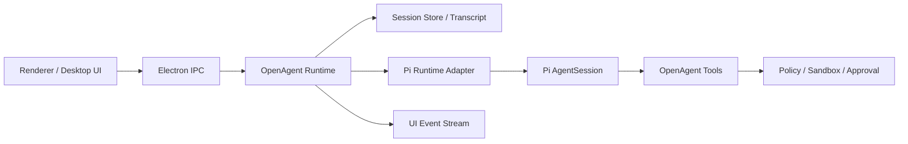
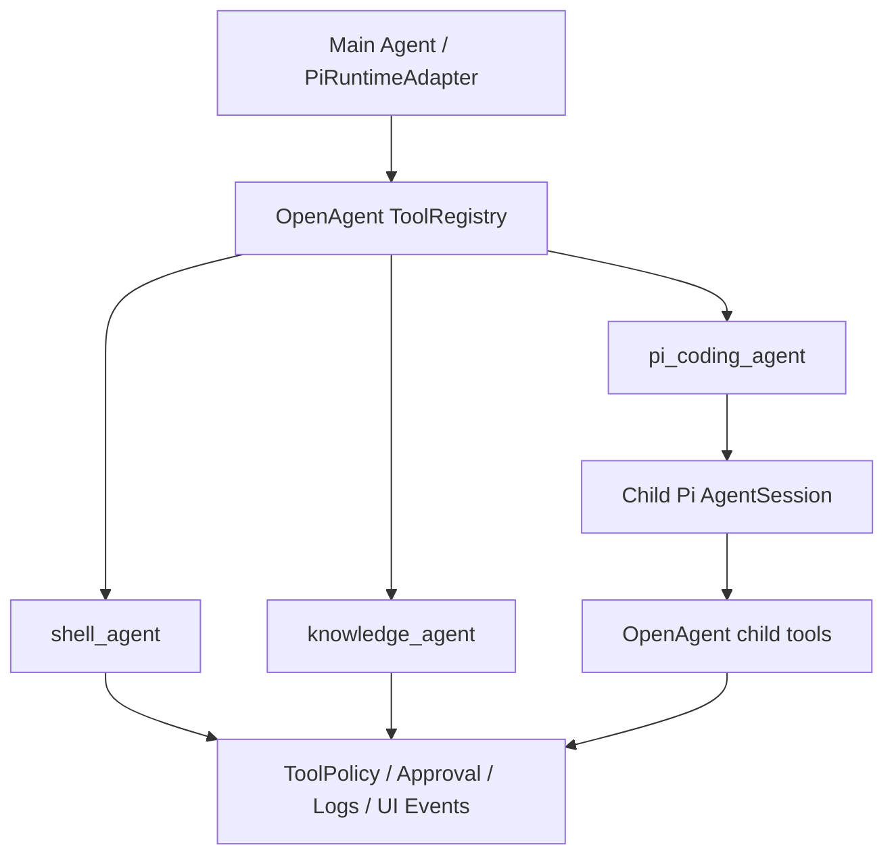
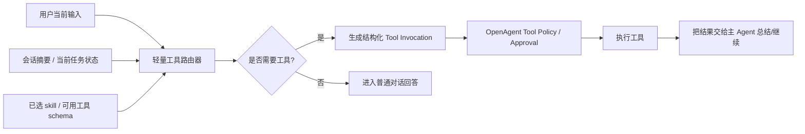

# Pi Agent 集成开发指导

> 目标：参照 OpenClaw 的 Pi 集成方式，为 OpenAgent 设计一层可落地、可替换、可观测的 agent runtime。本文是开发路线文档，不代表当前代码已经全部实现。

## 1. 参考结论

OpenClaw 的关键做法不是把 `pi` 当成外部 CLI 子进程来调用，而是把 Pi SDK 嵌入到应用运行时中：

- 使用 `@mariozechner/pi-coding-agent` 提供的 `createAgentSession()` 创建 `AgentSession`。
- 使用 `SessionManager` 管理 JSONL transcript、历史、分支和压缩。
- 由应用自己的 Gateway / Runtime 负责：会话路由、工具注入、权限策略、事件转发、UI 状态同步。
- Pi 负责核心 agent loop：LLM 调用、tool call、streaming、turn 生命周期。

OpenAgent 应采用同样的方向：**不要先做 Pi CLI 包壳；优先做 Embedded Pi Runtime Adapter**。

## 2. OpenAgent 中的目标分层



### 2.1 UI 层

职责：

- 提交 prompt、附件、模型选择、skill 选择。
- 展示 message、reasoning、tool call、approval、patch、run log。
- 不直接了解 Pi SDK 细节。

当前 OpenAgent 已有的 `desktopApi.sendPrompt()` / `onUiEvent()` 可以继续作为边界。

### 2.2 Runtime 层

职责：

- 接收 UI 请求并创建一次 run。
- 生成 `runId`、定位 `threadId`、解析当前 agent、workspace、provider、model。
- 决定本轮允许哪些 tools、skills、MCP、sandbox、审批策略。
- 调用 Pi Runtime Adapter。
- 把 Adapter 事件转换成 OpenAgent UI 事件。

建议新增目录：

```text
src/main/runtime/
├── runtime-service.ts          # prompt/run 总入口
├── run-state.ts                # active run、取消、状态机
├── event-bus.ts                # 统一 UI 事件分发
├── session-store.ts            # thread/session 文件定位与元数据
├── subagents/                  # shell_agent / knowledge_agent / pi_coding_agent
└── pi/
    ├── pi-runtime-adapter.ts   # OpenAgent -> Pi 的主适配层
    ├── pi-session.ts           # createAgentSession / SessionManager
    ├── pi-events.ts            # Pi events -> OpenAgent UiEvent
    ├── pi-tools.ts             # OpenAgent tools -> Pi ToolDefinition
    ├── pi-system-prompt.ts     # 系统提示词构建
    ├── pi-model.ts             # provider/model/auth 解析
    └── pi-errors.ts            # failover、abort、context overflow 分类
```

## 3. Runtime Adapter 契约

先定义 OpenAgent 自己的运行时契约，避免业务层直接依赖 Pi 类型。

```ts
export interface AgentRuntimeRunInput {
  runId: string;
  threadId: string;
  agentId: string;
  workspaceRoot: string;
  sessionFile: string;
  prompt: string;
  attachments?: PromptAttachmentDescriptor[];
  providerId: string;
  model: string;
  systemPrompt: string;
  tools: OpenAgentTool[];
  abortSignal: AbortSignal;
}

export interface AgentRuntimeRunResult {
  status: 'completed' | 'cancelled' | 'failed';
  summary?: string;
  error?: string;
}

export interface AgentRuntimeAdapter {
  run(input: AgentRuntimeRunInput): Promise<AgentRuntimeRunResult>;
  compact?(input: { threadId: string; sessionFile: string }): Promise<void>;
}
```

Pi 只是该接口的一个实现：`PiRuntimeAdapter`。以后如果要接 Codex、Claude Code、OpenAI Responses 原生 loop，也不会污染 UI 和业务状态机。

## 4. Pi Session 创建流程

OpenAgent 的 `PiRuntimeAdapter.run()` 建议流程：

1. 解析 `workspaceRoot`，确保只落在当前 agent workspace 或用户授权路径内。
2. 打开或创建当前 thread 对应的 `sessionFile`。
3. 初始化 Pi 的：
   - `SessionManager`
   - `SettingsManager`
   - `DefaultResourceLoader`
   - `AuthStorage`
   - `ModelRegistry`
4. 构建 OpenAgent 自己的 tools，并适配为 Pi `ToolDefinition`。
5. 调用 `createAgentSession()`。
6. 覆盖/追加系统提示词。
7. 订阅 Pi session 事件。
8. 调用 `session.prompt(prompt, { images })`。
9. 在完成、取消或失败时清理订阅和 active run 状态。

伪代码：

```ts
const sessionManager = SessionManager.open(input.sessionFile);
const resourceLoader = new DefaultResourceLoader({
  cwd: input.workspaceRoot,
  agentDir,
  settingsManager,
  additionalExtensionPaths,
});
await resourceLoader.reload();

const { session } = await createAgentSession({
  cwd: input.workspaceRoot,
  agentDir,
  authStorage,
  modelRegistry,
  model,
  tools: [],
  customTools: toPiToolDefinitions(input.tools),
  sessionManager,
  settingsManager,
  resourceLoader,
});

applySystemPromptOverrideToSession(session, input.systemPrompt);
subscribePiEvents(session, openAgentEventBus, input.runId);
await session.prompt(input.prompt, { images });
```

## 5. Tool 策略

参考 OpenClaw，OpenAgent 不应直接暴露 Pi 默认工具，而应该统一走自己的工具策略：

1. 基础工具：read、write、edit、shell、apply_patch。
2. OpenAgent 工具：workspace、git、browser、plugin、memory、task、approval。
3. MCP 工具：由已启用插件或 MCP server 注入。
4. 策略过滤：根据 agent、workspace、sandbox、审批要求过滤。
5. Schema 归一化：对不同 provider 的 tool schema 兼容做清洗。
6. Abort 包装：所有长任务都必须尊重 `AbortSignal`。

建议默认：

- `tools: []`
- `customTools: toPiToolDefinitions(openAgentTools)`

也就是**完全由 OpenAgent 管理工具集合**，不要混用 Pi 内置工具和 OpenAgent 工具，避免权限绕过和 UI 状态不可控。

当前 OpenAgent 对 Pi 的工具接入规则：

- Pi `tools` 必须传空数组，避免默认启用 Pi 内置 `read/bash/edit/write` 或同名内置工具。
- OpenAgent 工具只通过 `customTools: toPiToolDefinitions(openAgentTools)` 注入。
- 创建 session 后显式 `setActiveToolsByName(openAgentTools.map(name))`，确保 `shell_agent`、`knowledge_agent`、`write_file` 这类非 Pi 内置工具也处于 active 状态。
- `shell_agent` 只做只读命令型文件任务，例如 count/find/find-containing；不得承担写文件。
- 写文件统一使用 `write_file`，实际执行仍走 `ToolExecutor -> ToolPolicy -> Approval -> fs.writeFile`。
- 需要“写程序并执行程序完成任务”时，先用 `write_file` 写脚本/源文件，再用 `shell_exec` 执行；`shell_exec` 必须走审批、日志和 UI event。

### 5.1 子 Agent 与 Pi Coding Agent

OpenAgent 的子 agent 位于 runtime `subagents/` 层，和 Pi 主 runtime adapter 是不同边界：

- `shell_agent`：确定性只读 fast path，内部不是 Pi，只负责文件统计、文件查找、文件名+内容查找。
- `knowledge_agent`：知识库能力入口，内部使用 OpenAgent `KnowledgeService`。
- `pi_coding_agent`：计划新增的通用执行型子 agent，内部使用子级 Pi `AgentSession`，负责写代码、写脚本、运行脚本、调用 API、生成复杂产物和根据失败迭代修复。

三者是同层并列关系，不应把 `shell_agent` 当成 Pi Coding 的替代品，也不应把所有确定性搜索任务都交给 Pi Coding。



`pi_coding_agent` 的关键约束：

1. 子 Pi session 仍然传 `tools: []`，只能通过 `customTools` 使用 OpenAgent tools。
2. 子 agent 可用 tools 初版建议限制为 `read`、`grep`、`find`、`write_file`、`shell_exec`。
3. 子 agent tools 不包含 `pi_coding_agent` 本身，避免递归。
4. 子 agent 的 `write_file`、`shell_exec`、依赖安装、外部路径写入仍必须走 OpenAgent `ToolPolicy` 和审批。
5. 父 run 停止时，子 Pi session 和其内部工具执行必须随 `AbortSignal` 一起停止。
6. 子 agent 的日志和 UI event 必须带 `subagentId` / `parentToolCallId`，便于审计。
7. 子 agent 由 `SubagentService` 统一注册和调用，`pi_coding_agent` 不应绕开该层单独实例化。
8. `workingDirectory`、`maxIterations` 等执行参数必须在 runtime 层生效，不能只依赖提示词约束。

详细职责边界和开发计划见 `docs/subagents.md`。

### 5.2 伪 tool_call 保护

OpenAgent 只承认 provider / Pi runtime 产生的结构化工具调用事件。模型在普通文本里输出的内容，例如：

```text
call:find{pattern:<|"|>src/main/runtime/planning/*<|"|>}<tool_call|>
<|tool_call>call:ls{path:<|"|>..<|"|>}<tool_call|>
```

都属于 **未解析的伪工具调用文本**，不是已经执行的工具调用。

处理规则：

- 文本工具调用恢复只允许作为兼容兜底，不能绕过 ToolPolicy、审批、审计、timeout、AbortSignal 或 UI event。
- 默认允许对已注册 OpenAgent tool 做一次受控恢复，以兼容缺少结构化 tool calling 的模型；如需强制禁用，可设置 `OPENAGENT_ALLOW_TEXT_TOOL_RECOVERY=0`。恢复失败或被 policy 拒绝时，仍应记录 `unparsed_tool_call` 并失败返回。
- 如果最终 assistant 文本本身像伪工具调用，runtime 必须把本轮标记为失败或阻塞，而不是把伪语法展示成正常回答；即使此前已经有其他结构化 tool result（例如先成功 `write_file`，最后又吐出伪 `shell_exec`）也不能放行。
- run log 需要记录 `unparsed_tool_call` 诊断信息，包括 `runId`、`threadId`、模型、文本摘要和是否存在真实 tool results。
- UI 应展示可理解错误，例如“模型返回了未解析的工具调用文本，工具未执行”，而不是展示原始 `call:xxx...<tool_call|>`。
- 根本修复应优先切换/配置支持 tool calling 的模型，或修正 Pi/provider 的结构化 tool-call 适配；不得把伪文本当作授权执行入口。

### 5.3 Tool calling 提示词与 schema 强化

目标不是堆叠更长的提示词，而是让模型在进入任务前先看到短、硬、无反例污染的工具调用契约，并让 prompt、tool schema、失败修复提示保持一致。

#### 5.3.1 Prompt 分层顺序

OpenAgent 构建给 Pi AgentSession 的 system prompt 时，建议按下面顺序组织：

1. **Tool Calling Contract**：结构化工具调用硬契约，必须放在最前。
2. **Tool Selection Rules**：把常见任务映射到明确 tool。
3. **Runtime Safety / Policy**：审批、sandbox、不要假装执行等安全边界。
4. **Current Task Context**：`agentId`、`workspaceRoot`、当前附件、当前用户任务。
5. **Skill / Plugin / Knowledge Context**：只放相关摘要，不全量注入。
6. **Plan Mode Context**：plan 是执行指导，不是 tool call 的替代品。
7. **Identity / User Preference / Memory**：SOUL、USER、MEMORY 放在工具契约之后。
8. **Final Metadata Rules**：只约束最终回答，不干扰 tool-call-only turn。

#### 5.3.2 Tool Calling Contract

建议在 system prompt 顶部加入独立英文契约，减少模型把工具调用写成普通文本：

```text
Tool Calling Contract:
- If the next action requires reading files, listing directories, running scripts, writing files, invoking a skill, or delegating to a subagent, use a real structured tool call.
- Never write tool calls as normal assistant text.
- Do not output pseudo tool syntax, provider protocol markers, XML/ChatML markers, markdown code blocks, or template placeholders as a substitute for a tool call.
- Tool arguments must be plain JSON-compatible values matching the exposed tool schema.
- If you decide to call a tool, the assistant turn should contain the structured tool call directly, without explanation before it.
- After a tool failure, inspect the tool result and either repair the arguments once or explain the blocker. Do not repeat the same invalid call.
```

#### 5.3.3 Tool Selection Rules

工具选择规则应表格化或列表化，避免模型从长段文字里推断：

```text
Tool Selection Rules:
- List files/directories: use ls or list_directory.
- Read text file: use read or read_file.
- Find files by name/glob: use find.
- Search text content: use grep.
- Count files deterministically: use shell_agent with operation=count_files and extension.
- Write text files: use write_file.
- Run local commands or scripts: use shell_exec.
- Execute a declared skill script: use skill_script.
- Multi-step code/write/run/fix workflows: use pi_coding_agent.
- Knowledge search/query/ingest: use knowledge_agent.
```

#### 5.3.4 减少反例污染

不要在主提示词里展示完整坏格式，例如伪 `call` 语法、provider marker、ChatML/tool marker。即便语义是“不要这样做”，弱模型也可能模仿这些 token。

主提示词只写抽象禁止规则：

```text
Never include pseudo tool-call syntax or provider protocol markers in normal text.
```

完整坏样例只应进入日志、诊断和 UI 错误摘要，不要回灌到后续模型上下文。

#### 5.3.5 `skill_script` schema 与提示词对齐

`skill_script` 是高价值执行入口，不应为了“让模型重试”而放宽 schema。否则 prompt 说严格、schema 说随便，会削弱结构化 tool call 约束。

建议保持：

```json
{
  "required": ["skillName", "scriptPath"],
  "additionalProperties": false
}
```

对应提示词可以只强调：

```text
For skill_script:
- Use only when the script is declared in the current relevant skill context.
- Required arguments: skillName, scriptPath.
- Optional arguments: args, cwd, timeoutMs.
- Do not invent additional argument keys.
- Do not call skill_script if skillName or scriptPath is unknown; call skill_load first if available.
```

补充约束：

- 如果 selected skill 声明了 `skill.json.scripts[]`，runtime 可以把 `skill_script` 作为隐式可用工具暴露，即使旧包漏写 `allowedTools: ["skill_script"]`；但具体 `scriptPath` 仍必须命中声明列表。
- `dependencies.pip` / legacy `pipDependencies` 属于 `skill_script` 的执行前置条件。缺 Python 包时，安装应由 `skill_script` preflight 在同一次审批/audit 下完成，不能让主模型改成普通文本命令或绕到 `pi_coding_agent` 手工安装。

#### 5.3.6 Repair prompt 极简化

工具参数失败后的修复提示不要回显坏参数、provider marker 或超长 schema。建议只给一次极简修复指令：

```text
The previous structured tool call had invalid arguments.
Retry once using a real structured tool call.

Tool: <toolName>
Required arguments:
- <field>: <type>

Do not include explanation text before the tool call.
Do not reuse invalid markers or placeholder tokens.
```

如果已经修复过一次仍失败，应停止重试并向用户暴露可理解错误；不要把坏参数继续喂给模型。

### 5.4 工具调用上下文瘦身

工具调用决策不应默认依赖完整历史会话。完整 transcript 适合主 Agent 做连续对话、总结和最终回答，但对 tool call 来说会带来旧工具调用污染、过期参数干扰和更高的伪工具调用概率。

OpenAgent 的默认原则是：

- **当前用户输入是工具意图和参数的第一来源**：如果用户本轮已经给出命令、参数、文件路径或 skill 选择，runtime 应让模型围绕本轮输入生成结构化 tool call。
- **历史只做消歧，不做默认拼接**：只有用户本轮明显依赖上文（例如“继续”“按刚才那个”“把它改成”）时，才把最近会话注入工具调用上下文。
- **用状态替代长历史**：plan、selected skill、allowed tools、workspace、附件路径、最近 tool result 摘要应以短结构化块传入，而不是把完整聊天记录拼给模型。
- **工具执行仍由 OpenAgent runtime 决策和治理**：即使走最小上下文，也必须经过 ToolRegistry、ToolPolicy、Approval、日志、UI event 和 AbortSignal。

推荐 prompt 结构：

```text
<openagent-tool-routing-context>
Tool routing mode: minimal.
Use the current user prompt plus runtime state as the source of truth for tool intent and arguments.
Do not infer tool arguments from older transcript unless the current prompt explicitly refers to prior context.
</openagent-tool-routing-context>

<openagent-current-attachments>...</openagent-current-attachments>
<user-prompt>...</user-prompt>
```

实现约束：

1. 对明确的执行型任务、selected skill 运行和 Plan execute 步骤，优先使用最小工具上下文。
2. 对“继续/刚才/那个/它”等依赖上文的省略表达，保留最近会话上下文，避免误执行。
3. Pi session 的历史 replay 也应与 prompt 注入策略一致：最小工具上下文运行使用当前 run 独立的 Pi session replay 文件，避免旧 assistant 伪 tool 文本和旧工具参数影响本轮 tool call。
4. 最小上下文不是绕过记忆/知识库：SOUL、USER、相关 MEMORY、相关 knowledge、selected skill 摘要仍可按需注入 system prompt，但不能全量注入 transcript。
5. 如果最小上下文导致信息不足，模型应先提澄清问题，或调用只读工具获取当前事实；不要从旧历史猜测路径、账号、收件人、命令参数等高风险信息。

### 5.5 轻量 Tool Invocation 阶段

5.4 的“最小工具上下文”只解决了旧 transcript 污染问题；它不等于真正的轻量工具路由。selected skill、Plan execute 或明确执行型任务进入工具调用时，应增加一个独立的 Tool Invocation 阶段，把“要不要调工具、调哪个工具、参数是什么”从主 Agent 长上下文中拆出来。

目标流程：



#### 5.5.1 与当前主 Agent prompt 的边界

当前 selected skill 运行已经会过滤 tool surface，但如果仍把完整 SOUL、USER、MEMORY、Relevant skills、Active plan、完整 `SKILL.md`、tool schema 和上轮失败参数全部放进同一个 Pi request，模型仍可能在长上下文中产生 provider marker、伪 tool call 或旧参数复制。

轻量 Tool Invocation 阶段应只接收：

- 当前用户输入原文。
- 必要的短任务状态，例如 `planId`、当前 step、workspaceRoot、附件路径摘要。
- 已选 skill 的最小结构化信息：`skillName`、declared scripts/resources、默认目标 root。
- 本轮可用工具的最小 schema；如果已确定唯一工具，只暴露这一个工具。
- 最近一次 tool result 的短摘要；不得原样回灌包含 provider marker、坏 JSON、伪 tool-call 文本的失败参数。

轻量 Tool Invocation 阶段不应接收：

- 完整 SOUL.md / USER.md / MEMORY.md 原文。
- 无关 skill 列表或完整 skill 文档。
- 旧 assistant tool_calls 的完整 replay。
- 上一次 malformed arguments 原文，尤其是 `<|...|>`、`<tool_call|>`、ChatML/tool marker。
- 最终回答 metadata 规则；这些只属于主 Agent 总结阶段。

#### 5.5.2 selected skill 的确定性补全

当 runtime 已经确定 `selectedSkill` 时，不应再让模型自由拼完整 skill 调用。应由 runtime 固定或补全已知字段：

- `skillName`：来自 selected skill。
- `scriptPath`：如果 selected skill 只有一个 declared script，或当前 plan step 明确对应某个 declared script，由 runtime 直接填充。
- `cwd`：默认 workspaceRoot，除非用户本轮明确指定。

模型只负责提供仍需语义判断的业务变量，例如：

- 新 skill 的 display name / slug。
- 输入目录、输出文件名等用户任务参数。
- 是否需要先 `skill_load` / `skill_resource` 补充模板。

如果 `skillName` 和 `scriptPath` 都已确定，Tool Invocation 请求可以退化为一个窄 schema：

```json
{
  "action": "call_tool",
  "toolName": "skill_script",
  "args": ["<business-arg-1>", "<business-arg-2>"],
  "cwd": "."
}
```

runtime 再把它组装成真正的 RuntimeTool 调用：

```json
{
  "skillName": "skill-creator",
  "scriptPath": "scripts/init_skill.mjs",
  "args": ["/Users/guolimin/.openagent/agents/main/skills/merge-test"]
}
```

这样可以减少模型在长 JSON 字符串里生成 `skillName`、`scriptPath`、绝对路径和 provider quote marker 的机会。

#### 5.5.3 `skill-creator` 快路径

`skill-creator` 是最适合走轻量 Tool Invocation 的特殊场景。创建新 skill 时 runtime 通常已经知道：

- selected skill：`skill-creator`。
- scaffold script：`scripts/init_skill.mjs`。
- 默认目标根：`~/.openagent/agents/<agentId>/skills/<skill-slug>/`。

因此第一步 scaffold 不应把完整主 Agent prompt 交给模型生成完整 `skill_script` 参数。推荐：

1. runtime 根据用户输入解析或让轻量路由器生成 `displayName`、`slug`、`purpose`。
2. runtime 计算目标目录，并做 allowed skill root 校验。
3. runtime 构造标准 `skill_script(skillName=skill-creator, scriptPath=scripts/init_skill.mjs, args=[targetDir])`。
4. ToolPolicy / Approval 正常执行。
5. 脚手架完成后，再由主 Agent 或后续轻量阶段补写 `SKILL.md`、`skill.json` 和 `scripts/`。

如果用户输入里缺少必要信息（例如 skill 名称、目标 scope、风险级别），轻量路由器应输出澄清问题，而不是从旧历史或 MEMORY 中猜测。

#### 5.5.4 失败处理与污染隔离

Tool Invocation 阶段检测到 malformed arguments、provider marker 或 schema validation 失败时，应按下面顺序处理：

1. 如果字段可由 runtime 从 selected skill / declared script / plan state 安全补全，则 runtime 补全，不把坏参数回灌给模型。
2. 如果缺的是业务参数，返回短澄清问题。
3. 如果模型输出包含 provider marker，记录完整原文到日志，但传给下一轮模型的只是一句短摘要，例如：`previous tool arguments contained provider markers and were discarded`。
4. 同一工具同一 run 只允许一次 repair；再次失败则停止工具循环并向用户说明模型工具调用格式不稳定。

不得把下面内容继续作为 assistant/tool 历史喂给模型：

```text
<|tool_call>call:skill_script{args:[<|"|><|"|>]}<tool_call|>
```

也不得把完整 malformed JSON 原样放进 repair prompt。

#### 5.5.5 落地验收标准

实现轻量 Tool Invocation 后，至少用 `skill-creator` 创建新 skill 的场景验证：

- 发给 provider 的 Tool Invocation request 不包含完整 SOUL/USER/MEMORY、完整所有 skill 列表、完整 `SKILL.md` 或最终 metadata 规则。
- 当 selected skill 为 `skill-creator` 且 declared script 唯一时，模型不需要生成 `skillName` 和 `scriptPath`。
- malformed tool-call 参数不会被原样回灌到下一轮 request。
- `pi_coding_agent` 仍被 policy 阻止绕过 `skill-creator`。
- `skill_script` 执行仍走 ToolPolicy、Approval、audit log、UI event 和 AbortSignal。

## 6. Tool Adapter 约定

OpenAgent 自己的工具接口建议保持稳定：

```ts
export interface OpenAgentTool {
  name: string;
  label?: string;
  description: string;
  parameters: unknown;
  execute(args: {
    toolCallId: string;
    input: unknown;
    signal: AbortSignal;
    onUpdate?: (update: unknown) => void;
  }): Promise<unknown>;
}
```

转换到 Pi：

```ts
function toPiToolDefinitions(tools: OpenAgentTool[]): ToolDefinition[] {
  return tools.map((tool) => ({
    name: tool.name,
    label: tool.label ?? tool.name,
    description: tool.description,
    parameters: tool.parameters,
    execute: async (toolCallId, params, onUpdate, _ctx, signal) => {
      return tool.execute({
        toolCallId,
        input: params,
        signal,
        onUpdate,
      });
    },
  }));
}
```

## 7. System Prompt 构建

系统提示词不要散落在代码里。建议独立 `pi-system-prompt.ts`，由结构化 section 拼装：

- OpenAgent identity
- 当前 agent / thread / workspace
- 工具调用规范
- 文件编辑规范
- shell / git / approval 安全规则
- skills 摘要
- enabled plugins 摘要
- MCP tools 摘要
- memory 摘要
- 当前 run metadata
- 附加用户配置 prompt

注意：

- skills 不应全量无脑注入；只注入 enabled + loaded + 当前任务相关摘要。
- 大段 docs / memory 走检索或按需加载，不放进每轮系统 prompt。
- 子 agent / 后台任务应使用 minimal prompt。

## 8. Session / Memory / Compaction

建议文件布局：

```text
~/.openagent/
├── agents/
│   └── <agentId>/
│       ├── workspace/
│       ├── sessions/
│       │   ├── sessions.json
│       │   └── <threadId>.jsonl
│       ├── MEMORY.md
│       ├── USER.md
│       └── skills/
├── settings/
│   ├── openagent-settings.json
│   ├── pi-model-config.json
│   ├── pi-models.json
│   └── pi-auth.json
└── logs/
```

规则：

- `threadId` 对应一个 transcript JSONL。
- `sessions.json` 保存 thread/session 元数据映射。
- Pi 的 `SessionManager` 负责 JSONL transcript 读写。
- OpenAgent 自己维护 thread list、title、updatedAt、runCount 等 UI 元数据。
- compaction 先做手动入口，再接自动 context overflow 触发。

## 9. Event 映射

Pi 事件需要转换为 OpenAgent UI 事件：

| Pi 事件 | OpenAgent 事件 |
| --- | --- |
| `agent_start` / `turn_start` | `run.started` / `plan.updated` |
| `message_update` | `message.delta` 或本地聚合后 `message.completed` |
| `tool_execution_start` | `tool.started` |
| `tool_execution_update` | `tool.updated` / `terminal.delta` |
| `tool_execution_end` | `tool.completed` / `tool.failed` |
| `compaction_start` | `memory.updated` 或 `run-log` |
| `agent_end` / `turn_end` | `run.completed` |

当前 `UiEvent` 类型如果不够，需要补充 delta 类事件，而不是把所有 streaming 都塞进最终 message。

## 10. Auth / Model Resolution

OpenAgent 不要把 provider/model 解析写死在 Pi Adapter 中。

建议：

- `settings/openagent-settings.json` 保存 OpenAgent 应用级设置，例如 runtime 兼容开关。
- `settings/pi-model-config.json` 保存当前 provider/model 选择。
- `settings/pi-models.json` 保存 provider、baseUrl、apiKey 引用、defaultModel 与模型目录。
- `model-config-store.ts` 负责读写配置。
- `pi-model.ts` 只负责把 OpenAgent provider config 转为 Pi 的 `AuthStorage` + `ModelRegistry` + `Model`。
- 支持 provider fallback，但第一期可以只做单 provider 明确失败。

第一期目标：

- Pi ModelRegistry 作为默认模型目录和 provider 选择来源
- Pi AuthStorage 作为默认认证来源，OpenAgent 仅提供 `~/.openagent/settings/pi-auth.json` 路径与环境变量注入
- local demo 仅作为显式 `OPENAGENT_RUNTIME_ENGINE=local-demo` 的调试 fallback

## 11. Sandbox / Approval

Pi 工具执行前必须经过 OpenAgent policy：

- workspace read：默认允许当前 workspace。
- workspace write：允许但需要记录 patch。
- shell：高风险命令需要 approval。
- git：创建分支、切换分支、push、reset 等需要明确策略。
- external path：默认要求 approval 或通过 shell 安全边界处理。
- destructive action：默认 approval。

不要让 Pi 默认工具绕过这些策略。

## 12. 开发里程碑

### M1：文档和边界

- 确定 Runtime Adapter 接口。
- 新增 session 文件布局。
- 明确 UI event 类型。
- 保留当前 local-demo runtime。

### M2：最小 Pi Run

- 安装 Pi SDK 依赖。
- 实现 `PiRuntimeAdapter.run()`。
- 只接文本 prompt。
- 只接 read-only 工具或无工具。
- UI 能看到 assistant 最终回复。

### M3：Streaming 和 Tool Events

- 接入 message delta。
- 接入 tool start/update/end。
- 接入 run cancel。
- run log 可定位错误。

### M4：OpenAgent Tools

- read/write/edit/shell 走 OpenAgent tool policy。
- 支持 approval。
- 支持 patch 展示。

### M5：Skills / Plugins / MCP

- enabled plugin skills 进入 system prompt 摘要。
- MCP tools 转 OpenAgent tools，再转 Pi tools。
- schema normalization。

### M6：Session / Compaction / Memory

- JSONL transcript 持久化。
- thread 选择恢复上下文。
- 手动 compaction。
- memory 摘要按需注入。

## 13. 暂不做的事情

- 不先实现多平台 Gateway，如 WhatsApp/Slack/Telegram。
- 不先做 channel-specific action tools。
- 不直接复制 OpenClaw 的所有 tool 和 sandbox 目录结构。
- 不让 UI 直接依赖 Pi SDK 类型。
- 不把 skills、memory、docs 全量塞入每轮 prompt。

## 14. 参考资料

- OpenClaw Pi Integration Architecture: <https://github.com/openclaw/openclaw/blob/main/docs/pi.md>
- OpenClaw Architecture Concepts: <https://github.com/openclaw/openclaw/blob/main/docs/concepts/architecture.md>
