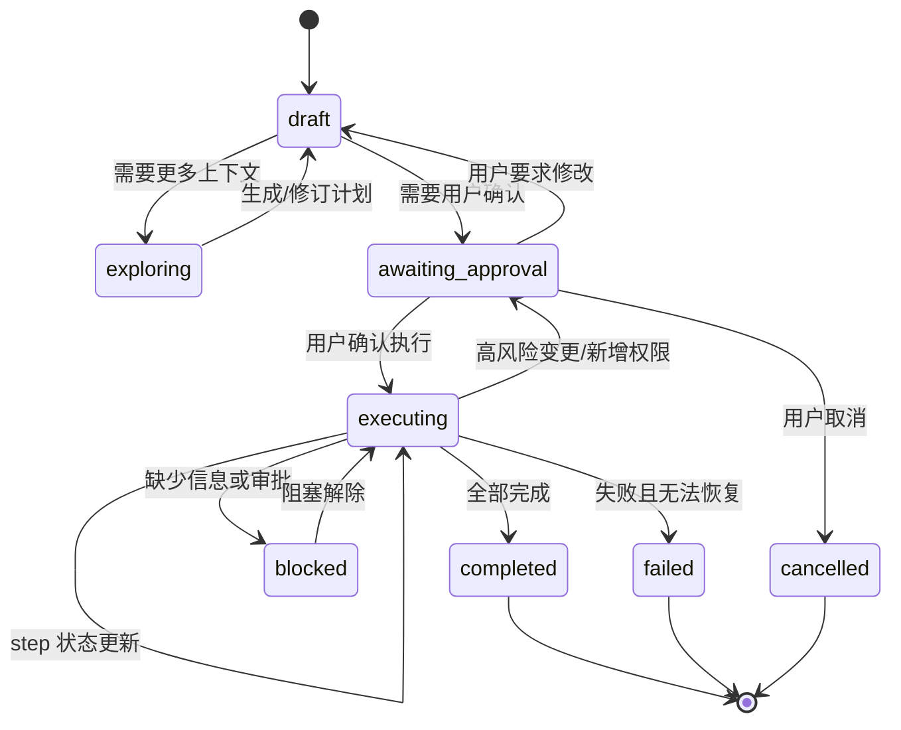

# Agent Plan Mode 设计与实现计划

> 本文定义 OpenAgent 的完整 Agent Plan Mode。它不是当前 UI 里的 `plan.updated` 进度条，而是 runtime 级别的“先规划、再确认、再执行、可恢复”的工作模式。

## 1. 背景与结论

当前 OpenAgent 已有 `plan.updated` UI 事件，用于展示一次 run 的运行进度，例如：

- 构建运行上下文
- 启动 agent loop
- 调用模型并等待返回
- 保存 transcript

这类 plan 本质是 **runtime progress**，回答的是“这次运行走到哪里了”。

完整 Agent Plan Mode 要回答的是：

> 为完成用户目标，Agent 准备做什么、按什么顺序做、每步是否需要权限、执行到哪里、是否需要调整计划。

因此 Plan Mode 应落在 **OpenAgent runtime 层**，由 OpenAgent 管理状态、审批、工具权限、日志和持久化；Pi 只作为可替换的 agent execution adapter，不直接拥有 OpenAgent 的 plan 状态。

## 2. 目标

Agent Plan Mode 的目标：

1. **只读规划**：在计划阶段允许读取、搜索、分析，默认禁止写文件、执行高风险 shell、git commit/push 等动作。
2. **结构化计划**：计划必须是 runtime 可识别的数据结构，而不是普通 Markdown 文本。
3. **用户确认**：高影响任务默认先生成 draft plan，等待用户确认后再执行。
4. **分步执行**：执行阶段按 step 更新状态、结果、失败原因和关联日志。
5. **动态调整**：执行中发现新情况时允许追加、跳过、重排或阻塞 step；高风险调整需要再次确认。
6. **可恢复**：计划和状态落盘，应用重启或 thread 恢复后能继续展示和追踪。
7. **工具权限约束**：当前 mode 和当前 step 会影响 ToolPolicy 的允许工具集合与审批要求。
8. **UI 可观测**：renderer 只消费事件，不直接理解 Pi 或 runtime 内部实现。

## 3. 非目标

第一版不做：

- 不复制 Pi 示例 plan-mode 的 TUI 结构。
- 不把计划状态只存在 LLM 回复文本中。
- 不让 renderer 自己生成或裁决 plan。
- 不绕过 OpenAgent ToolRegistry / ToolExecutor / ToolPolicy。
- 不要求所有任务都强制进入 Plan Mode；简单问答、解释类任务可以直接回答。

## 4. 核心概念

### 4.1 Runtime Progress vs Agent Plan

| 类型 | 当前 runtime progress | Agent Plan Mode |
| --- | --- | --- |
| 关注点 | run 技术阶段 | 用户任务拆解 |
| 来源 | RuntimeService 固定阶段与日志摘要 | LLM + runtime 规则生成的结构化计划 |
| 是否可审批 | 否 | 是 |
| 是否指导工具执行 | 否 | 是 |
| 是否持久化恢复 | 不完整 | 必须支持 |
| 示例 | 调用模型、保存 transcript | 阅读文件、修改模块、运行 typecheck、总结结果 |

### 4.2 Mode

Plan Mode 至少包含两种执行模式：

```text
planning   # 只读探索、生成/修订计划
executing  # 按已确认计划执行
```

可选扩展：

```text
idle              # 没有活动计划
awaiting_approval # 等待用户确认计划或风险变更
paused            # 用户暂停或审批阻塞
```

### 4.3 Plan 生命周期



## 5. 建议目录结构

新增 runtime planning 模块：

```text
packages/planning/src/
├── plan-types.ts        # AgentPlan / AgentPlanStep / PlanMode 类型
├── plan-service.ts      # 创建、修订、确认、取消计划
├── plan-store.ts        # 持久化和恢复计划
├── plan-executor.ts     # 按 step 执行计划并更新状态
├── plan-prompts.ts      # 生成/修订计划的系统提示词和结构化输出 schema
└── plan-policy.ts       # mode/step -> tool policy 约束
```

与现有模块关系：

```text
RuntimeService
  ├── PlanService
  │   ├── PlanStore
  │   ├── PlanExecutor
  │   └── PlanPolicy
  ├── ToolRegistry
  ├── ToolExecutor
  ├── ToolPolicy
  ├── EventBus
  ├── TranscriptStore
  └── PiRuntimeAdapter
```

## 6. 数据模型草案

### 6.1 AgentPlan

```ts
export type PlanMode = 'planning' | 'executing';

export type PlanStatus =
  | 'draft'
  | 'exploring'
  | 'awaiting_approval'
  | 'executing'
  | 'blocked'
  | 'completed'
  | 'failed'
  | 'cancelled';

export interface AgentPlan {
  id: string;
  runId: string;
  threadId: string;
  agentId: string;
  goal: string;
  mode: PlanMode;
  status: PlanStatus;
  createdAt: string;
  updatedAt: string;
  approvedAt?: string;
  completedAt?: string;
  approvalRequired: boolean;
  approvalReason?: string;
  steps: AgentPlanStep[];
  revision: number;
  source: 'llm' | 'runtime' | 'user';
  riskLevel: 'low' | 'medium' | 'high';
  summary?: string;
}
```

### 6.2 AgentPlanStep

```ts
export type PlanStepStatus =
  | 'pending'
  | 'in_progress'
  | 'completed'
  | 'failed'
  | 'skipped'
  | 'blocked';

export interface AgentPlanStep {
  id: string;
  title: string;
  description?: string;
  status: PlanStepStatus;
  allowedTools?: string[];
  requiresApproval?: boolean;
  approvalReason?: string;
  riskLevel?: 'low' | 'medium' | 'high';
  startedAt?: string;
  completedAt?: string;
  resultSummary?: string;
  error?: string;
  evidence?: Array<{
    kind: 'file' | 'log' | 'tool' | 'message';
    ref: string;
    summary?: string;
  }>;
}
```

### 6.3 UI Event

现有 `plan.updated` 可以保留，但 payload 需要从“简单 steps”升级为兼容结构化 plan：

```ts
export interface PlanUpdatedPayload {
  plan: AgentPlan;
  changedStepId?: string;
  reason?: string;
}
```

建议新增事件：

```text
plan.created
plan.updated
plan.approval.required
plan.approval.resolved
plan.completed
plan.failed
```

为了兼容现有 UI，第一阶段可以继续把 `AgentPlan.steps` 投影为当前 `PlanStepItem[]`。

## 7. 持久化设计

计划文件建议落在 agent/session 目录下：

```text
~/.openagent/agents/<agentId>/sessions/plans/<threadId>/<planId>.json
```

也可以在 thread metadata 中保存 active plan 索引：

```json
{
  "threadId": "thread-welcome",
  "activePlanId": "plan-...",
  "lastPlanStatus": "executing"
}
```

要求：

- 每次状态变化都写入 `updatedAt` 和 `revision`。
- 计划状态不能只靠 transcript 重放恢复。
- transcript 可以记录计划摘要，但 JSON plan 文件是结构化事实源。
- run log 中要包含 planId / stepId，方便 UI 关联日志。

## 8. Runtime 流程

### 8.1 自动判断是否需要 Plan Mode

`RuntimeService.submitPrompt()` 收到用户输入后：

1. 先构建基础 run context。
2. `PlanService.classifyPlanningIntent(input)` 调用轻量 LLM classifier，输出结构化判断。
3. `shouldPlan=false` 的简单问答、解释、翻译、只读回答直接走现有 adapter。
4. `shouldPlan=true` 的复杂任务进入 planning，并继续由 LLM 生成结构化计划。
5. `approvalRequired=false` 的低/中风险 workspace-local 任务可以自动进入执行；`approvalRequired=true` 的高风险、外部影响或破坏性任务仍必须等待用户确认。

Intent classifier 不再依赖固定业务关键词表，而是要求 LLM 判断：

```ts
{
  shouldPlan: boolean;
  approvalRequired: boolean;
  riskLevel: 'low' | 'medium' | 'high';
  reason: string;
}
```

判断维度包括但不限于：是否多步骤、是否写文件、是否多文件输出、是否代码修改、是否删除/清理数据、是否 git/发布/外部影响、用户是否要求自动完成而不是中途确认。LLM 不可用时降级为普通 runtime 执行，不使用关键词规则强行触发 Plan Mode；后续工具级 policy/approval 仍负责具体风险拦截。

### 8.2 Planning 阶段

```text
RuntimeService
  -> PlanService.createDraftPlan()
  -> 可选只读探索：read/grep/list/context 检索
  -> PiRuntimeAdapter 生成结构化 plan JSON
  -> PlanStore.save()
  -> EventBus.emit('plan.created')
  -> 如果需要确认：进入 awaiting_approval
```

Planning 阶段工具约束：

```text
允许：read、grep、list、knowledge_search、context_build
禁止：write、edit、apply_patch、shell 写操作、git commit/push、外部写入
```

### 8.3 Approval 阶段

当计划需要用户确认时，runtime 发出：

```text
plan.approval.required
```

用户可以：

- 执行计划
- 修改计划
- 继续只读探索
- 取消计划

对应 IPC 建议：

```text
plan:approve
plan:revise
plan:continue-exploration
plan:cancel
```

### 8.4 Executing 阶段

执行阶段由 `PlanExecutor` 驱动：

```text
for step in plan.steps:
  mark step in_progress
  derive allowed tools from step + mode
  call PiRuntimeAdapter or ToolExecutor
  collect tool/log/message evidence
  mark completed/failed/blocked
  persist and emit plan.updated
```

关键原则：

- ToolExecutor 仍然是实际工具执行入口。
- PiRuntimeAdapter 可以负责每个 step 的推理和 tool call，但不能绕过 OpenAgent policy。
- 每个 step 的失败都要落到 `resultSummary` 或 `error`。
- 如果执行中发现计划不适用，先调用 `PlanService.revisePlan()`，必要时重新审批。

## 9. ToolPolicy 集成

`ToolPolicy` 需要感知当前 plan context：

```ts
export interface PlanExecutionContext {
  planId: string;
  stepId: string;
  mode: PlanMode;
  allowedTools?: string[];
  riskLevel?: 'low' | 'medium' | 'high';
}
```

策略示例：

| 场景 | 策略 |
| --- | --- |
| planning mode | 只允许 read-only 工具 |
| executing + step.allowedTools | 只允许 step 声明的工具 |
| step.requiresApproval | 工具执行前发 approval.required |
| `write_file` workspace 内新文件 | 可直接执行，但必须记录 tool/run/activity 事件 |
| `write_file` workspace 外路径 | 必须触发 `file.write` 审批 |
| `write_file` 覆盖已有文件 | 必须触发覆盖审批；未声明 `overwrite=true` 时由工具拒绝 |
| `shell_exec` 运行脚本/程序 | 必须触发 `shell.exec` 审批，并记录命令、cwd、输出摘要 |
| `pi_coding_agent` 执行编码/脚本任务 | 按 step 允许工具执行；其内部 `write_file` / `shell_exec` 仍按原工具策略审批 |
| 外部路径写入 | 无论 plan 如何都必须走审批 |
| git commit/push | 必须显式审批或用户明确要求 |
| destructive shell | 必须审批，且不能由 plan 隐式授权 |

## 10. Prompt 设计

生成计划时，不要求模型输出自然语言自由文本，而是要求结构化 JSON。

示例要求：

```text
You are creating an OpenAgent execution plan.
Return strict JSON only.
Do not execute tools that mutate files in planning mode.
Every step must be actionable and observable.
Mark steps requiring write/shell/git/external access with requiresApproval.
```

输出 schema 对齐 `AgentPlan`，然后由 runtime 校验：

- step 数量合理，避免过细或过粗。
- 不允许在 planning 计划中声明已经完成未发生的动作。
- 风险等级和 allowedTools 与 policy 规则一致。
- JSON 无法解析时降级为“需要澄清/重新生成计划”。

## 11. UI 集成

Renderer 只负责展示和触发用户动作：

- Plan 面板显示 plan goal、status、risk、steps。
- 每个 step 展示状态、结果摘要、关联日志/文件证据。
- awaiting approval 时显示操作按钮：执行、修改、继续探索、取消。
- 执行时展示当前 step 和 runtime log。

Renderer 不应该：

- 自己决定 step 是否可执行。
- 自己绕过 IPC 调工具。
- 直接 import Pi SDK 类型。

## 12. 实现阶段

### Phase 1：文档与类型骨架

- 新增 `docs/plan-mode.md`。
- 新增 `packages/planning/src/plan-types.ts`。
- 扩展 shared UI event 类型，兼容当前 `plan.updated`。
- 在 `agents.md` 中把 Plan Mode 路由到本文档。

验收：`pnpm typecheck` 通过，现有 UI 不破。

### Phase 2：PlanStore 与 runtime progress 兼容

- 新增 `PlanStore`，支持 save/load/list active plan。
- 把当前固定 `plan.updated` 包装成一个 runtime-generated plan。
- 保持现有 renderer 可继续展示 steps。

验收：普通 prompt 仍能显示进度，磁盘上能看到 plan JSON。

### Phase 3：PlanService 生成 draft plan

- 新增 `PlanService.shouldPlan()`。
- 新增 `createDraftPlan()`，调用 PiRuntimeAdapter 或轻量 LLM path 生成结构化计划。
- planning mode 下只开放只读工具。
- 支持 `awaiting_approval` 状态。

验收：复杂任务先生成计划，不直接改文件。

### Phase 4：审批 IPC 与 UI 操作

- 新增 IPC：`plan:approve`、`plan:revise`、`plan:cancel`。
- Renderer Plan 面板显示审批按钮。
- EventBus 支持 `plan.approval.required/resolved`。

验收：用户点击确认后才进入执行。

### Phase 5：PlanExecutor 分步执行

- 新增 `PlanExecutor`。
- 每个 step 执行前设置 plan context。
- ToolPolicy 根据 plan context 限制工具。
- step 完成后写 resultSummary/evidence。

验收：Plan 面板能看到真实任务步骤逐个完成。

### Phase 6：动态修订与恢复

- 支持执行中新增/跳过/阻塞 step。
- 高风险修订重新进入 approval。
- App 重启后通过 PlanStore 恢复 active plan。

验收：中断恢复后仍能显示 active plan 和 step 状态。

## 13. 第一版最小可交付范围

建议第一版不要一次做满，先实现：

1. `plan-types.ts` + `plan-store.ts`。
2. 当前 runtime progress 兼容成 `AgentPlan`。
3. `PlanService.shouldPlan()` 只做明确触发词和高风险任务判断。
4. 复杂任务只生成 draft plan 并等待用户确认。
5. 用户确认后仍走现有 `RuntimeService -> PiRuntimeAdapter -> ToolExecutor`，但附带 planId/stepId 日志。

这样可以先建立正确边界，再逐步增强分步执行。

## 14. 开发注意事项

- Plan Mode 是 OpenAgent runtime 能力，不是 Pi 专属能力。
- Pi 默认没有内置 OpenAgent 所需的 plan 状态、审批和恢复语义；可以参考 Pi extension 思路，但不要把 OpenAgent 的 plan 状态交给 Pi TUI。
- 所有工具执行必须继续走 OpenAgent ToolRegistry / ToolExecutor / ToolPolicy。
- 所有 plan 状态变化必须发 UI event 并持久化。
- 不要把用户确认计划等同于授权所有风险动作；外部路径、破坏性 shell、git push 等仍需独立安全策略。

## 15. 当前实现状态

截至当前实现，OpenAgent 已完成第一版 runtime-owned Plan Mode：

- `PlanService` 负责判断是否进入 Plan Mode、创建 draft plan、审批后进入 executing、step 状态迁移、完成/失败收尾。
- `PlanStore` 将 plan JSON 持久化到 `~/.openagent/agents/<agentId>/sessions/plans/<threadId>/<planId>.json`，并维护 active plan 索引。
- `PlanExecutor` 在 `RuntimeService` 内按 runtime 阶段推进 step：inspect -> design -> execute -> finalize。
- `RuntimeService` 会在审批通过后把 active plan 注入本轮 system prompt，让 Pi agent loop 能看到目标、步骤和执行约束。
- UI event 已支持 `plan.created`、`plan.updated`、`plan.approval.required`、`plan.approval.resolved`、`plan.completed`、`plan.failed`，并继续兼容旧的 `steps` 展示结构。

仍未完成的增强项：

- 真正由 LLM 生成细粒度业务步骤，而不是 runtime 模板步骤。
- 按每个业务 step 独立调用 agent loop 或工具执行器。
- step 级 ToolPolicy 强制约束，例如只允许当前 step 声明的工具。
- 执行中 plan revision / 重新审批。

### 15.1 本次增强：step 级工具上下文与策略入口

已补充 step 级 plan context：

- `RuntimeService` 会根据当前 in-progress step 生成 `PlanExecutionContext`。
- `PiRuntimeAdapter -> ToolExecutor -> ToolPolicy` 会携带当前 `planId`、`stepId`、`mode`、`allowedTools`、`riskLevel`。
- `ToolPolicy` 已开始强制判断当前 step 的 `allowedTools`：未被当前 step 允许的工具会被拒绝。
- planning mode 下仍强制只允许 read-only 工具。
- tool log / UI meta / approval 描述中会附带 plan context，方便追踪工具调用属于哪个 plan step。

这意味着后续 LLM 生成更细粒度 step 后，step 级工具白名单已经有 runtime 执行入口。

### 15.2 本次增强：LLM 细粒度计划生成

已补充 LLM 结构化计划生成：

- `PlanLlmGenerator` 会优先调用当前 Pi provider catalog 中的 active chat-completions endpoint 生成业务步骤。
- LLM 只返回 JSON，runtime 会校验、裁剪并归一化 step title、description、allowedTools、riskLevel、requiresApproval。
- LLM 不可用、无 API key、响应不可解析或无有效步骤时，自动回退 runtime 模板步骤。
- LLM 生成的业务步骤会作为多个 `kind: execute` step 插入到固定 runtime 阶段 `inspect -> design -> execute* -> finalize` 之间。
- 当前仍然是单次 agent loop 执行所有 execute steps；执行完成后 runtime 会统一标记这些业务步骤完成。

### 15.3 本次增强：伪 tool_call 失败保护

Plan Mode 执行阶段必须区分 **真实结构化工具调用** 和 **模型文本里吐出的伪工具调用**。

例如模型返回：

```text
call:find{pattern:<|"|>packages/planning/src/*<|"|>}<tool_call|>
```

说明 `find` 没有通过 OpenAgent `ToolExecutor` 执行。此时：

- 不把该文本保存为正常完成的助手回答。
- 不通过文本解析补执行工具调用。
- 当前 run / plan step 应进入失败或阻塞状态，并给出“模型返回未解析工具调用文本，工具未执行”的错误摘要。
- `runtime-info.log` 应记录 `unparsed_tool_call`，用于定位 provider/tool-call 协议问题。

注意这个保护不能只看本轮总 `toolResults` 是否为空。混合场景也要拦截：例如模型先真实调用 `write_file` 写出脚本，随后最终 assistant 文本又返回

```text
call:shell_exec{command:<|"|>python3 get_stock_data.py<|"|>}<tool_call|>
```

此时虽然前面已有 `write_file` 的 tool result，但最终的 `shell_exec` 仍然没有被结构化执行，run / plan step 也必须失败或阻塞，不能把这段伪语法展示给用户。

这样可以避免 Plan Mode 面板把“看似在执行”的伪语法误展示成真实进展，也避免绕过 OpenAgent 的 ToolPolicy、审批、日志和 UI event。

### 15.4 本次增强：统一 `write_file` 写文件工具

OpenAgent 已补齐统一写文件工具：

- `write_file` 是唯一面向模型暴露的普通文本文件写入工具。
- 参数为 `path`、`content`，可选 `overwrite`、`createDirs`。
- 相对路径从当前 OpenAgent workspace 解析。
- workspace 内新文件写入可以直接执行并记录 tool/run/activity 事件。
- workspace 外写入必须走 `file.write` 审批。
- 覆盖已有文件必须显式传 `overwrite=true`，且会触发覆盖审批。
- 系统目录和敏感凭证目录应由 `ToolPolicy` 直接拒绝。
- `shell_agent` 继续只承担只读命令型文件任务，不负责写文件。

Pi 侧仍只负责结构化调用；实际写入由 `ToolExecutor -> ToolPolicy -> write_file` 完成。

### 15.5 本次增强：通用程序执行能力

OpenAgent 的目标不是只支持某一种文件格式，而是支持通用的“写程序并执行程序完成任务”工作流：

1. 通过 `write_file` 写入脚本或源文件，例如 Python、Node.js、Shell 脚本。
2. 通过 `shell_exec` 在指定 `cwd` 执行脚本、本地程序或 CLI。
3. 通过 read/find/grep 或后续工具读取和验证产物。

约束：

- `shell_exec` 不绕过 OpenAgent，必须走 `ToolExecutor -> ToolPolicy -> Approval`。
- `shell_agent` 仍只做只读文件统计和检索，不能承担程序执行。
- 依赖安装、外部路径、破坏性命令、长时间命令都应在审批内容里清晰展示。
- Plan Mode 中这类 step 应声明 `shell_exec` / `shell-exec` 或 `tool-executor`，让用户能看到风险和执行边界。
- 更推荐的复杂执行路径是声明 `pi_coding_agent` / `pi-coding`，由子 agent 负责写脚本、执行、修复和汇总；详见 `docs/subagents.md`。
- 例外：如果当前 run 已有 selected skill 且该 skill 声明了匹配脚本，Plan execute step 应优先允许 `skill_script` / `skill-tools`；`skill-creator` 创建脚手架时应走 runtime 轻量 Tool Invocation 快路径，固定 `skillName` / `scriptPath`，避免在主 Agent 长 prompt 中重新生成完整工具参数。

### 15.6 本次修正：执行步骤不能被误收窄成只读

真实执行任务中，LLM 生成计划时可能把执行步骤错误标成 `knowledge` / `read-only`，导致后续 `write_file` 或 `shell_exec` 被 `ToolPolicy` 拒绝。例如获取实时股票数据时，模型需要写脚本并运行 HTTP 请求，但 plan step 却只允许只读工具。

修正策略：

- Runtime 仍保留 planning/design step 的只读限制。
- 对 `kind=execute` 的业务执行步骤，如果 LLM 没有显式给出 `write_file` / `file-write` / `shell_exec` / `shell-exec` / `tool-executor`，runtime 会自动补上 `tool-executor`。
- 对写程序、运行程序、API 获取、复杂文件生成这类任务，plan step 应优先允许 `pi_coding_agent` / `pi-coding` 或 `tool-executor`，不要只给 `knowledge` / `read-only`；但 selected skill 场景应先允许对应 skill tools，不能让 `pi_coding_agent` 绕过已选 skill 的 declared script。
- 这不是绕过审批：`shell_exec`、外部路径写入、覆盖、破坏性命令仍然由 `ToolPolicy -> Approval` 单独控制。
- 这样避免 Plan Mode 误把“需要实际执行”的任务卡在只读设计阶段，也避免模型在工具被拒后退化成伪 `call:shell_exec...<tool_call|>` 文本。
