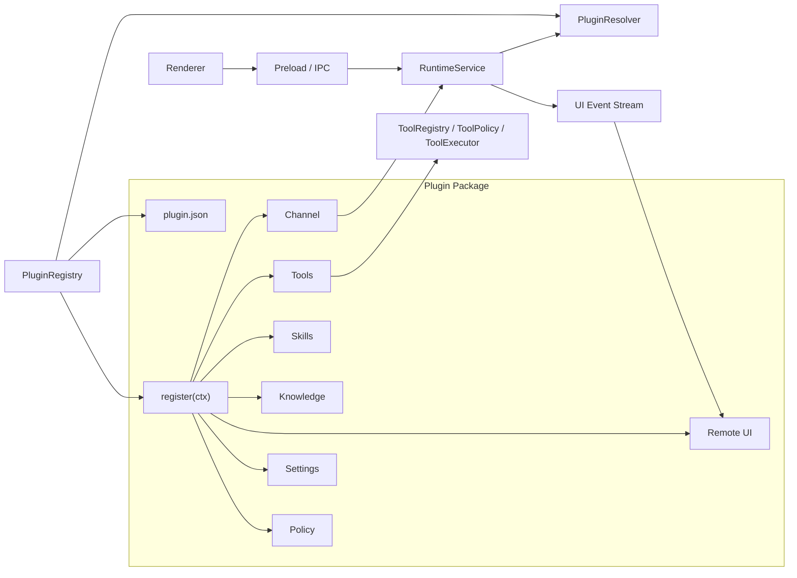
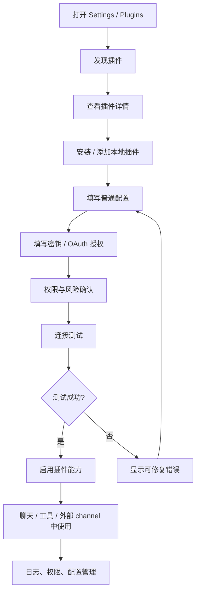
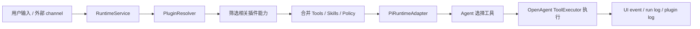

# OpenAgent Plugin System 设计

> 目标：为 OpenAgent 定义一套可扩展、可审计、可替换的插件系统，让飞书、Slack、企业微信、GitHub、Notion、MCP、本地 CLI 等外部能力以受控方式进入 OpenAgent，而不是绕过 OpenAgent runtime、approval、日志和 UI event。

## 1. 结论

OpenAgent 插件不是 agent runtime 的替代品，也不是直接接管 Pi / LLM loop 的外部包。插件只负责给 OpenAgent 增加能力：

```text
Plugin = Channel + Tools + Skills + Knowledge + Remote UI + Settings + Policy
```

核心原则：

1. **Runtime 主权在 OpenAgent**：插件不能直接调用 Pi、不能自行执行 agent loop，所有用户请求必须进入 `RuntimeService`。
2. **工具统一治理**：插件工具必须注册成 OpenAgent `RuntimeTool`，再进入 `ToolRegistry`、`ToolPolicy`、`ToolExecutor`、run log 和 UI event。
3. **能力按需启用**：插件被发现不代表启用，启用不代表每轮 prompt 注入；只有当前任务相关的 skill/tool 摘要才进入上下文。
4. **配置与密钥分离**：普通配置可以进 settings；secret 只进入安全存储，不能进入 prompt、transcript、UI event 明文或 LLM 日志。
5. **外部 UI 是投影**：飞书卡片、Slack thread 等远程 UI 只能投影 OpenAgent runtime 状态，不能成为事实源。
6. **第一版克制实现**：先支持内置插件和本地开发插件；暂不做完整插件市场、远程代码热加载或任意第三方代码沙箱。

## 2. 非目标

第一版插件系统不做：

- 不支持任意第三方 JS 代码无隔离热加载。
- 不实现插件市场、在线安装、版本升级和签名校验。
- 不允许插件绕过 OpenAgent 直接访问 Pi SDK。
- 不允许插件私自执行 shell、文件写入、外部发送或破坏性操作。
- 不把插件全部 skill、文档或工具 schema 全量塞进系统 prompt。
- 不让 renderer 直接 import 插件实现、外部 SDK 或 CLI 封装。
- 不把飞书协议、OpenClaw 插件 SDK 或某个 CLI 的参数形态反向绑定为 OpenAgent 插件标准。

## 3. 总体架构



### 3.1 分层职责

| 层 | 职责 | 不应该做的事 |
| --- | --- | --- |
| `PluginRegistry` | 发现插件、读取 manifest、加载已启用插件、保存注册结果 | 直接调用 LLM 或执行工具 |
| `PluginLoader` | 校验 manifest、加载插件入口、调用 `register(ctx)` | 让未授权插件执行任意副作用 |
| `PluginContext` | 给插件暴露受控注册和 runtime API | 暴露 Electron、Pi、Node 任意能力 |
| `PluginConfigStore` | 保存普通配置、启用状态、能力开关 | 保存 secret 明文 |
| `PluginSecretStore` | 保存 app secret、token、OAuth refresh token | 把 secret 写入日志或 prompt |
| `PluginResolver` | 为当前 run 解析 enabled/relevant skills、tools、knowledge、remote UI | 全量注入所有插件内容 |
| `RuntimeService` | 接收用户或 channel prompt，创建 run，统一触发 runtime | 感知某个插件内部协议 |
| `ToolRegistry` | 汇总 core tools 与 plugin tools | 绕过 policy 执行工具 |
| `ToolExecutor` | 包装工具执行、审批、AbortSignal、日志和 UI event | 让插件自己执行高风险动作 |
| `Remote UI Renderer` | 把 OpenAgent UI event 同步到外部平台 | 决定 runtime 状态或修改 transcript |

## 4. 插件目录与 manifest

OpenAgent 主程序只内置插件系统能力，不再把具体业务插件写死在 `apps/desktop/src/main/plugins/builtins`。
仓库随附但不进入发布包的第一方插件放在：

```text
openagent-plugins/
└── feishu-cli/
    ├── plugin.json
    └── index.mjs
```

开发态初始化会自动发现 `openagent-plugins` 下的 manifest；打包发布时该目录应排除，用户侧插件通过
`~/.openagent/plugins` 或设置页选择的插件根目录安装/加载。

推荐插件目录：

```text
plugins/
└── feishu/
    ├── plugin.json
    ├── README.md
    ├── src/
    │   ├── index.ts
    │   ├── channel/
    │   ├── tools/
    │   ├── skills/
    │   ├── knowledge/
    │   ├── remote-ui/
    │   ├── settings/
    │   └── policy/
    └── dist/
        └── index.js
```

`plugin.json` 第一版建议：

```json
{
  "schemaVersion": "openagent.plugin.v1",
  "id": "openagent-plugin-feishu",
  "name": "Feishu",
  "version": "0.1.0",
  "description": "Feishu channel, tools, and remote UI integration for OpenAgent.",
  "main": "dist/index.js",
  "capabilities": [
    "channel",
    "tools",
    "skills",
    "remote_ui",
    "settings",
    "policy"
  ],
  "configSchema": {
    "type": "object",
    "properties": {
      "enabled": { "type": "boolean", "default": false },
      "allowedChatIds": {
        "type": "array",
        "items": { "type": "string" },
        "default": []
      },
      "requireApprovalForExternalSend": {
        "type": "boolean",
        "default": true
      }
    },
    "additionalProperties": false
  },
  "secretSchema": {
    "type": "object",
    "properties": {
      "appId": { "type": "string" },
      "appSecret": { "type": "string" },
      "verificationToken": { "type": "string" },
      "encryptKey": { "type": "string" }
    },
    "additionalProperties": false
  }
}
```

manifest 只描述插件元数据、能力、入口和配置 schema；不要在 manifest 中保存 secret 值。

## 5. 能力模型

```ts
export type PluginCapability =
  | 'channel'
  | 'tools'
  | 'skills'
  | 'knowledge'
  | 'remote_ui'
  | 'settings'
  | 'policy';
```

| Capability | 作用 | 示例 |
| --- | --- | --- |
| `channel` | 接收外部消息并转成 OpenAgent prompt | 飞书、Slack、企业微信、Webhook |
| `tools` | 给 agent 增加可调用工具 | 飞书发消息、读取文档、查日历 |
| `skills` | 提供按需加载的任务说明和 prompt 片段 | 飞书多维表格分析 skill |
| `knowledge` | 接入外部知识源或知识 provider | 企业知识库、远端 wiki、MCP knowledge |
| `remote_ui` | 将 runtime 状态同步到外部 UI | 飞书交互卡片、Slack thread update |
| `settings` | 提供配置 schema 或设置页入口 | 插件开关、allowlist、默认行为 |
| `policy` | 声明工具风险、channel 权限、审批规则 | 群聊 allowlist、写操作审批 |

## 6. PluginContext

插件入口统一是 `register(ctx)`：

```ts
export interface OpenAgentPlugin {
  id: string;
  name: string;
  register(ctx: OpenAgentPluginContext): Promise<void> | void;
}
```

OpenAgent 提供受控上下文：

```ts
export interface OpenAgentPluginContext {
  pluginId: string;

  registerChannel(channel: OpenAgentChannel): void;
  registerTool(tool: RuntimeTool): void;
  registerSkill(skill: PluginSkill): void;
  registerKnowledgeProvider(provider: PluginKnowledgeProvider): void;
  registerRemoteUi(renderer: RemoteUiRenderer): void;
  registerPolicy(policy: PluginPolicy): void;

  runtime: {
    submitPrompt(input: PluginPromptInput): Promise<PluginPromptResult>;
  };

  events: {
    subscribe(listener: UiEventListener): () => void;
  };

  config: {
    get<T = unknown>(key: string): Promise<T | null>;
    set<T = unknown>(key: string, value: T): Promise<void>;
  };

  secrets: {
    get(key: string): Promise<string | null>;
    set(key: string, value: string): Promise<void>;
    delete(key: string): Promise<void>;
  };

  logger: PluginLogger;
}
```

约束：

- `ctx.runtime.submitPrompt()` 是 channel 进入 agent loop 的唯一入口。
- `ctx.secrets` 不允许返回到 renderer、prompt、transcript 或 UI event。
- `ctx.registerTool()` 注册的是 OpenAgent tool，不是 Pi tool。
- 插件可以声明 settings schema，但最终表单和保存由 OpenAgent 管理。

## 7. 用户集成插件流程

用户集成插件应该是产品化流程，而不是手动改 JSON：



### 7.1 插件中心页面

```text
Settings
└── Plugins
    ├── 已安装
    ├── 可用插件
    ├── 本地开发插件
    └── 插件运行日志
```

插件卡片展示：

- 名称、描述、版本、来源。
- 状态：未安装 / 未配置 / 待授权 / 可启用 / 已启用 / 有错误 / 已禁用。
- 能力：Channel、Tools、Skills、Knowledge、Remote UI。
- 风险等级：只读、外部发送、外部写入、需要审批。
- 最近错误和最近运行时间。

### 7.2 插件详情页

```text
插件详情
├── 基本信息
├── 能力列表
├── 配置项
├── 密钥 / 授权
├── 权限策略
├── 连接测试
└── 日志
```

启用前必须完成：

1. manifest 校验通过。
2. 普通配置通过 schema 校验。
3. 必要 secret 已存在或 OAuth 授权完成。
4. 权限策略已确认。
5. 连接测试通过或用户显式选择“先启用但标记为未验证”。

### 7.3 插件状态机

```ts
export type PluginInstallState =
  | 'discovered'
  | 'installed'
  | 'needs_config'
  | 'needs_auth'
  | 'ready'
  | 'enabled'
  | 'disabled'
  | 'error';
```

| 状态 | UI 显示 | 说明 |
| --- | --- | --- |
| `discovered` | 可安装 | 已扫描到 manifest，但未加入用户配置 |
| `installed` | 已安装，待配置 | 已记录到插件配置，但未完成配置 |
| `needs_config` | 需要配置 | 普通配置缺失或 schema 不通过 |
| `needs_auth` | 需要授权 | secret 缺失、OAuth 未完成或 token 过期 |
| `ready` | 可启用 | 已配置、已授权、测试通过 |
| `enabled` | 运行中 | 能力进入 resolver，可被当前 run 使用 |
| `disabled` | 已禁用 | 保留配置与 secret，但不参与运行 |
| `error` | 配置异常 | 加载、注册、测试或运行出现错误 |

## 8. 配置、密钥与本地数据布局

普通配置：

```text
~/.openagent/settings/plugins/<pluginId>.json
```

示例：

```json
{
  "enabled": true,
  "capabilities": {
    "channel": true,
    "tools": true,
    "remoteUi": false
  },
  "allowedChatIds": ["oc_xxx"],
  "requireApprovalForExternalSend": true
}
```

密钥逻辑路径：

```text
~/.openagent/secrets/<pluginId>/
```

实际实现优先映射到系统安全存储，例如 macOS Keychain。secret 不应写入普通 JSON、transcript、prompt、UI event 或 LLM request/response log。

插件状态与日志：

```text
~/.openagent/
├── settings/
│   └── plugins/
│       └── <pluginId>.json
├── state/
│   └── plugins/
│       └── <pluginId>/
├── logs/
│   └── plugins/
│       └── <pluginId>.log
└── secrets/
    └── <pluginId>/        # 逻辑路径；实际可映射到 keychain
```

## 9. 权限与审批模型

插件必须声明工具和 channel 行为风险：

```ts
export type PluginRiskLevel =
  | 'read'
  | 'external_send'
  | 'external_write'
  | 'destructive'
  | 'secret_access';

export interface PluginToolPolicy {
  toolName: string;
  risk: PluginRiskLevel;
  requiresApproval: boolean;
  allowlist?: string[];
  description: string;
}
```

推荐默认策略：

| 风险 | 默认策略 |
| --- | --- |
| `read` | 可允许，但仍受 channel/user/workspace 限制 |
| `external_send` | 默认需要 channel allowlist，必要时审批 |
| `external_write` | 默认审批 |
| `destructive` | 默认禁止，除非用户显式开启且逐次审批 |
| `secret_access` | 插件内部可用，不可传给模型或 UI |

用户启用插件前，需要看到明确权限：

```text
该插件将获得以下能力：

✅ 读取飞书消息
✅ 向指定飞书会话发送回复
✅ 读取飞书文档
⚠️ 修改多维表格记录：需要每次审批
⚠️ 主动发送群消息：默认关闭
```

## 10. Runtime 解析与执行流程

插件启用后，不代表每轮 prompt 都注入插件。每次 run 由 `PluginResolver` 按上下文筛选：



`ResolvedPluginContext`：

```ts
export interface ResolvedPluginContext {
  skills: PluginSkillSummary[];
  tools: RuntimeTool[];
  knowledgeProviders: PluginKnowledgeProvider[];
  remoteUiRenderers: RemoteUiRenderer[];
  policies: PluginPolicy[];
}
```

解析规则第一版可以简单：

1. 插件必须 `enabled`。
2. 对应 capability 必须打开。
3. channel 来源匹配时，优先启用该 channel 插件相关能力。
4. 用户 prompt 明确提到插件能力时启用相关 tools/skills。
5. 写操作、外部发送、destructive 行为仍由 `ToolPolicy` 决定是否审批。

后续可以把 relevance 判断接入 LLM router，但不要退回纯关键词作为唯一机制。

## 11. Channel 设计

Channel 是外部消息进入 OpenAgent 的入口，例如飞书私聊、Slack thread、Webhook。

```ts
export interface OpenAgentChannel {
  id: string;
  type: string;
  start(): Promise<void>;
  stop(): Promise<void>;
}

export interface PluginPromptInput {
  prompt: string;
  source: {
    type: 'plugin_channel';
    pluginId: string;
    channelId: string;
    externalThreadId?: string;
    externalUserId?: string;
    metadata?: Record<string, unknown>;
  };
}
```

要求：

- channel 不直接调用模型，只调用 `ctx.runtime.submitPrompt()`。
- external thread 必须映射到 OpenAgent threadId。
- channel metadata 可进入 transcript，但必须脱敏。
- channel 应写入 plugin log，方便排查外部消息是否到达。

## 12. Tools 设计

插件工具必须是 OpenAgent `RuntimeTool`：

```ts
export interface RuntimeTool {
  name: string;
  description: string;
  inputSchema: unknown;
  risk?: PluginRiskLevel;
  execute(input: unknown, ctx: RuntimeToolContext): Promise<RuntimeToolResult>;
}
```

执行约束：

- 必须支持 `AbortSignal`。
- 必须由 `ToolExecutor` 包装执行。
- 必须发出 `tool.started`、`tool.updated`、`tool.completed`、`tool.failed`。
- 外部发送、外部写入、破坏性操作必须走 approval。
- 工具结果必须做体积控制和脱敏，再返回给 agent。

## 13. Remote UI 设计

Remote UI 用于把 OpenAgent runtime 状态同步到外部平台，例如飞书交互卡片。

原则：

- Remote UI 是投影，不是事实源。
- 状态源仍是 OpenAgent run state、transcript、approval state 和 UI event。
- 外部按钮回调必须回到 OpenAgent approval/runtime API，不允许外部平台直接修改 run。

事件示例：

```text
run.started
message.delta
tool.started
tool.updated
tool.completed
tool.failed
approval.requested
approval.resolved
run.completed
run.failed
```

## 14. 与 Pi Runtime 的边界

插件与 Pi 的关系：

```text
Plugin Tool -> OpenAgent RuntimeTool -> ToolRegistry -> ToolExecutor -> Pi ToolDefinition
```

禁止：

- 插件直接调用 `createAgentSession()`。
- 插件直接构造 Pi tool 绕过 OpenAgent `ToolPolicy`。
- 插件把外部 SDK 类型泄漏到 renderer 或 `packages/shared-types/src`。
- 插件把 secret、完整外部文档或大体量工具 schema 全量塞给模型。

## 15. OpenAgent core 目录建议

```text
apps/desktop/src/main/plugins/
├── plugin-types.ts
├── plugin-manifest.ts
├── plugin-registry.ts
├── plugin-loader.ts
├── plugin-config-store.ts
├── plugin-secret-store.ts
├── plugin-context.ts
├── plugin-resolver.ts
├── plugin-policy.ts
└── plugin-test-runner.ts
```

Renderer 侧建议：

```text
apps/desktop/src/renderer/features/plugins/
├── plugins-screen.tsx
├── plugin-list.tsx
├── plugin-detail.tsx
├── plugin-config-form.tsx
├── plugin-secret-form.tsx
├── plugin-permission-panel.tsx
├── plugin-connection-test.tsx
└── plugin-log-viewer.tsx
```

IPC 建议：

```text
plugins:list
plugins:get
plugins:install-local
plugins:update-config
plugins:set-secret
plugins:test
plugins:enable
plugins:disable
plugins:get-logs
```

## 16. 生命周期

```text
discover -> validate -> install -> load -> register -> configure -> authorize -> test -> enable -> resolve -> execute -> stop
```

| 阶段 | 说明 |
| --- | --- |
| `discover` | 扫描内置插件目录和用户插件目录，读取 `plugin.json` |
| `validate` | 校验 schemaVersion、id、main、capabilities、config schema |
| `install` | 将插件加入用户配置；本地插件保存路径引用 |
| `load` | 加载入口模块，但尽量避免外部副作用 |
| `register` | 调用 `register(ctx)` 收集 channel/tool/skill/policy |
| `configure` | 用户填写普通配置 |
| `authorize` | 用户填写 secret 或完成 OAuth |
| `test` | 连接测试与权限测试 |
| `enable` | 根据用户配置启用能力 |
| `resolve` | 每个 run 根据上下文筛选相关能力 |
| `execute` | 工具和 channel 行为经 OpenAgent runtime 执行 |
| `stop` | 应用退出或禁用插件时停止 channel/listener |

## 17. 测试与错误处理

连接测试建议包含：

1. manifest 校验。
2. config schema 校验。
3. secret 是否存在。
4. 外部 API / CLI 是否可用。
5. webhook/channel 是否可访问。
6. allowlist 是否生效。
7. 只读工具 smoke test。
8. 写入 plugin log。

错误展示必须可修复：

```text
连接失败：appSecret 无效
建议：
1. 检查开放平台应用密钥
2. 确认应用已发布
3. 确认机器人权限已开启
```

## 18. 实施路线

### M1：文档与类型

- [ ] 完成 `docs/plugins.md`。
- [ ] 新增 `packages/plugin-runtime/src/plugin-types.ts`。
- [ ] 定义 manifest、capability、context、channel、remote UI、policy 类型。

### M2：内置注册表

- [ ] 实现 `PluginRegistry`。
- [ ] 支持读取内置插件 manifest。
- [ ] 支持启用/禁用插件配置。
- [ ] 将注册出的 tools/skills/policies 暂存到 registry。

### M3：设置页插件中心

- [ ] 新增 Plugins 设置页。
- [ ] 支持查看插件详情、配置、权限、测试结果、日志。
- [ ] 支持普通配置和 secret 分离保存。

### M4：Runtime resolver

- [ ] 将 enabled plugin tools 合并到 `ToolRegistry`。
- [ ] 将 enabled/relevant skills 汇总为短摘要。
- [ ] 将 plugin policy 合并到 `ToolPolicy`。

### M5：Channel runtime path

- [ ] 支持插件 channel 调用 `RuntimeService.submitPrompt()`。
- [ ] 增加 external channel metadata。
- [ ] 支持 channel thread mapping。

### M6：Remote UI

- [ ] remote UI renderer 订阅 UI event。
- [ ] 支持 run/card mapping。
- [ ] 支持 approval round-trip。

### M7：Feishu CLI MVP

- [ ] 实现 `plugins/feishu-cli`。
- [ ] 打通飞书私聊消息 -> OpenAgent run -> 飞书回复。
- [ ] 实现基础 IM tools。
- [ ] 补充飞书 CLI 集成文档。

## 19. 快速判断原则

| 问题 | 判断 |
| --- | --- |
| 插件能不能直接调 Pi？ | 不能，必须进入 OpenAgent runtime |
| 插件 tool 能不能直接执行？ | 不能，必须注册为 OpenAgent `RuntimeTool` 并由 `ToolExecutor` 执行 |
| 飞书卡片是否是事实源？ | 不是，只是 remote UI 投影 |
| secret 能不能进 config JSON？ | 不能，必须进入 secret store |
| 插件启用后是否每轮都注入 prompt？ | 不能，必须由 resolver 按需注入摘要 |
| 第一版是否做插件市场？ | 不做，先支持内置和本地开发插件 |
