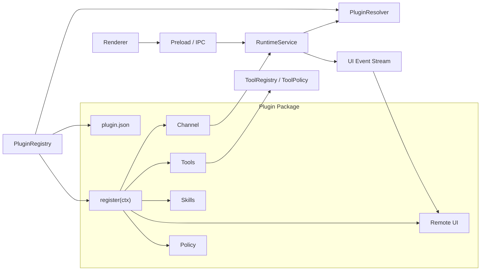

# OpenAgent Plugin System 设计

> 目标：为 OpenAgent 定义一套可扩展、可审计、可替换的插件系统标准。飞书插件会是第一批验证场景之一，但插件标准不能被飞书的协议或 OpenClaw 的插件 SDK 反向绑定。

## 1. 结论

OpenAgent 插件不是 agent runtime 的替代品，也不是直接接管 Pi / LLM loop 的外部包。插件的职责是以受控方式给 OpenAgent 增加能力：

```text
Plugin = Channel + Tools + Skills + Knowledge + Remote UI + Settings + Policy
```

核心原则：

- **Runtime 主权在 OpenAgent**：插件不能直接调用 Pi、不能自行执行 agent loop，所有用户请求必须进入 `RuntimeService`。
- **工具统一治理**：插件工具必须注册成 OpenAgent `RuntimeTool`，再进入 `ToolRegistry`、`ToolPolicy`、`ToolExecutor`、run log 和 UI event。
- **能力按需启用**：插件被发现不代表启用，启用不代表每轮 prompt 注入，只有当前任务相关的 skill/tool 摘要才进入上下文。
- **配置与密钥分离**：普通配置可以进 settings，secret 只进入安全存储，不能进入 prompt、transcript、UI event 明文或 LLM 日志。
- **外部 UI 是投影**：飞书卡片、Slack 消息等远程 UI 只能投影 OpenAgent runtime 状态，不能成为事实源。
- **第一版克制实现**：先定义 manifest、注册表、能力接口、配置和策略；暂不做完整插件市场、远程代码热加载或独立插件沙箱。

## 2. 非目标

第一版插件系统不做：

- 不支持任意第三方 JS 代码无隔离热加载。
- 不实现插件市场、在线安装、版本升级和签名校验。
- 不允许插件绕过 OpenAgent 直接访问 Pi SDK。
- 不允许插件私自执行 shell、文件写入、外部发送或破坏性操作。
- 不把插件的全部 skill、文档或工具 schema 全量塞进系统 prompt。
- 不让 renderer 直接 import 插件实现或外部 SDK。

## 3. 总体架构



### 3.1 分层职责

| 层 | 职责 | 不应该做的事 |
| --- | --- | --- |
| `PluginRegistry` | 发现插件、读取 manifest、加载已启用插件、保存注册结果 | 直接调用 LLM 或执行工具 |
| `PluginContext` | 给插件暴露受控注册和 runtime API | 暴露 Electron、Pi、Node 任意能力 |
| `PluginResolver` | 为当前 run 解析 enabled/relevant skills、tools、knowledge、remote UI | 全量注入所有插件内容 |
| `RuntimeService` | 接收用户或 channel prompt，创建 run，统一触发 runtime | 感知某个插件内部协议 |
| `ToolRegistry` | 汇总 core tools 与 plugin tools | 绕过 policy 执行工具 |
| `Remote UI Renderer` | 把 OpenAgent UI event 同步到外部平台 | 决定 runtime 状态或修改 transcript |

## 4. 插件目录与 manifest

推荐插件目录：

```text
plugins/
└── feishu/
    ├── plugin.json
    ├── README.md
    ├── src/
    │   ├── index.ts
    │   ├── channel/
    │   ├── tools/
    │   ├── skills/
    │   ├── knowledge/
    │   ├── remote-ui/
    │   ├── settings/
    │   └── policy/
    └── dist/
        └── index.js
```

`plugin.json` 第一版建议：

```json
{
  "schemaVersion": "openagent.plugin.v1",
  "id": "openagent-plugin-feishu",
  "name": "Feishu",
  "version": "0.1.0",
  "description": "Feishu channel, tools, and remote UI integration for OpenAgent.",
  "main": "dist/index.js",
  "capabilities": [
    "channel",
    "tools",
    "skills",
    "remote_ui",
    "settings",
    "policy"
  ],
  "configSchema": {
    "type": "object",
    "properties": {
      "enabled": { "type": "boolean", "default": false },
      "allowedChatIds": {
        "type": "array",
        "items": { "type": "string" },
        "default": []
      }
    },
    "additionalProperties": false
  },
  "secretSchema": {
    "type": "object",
    "properties": {
      "appId": { "type": "string" },
      "appSecret": { "type": "string" },
      "verificationToken": { "type": "string" },
      "encryptKey": { "type": "string" }
    },
    "additionalProperties": false
  }
}
```

manifest 只描述插件元数据、能力、入口和配置 schema；不要在 manifest 中保存 secret 值。

## 5. 能力类型

```ts
export type PluginCapability =
  | 'channel'
  | 'tools'
  | 'skills'
  | 'knowledge'
  | 'remote_ui'
  | 'settings'
  | 'policy';
```

| Capability | 作用 | 示例 |
| --- | --- | --- |
| `channel` | 接收外部消息并转成 OpenAgent prompt | 飞书、Slack、企业微信、Webhook |
| `tools` | 给 agent 增加可调用工具 | 飞书发消息、读取文档、查日历 |
| `skills` | 提供按需加载的任务说明和 prompt 片段 | 飞书多维表格分析 skill |
| `knowledge` | 接入外部知识源或知识 provider | 企业知识库、远端 wiki、MCP knowledge |
| `remote_ui` | 将 runtime 状态同步到外部 UI | 飞书交互卡片、Slack thread update |
| `settings` | 提供配置 schema 或设置页入口 | 插件开关、allowlist、默认行为 |
| `policy` | 声明工具风险、channel 权限、审批规则 | 群聊 allowlist、写操作审批 |

## 6. PluginContext

插件入口统一是 `register(ctx)`：

```ts
export interface OpenAgentPlugin {
  id: string;
  name: string;
  register(ctx: OpenAgentPluginContext): Promise<void> | void;
}
```

OpenAgent 提供受控上下文：

```ts
export interface OpenAgentPluginContext {
  pluginId: string;

  registerChannel(channel: OpenAgentChannel): void;
  registerTool(tool: RuntimeTool): void;
  registerSkill(skill: PluginSkill): void;
  registerKnowledgeProvider(provider: PluginKnowledgeProvider): void;
  registerRemoteUi(renderer: RemoteUiRenderer): void;
  registerPolicy(policy: PluginPolicy): void;

  runtime: {
    submitPrompt(input: PluginPromptInput): Promise<PluginPromptResult>;
  };

  events: {
    subscribe(listener: UiEventListener): () => void;
  };

  config: {
    get<T = unknown>(key: string): Promise<T | null>;
    set<T = unknown>(key: string, value: T): Promise<void>;
  };

  secrets: {
    get(key: string): Promise<string | null>;
    set(key: string, value: string): Promise<void>;
    delete(key: string): Promise<void>;
  };

  logger: PluginLogger;
}
```

约束：

- `ctx.runtime.submitPrompt()` 是 channel 进入 agent loop 的唯一入口。
- `ctx.registerTool()` 只注册工具定义，不代表工具每轮都暴露给模型。
- `ctx.secrets` 返回的 secret 只能用于当前插件调用外部 API，不能写入 prompt、transcript 或 UI event。
- `ctx.events.subscribe()` 只能订阅 OpenAgent 标准 UI event，不直接访问 runtime 内部状态对象。

## 7. Channel 标准

Channel 用于把外部消息入口统一成 OpenAgent prompt。

```ts
export interface OpenAgentChannel {
  id: string;
  type: string;
  displayName: string;

  start(): Promise<void>;
  stop(): Promise<void>;

  normalizeEvent(event: unknown): Promise<ChannelMessage | null>;
}
```

统一消息结构：

```ts
export interface ChannelMessage {
  channelId: string;
  channelType: string;
  externalThreadId: string;
  externalMessageId: string;
  sender: {
    id: string;
    displayName?: string;
  };
  text: string;
  attachments?: ChannelAttachment[];
  raw?: unknown;
}
```

Channel 调用 runtime 时：

```ts
export interface PluginPromptInput {
  agentId?: string;
  threadId?: string;
  prompt: string;
  source: {
    type: 'plugin_channel';
    pluginId: string;
    channelId: string;
    externalThreadId: string;
    externalMessageId: string;
    senderId: string;
  };
  attachments?: ChannelAttachment[];
}
```

设计要求：

- `externalThreadId` 应稳定映射到 OpenAgent `threadId`。
- 外部平台消息不要直接写 OpenAgent transcript，必须由 `RuntimeService` 统一落盘。
- 群聊、外部用户、机器人提及等策略由 plugin policy 判断，不能只靠 prompt 提醒。

## 8. Tool 标准

插件工具必须适配为 OpenAgent 当前的 `RuntimeTool` 形态：

```ts
export interface RuntimeTool {
  name: string;
  label?: string;
  description: string;
  parameters: unknown;
  execute(args: RuntimeToolExecuteArgs): Promise<unknown>;
}
```

工具设计要求：

- 必须支持 `AbortSignal`。
- 必须返回结构化结果，避免只返回不可解析的大段文本。
- 必须由 `ToolExecutor` 包装执行，发出 tool start/update/end/fail event。
- 所有外部写入、外发消息、删除、批量修改必须被 policy 标记风险级别。
- 插件工具名需要带命名空间，避免污染核心工具，例如：

```text
feishu_send_message
feishu_reply_message
feishu_get_messages
feishu_get_doc
feishu_update_doc
feishu_search_messages
```

## 9. Skill 标准

插件可以提供 skill，但 skill 需要分阶段进入上下文：

```text
discovered -> enabled -> relevant -> loaded
```

```ts
export interface PluginSkill {
  id: string;
  pluginId: string;
  name: string;
  description: string;
  capability?: string;
  triggers?: string[];
  content: string;
}
```

约束：

- `discovered`：插件被发现，OpenAgent 知道它有这个 skill。
- `enabled`：用户或配置启用了该 skill。
- `relevant`：本轮任务与 skill 相关，可以进入候选集。
- `loaded`：经过 context budget 和安全过滤后，真正注入 prompt。

第一版可以用插件描述、用户显式启用、当前 channel 来源和工具需求判断 relevance；后续再引入 LLM-based skill router。

## 10. Knowledge Provider 标准

插件可以注册外部知识 provider，但必须服从 `KnowledgeService` 抽象：

```ts
export interface PluginKnowledgeProvider {
  id: string;
  pluginId: string;
  displayName: string;
  capabilities: Array<'search' | 'query' | 'capture' | 'ingest' | 'provenance'>;
}
```

约束：

- knowledge provider 不直接暴露给 renderer。
- runtime 只能通过 `KnowledgeService` 或 knowledge tools 调用。
- 外部知识结果进入 prompt 前必须做摘要、来源和长度控制。
- 写入系统知识库或长期记忆必须走审批或可见写回策略。

## 11. Remote UI 标准

Remote UI 用于把 OpenAgent runtime 状态同步到外部平台，例如飞书 interactive card。

```ts
export interface RemoteUiRenderer {
  id: string;
  pluginId: string;
  channelType: string;
  canRender(event: UiEvent, context: RemoteUiContext): boolean;
  render(event: UiEvent, context: RemoteUiContext): Promise<void>;
}
```

Remote UI 可消费的事件包括：

```text
run.started
message.delta
message.completed
runtime.activity
tool.started
tool.updated
tool.completed
tool.failed
approval.required
approval.resolved
run.completed
run.failed
```

约束：

- Remote UI 只能展示或请求用户动作，不能私自修改 run 状态。
- 审批按钮点击后必须回到 OpenAgent `ApprovalService`，不能直接继续工具执行。
- 外部卡片 ID、消息 ID 与 OpenAgent `runId/threadId` 的映射应持久化，便于重试和恢复。

## 12. Settings / Config / Secret 标准

配置分三类：

| 类型 | 存储 | 示例 | 可否进 prompt |
| --- | --- | --- | --- |
| public config | `~/.openagent/settings/plugins/<pluginId>.json` | enabled、allowedChatIds、enabledTools | 可摘要，但不默认注入 |
| secret | 系统 keychain 或 OpenAgent secret store | appSecret、accessToken、webhook secret | 绝对不允许 |
| runtime state | `~/.openagent/state/plugins/<pluginId>/` | token cache、message-thread mapping | 不允许直接注入 |

要求：

- `appSecret`、access token、refresh token、verification token、encrypt key 不得进入 LLM 请求体。
- token cache 需要记录过期时间，刷新失败需要写 plugin log。
- 设置页只显示 secret 是否已配置，不显示明文。

## 13. Policy / Approval 标准

插件必须声明工具和 channel 行为风险：

```ts
export type PluginRiskLevel =
  | 'read'
  | 'write'
  | 'external_send'
  | 'destructive';
```

```ts
export interface PluginPolicy {
  pluginId: string;
  toolPolicies?: Record<string, PluginToolPolicy>;
  channelPolicies?: Record<string, PluginChannelPolicy>;
}

export interface PluginToolPolicy {
  risk: PluginRiskLevel;
  requiresApproval?: boolean;
  description?: string;
}
```

默认建议：

| 风险级别 | 默认行为 |
| --- | --- |
| `read` | 可允许，但仍需受 channel/user/workspace 限制 |
| `write` | 默认需要审批或明确启用 |
| `external_send` | 默认需要 channel allowlist，必要时审批 |
| `destructive` | 必须审批，不允许静默执行 |

飞书示例：

| 工具 | 风险 |
| --- | --- |
| `feishu_get_doc` | `read` |
| `feishu_search_messages` | `read` |
| `feishu_send_message` | `external_send` |
| `feishu_update_doc` | `write` |
| `feishu_delete_message` | `destructive` |

## 14. 生命周期

插件生命周期：

```text
discover -> validate -> load -> register -> enable -> resolve -> execute -> stop
```

| 阶段 | 说明 |
| --- | --- |
| `discover` | 扫描内置插件目录和用户插件目录，读取 `plugin.json` |
| `validate` | 校验 schemaVersion、id、main、capabilities、config schema |
| `load` | 加载入口模块，但不执行外部副作用 |
| `register` | 调用 `register(ctx)` 收集 channel/tool/skill/policy |
| `enable` | 根据用户配置启用能力 |
| `resolve` | 每个 run 根据上下文筛选相关能力 |
| `execute` | 工具和 channel 行为经 OpenAgent runtime 执行 |
| `stop` | 应用退出或禁用插件时停止 channel/listener |

第一版可以只支持内置插件和本地开发插件，不支持远程安装。

## 15. 文件与目录建议

OpenAgent core 侧建议：

```text
src/main/plugins/
├── plugin-types.ts
├── plugin-manifest.ts
├── plugin-registry.ts
├── plugin-loader.ts
├── plugin-config-store.ts
├── plugin-secret-store.ts
├── plugin-context.ts
├── plugin-resolver.ts
└── plugin-policy.ts
```

`src/main/runtime/plugin-resolver.ts` 后续可以变成对 `src/main/plugins/plugin-resolver.ts` 的薄封装，负责给当前 run 输出：

```ts
export interface ResolvedPluginContext {
  skills: string;
  tools: RuntimeTool[];
  knowledgeProviders: PluginKnowledgeProvider[];
  remoteUiRenderers: RemoteUiRenderer[];
  policies: PluginPolicy[];
}
```

本地数据目录建议：

```text
~/.openagent/
├── settings/
│   └── plugins/
│       └── <pluginId>.json
├── state/
│   └── plugins/
│       └── <pluginId>/
├── logs/
│   └── plugins/
│       └── <pluginId>.log
└── secrets/
    └── <pluginId>/        # 逻辑路径；实际可映射到 keychain
```

## 16. 与 Pi Runtime 的边界

插件与 Pi 的关系：

```text
Plugin Tool -> OpenAgent RuntimeTool -> Pi ToolDefinition
```

禁止：

- 插件直接调用 `createAgentSession()`。
- 插件直接构造 Pi tool 绕过 OpenAgent `ToolPolicy`。
- 插件把外部 SDK 类型泄漏到 renderer 或 `src/shared/types`。

允许：

- 插件注册 OpenAgent `RuntimeTool`。
- Runtime resolver 按需把插件工具转成 Pi tool。
- 插件通过 `ctx.runtime.submitPrompt()` 创建 OpenAgent run。

## 17. 飞书插件参考实现边界

飞书插件应作为该标准的第一个复杂验证场景，而不是标准本身。

推荐能力拆分：

```text
plugins/feishu/src/
├── index.ts
├── config.ts
├── auth/
│   ├── token-store.ts
│   └── feishu-auth.ts
├── channel/
│   ├── feishu-channel.ts
│   ├── webhook-server.ts
│   ├── event-normalizer.ts
│   └── thread-mapper.ts
├── tools/
│   ├── im-tools.ts
│   ├── doc-tools.ts
│   ├── calendar-tools.ts
│   └── bitable-tools.ts
├── remote-ui/
│   ├── card-renderer.ts
│   ├── streaming-card.ts
│   └── approval-card.ts
└── policy/
    ├── feishu-policy.ts
    └── permission-check.ts
```

第一版 MVP：

1. 读取飞书插件配置和 secret。
2. 接收飞书私聊消息。
3. `chatId/messageId` 映射到 OpenAgent `threadId`。
4. 通过 `ctx.runtime.submitPrompt()` 进入 OpenAgent run。
5. run 完成后发送文本回复。
6. 写入 plugin log 和 runtime log。

后续再做：

- 群聊 allowlist。
- interactive card streaming。
- approval card。
- IM / Docs / Calendar / Bitable tools。
- 飞书 skill relevance。

可借鉴 `@larksuite/openclaw-lark` 的消息归一化、OpenAPI 封装、交互卡片和权限模型；但不要复用它的 OpenClaw plugin SDK 注册协议，也不要让 OpenClaw ChannelPlugin 类型进入 OpenAgent core。

## 18. 实施路线

### M1：文档与类型

- [ ] 完成 `docs/plugins.md`。
- [ ] 新增 `src/main/plugins/plugin-types.ts`。
- [ ] 定义 manifest、capability、context、channel、remote UI、policy 类型。

### M2：内置注册表

- [ ] 实现 `PluginRegistry`。
- [ ] 支持读取内置插件 manifest。
- [ ] 支持启用/禁用插件配置。
- [ ] 将注册出的 tools/skills/policies 暂存到 registry。

### M3：Runtime resolver

- [ ] 将 enabled plugin tools 合并到 `ToolRegistry`。
- [ ] 将 enabled/relevant skills 汇总为短摘要。
- [ ] 将 plugin policy 合并到 `ToolPolicy`。

### M4：Channel runtime path

- [ ] 支持插件 channel 调用 `RuntimeService.submitPrompt()`。
- [ ] 增加 external channel metadata。
- [ ] 支持 channel thread mapping。

### M5：Remote UI

- [ ] remote UI renderer 订阅 UI event。
- [ ] 支持 run/card mapping。
- [ ] 支持 approval round-trip。

### M6：Feishu MVP

- [ ] 实现 `plugins/feishu`。
- [ ] 打通私聊消息 -> OpenAgent run -> 飞书回复。
- [ ] 补充飞书插件说明文档。

## 19. 快速判断原则

后续遇到插件相关设计争议时，按下面规则判断：

| 问题 | 判断 |
| --- | --- |
| 插件是否可以直接调用 Pi？ | 不可以，必须走 OpenAgent runtime |
| 插件工具是否可以绕过审批？ | 不可以，必须走 ToolPolicy |
| 插件 skill 是否每轮都进 prompt？ | 不可以，必须 enabled + relevant + loaded |
| 飞书卡片是否是事实源？ | 不是，只是 remote UI 投影 |
| secret 是否可以写入 transcript/log？ | 不可以 |
| 是否现在就做插件市场？ | 不做，先做本地/内置插件标准 |
