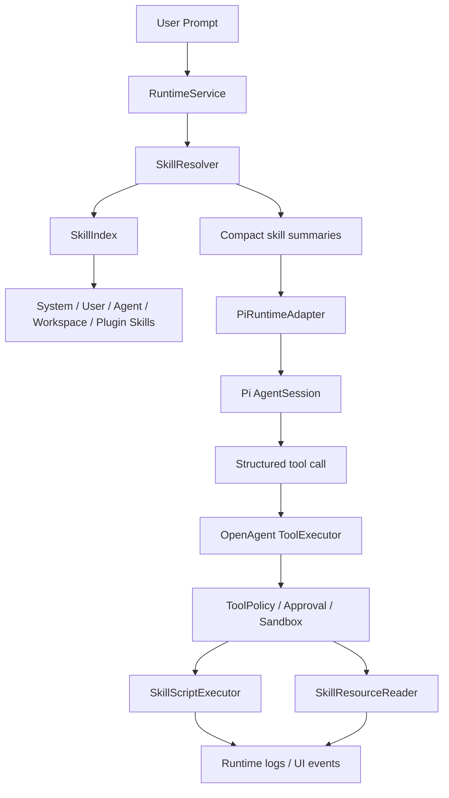

# OpenAgent Skill System 设计

> 目标：把 OpenAgent 的 Skill 设计成可发现、可审计、可按需加载的能力包。目录形态参考 Claude Code Skill；运行时注入、工具治理和 Pi AgentSession 集成参考 OpenClaw / OpenAgent Embedded Pi 路线。

## 1. 设计结论

OpenAgent Skill 不应只是一个 prompt 片段，而应是一个带资源和执行边界的文件系统能力包：

```text
Skill = SKILL.md + scripts + templates + references + examples + assets + policy
```

核心判断：

1. **Skill 归 OpenAgent 管理**：发现、启用、索引、相关性判断、权限、日志和 UI 状态都由 OpenAgent runtime 管理。
2. **Pi 只负责 agent loop**：Skill 不直接调用 Pi；OpenAgent 将本轮相关 Skill 摘要和可用工具交给 `PiRuntimeAdapter -> AgentSession`。
3. **脚本不裸跑**：Skill 的 `scripts/` 只能通过 OpenAgent tool 执行，必须经过 `ToolPolicy / Approval / Sandbox / Logs / UI Event`。
4. **按需注入**：发现 Skill 不等于每轮注入；默认只注入 compact summary，完整 `SKILL.md`、references、templates 按需读取。
5. **Skill 不能扩大权限**：`SKILL.md` 和 `skill.json` 只能声明需要的工具与风险，最终授权以 OpenAgent policy 为准。
6. **Plugin 可以携带 Skill**：插件的 bundled skills 进入同一套 SkillService，而不是走插件自己的私有 prompt 注入。

整体关系：



## 2. 与 Claude Code / OpenClaw 的关系

### 2.1 借鉴 Claude Code 的部分

Claude Code Skill 的关键价值是 **progressive disclosure**：先通过 `SKILL.md` 的名称、描述和触发说明识别能力；只有当前任务需要时，才读取更长的 instructions、scripts、templates、references 或 examples。

OpenAgent 应借鉴它的目录模型：

```text
my-skill/
├── SKILL.md
├── scripts/
├── templates/
├── references/
├── examples/
└── assets/
```

但 OpenAgent 不能照搬“脚本由模型环境直接执行”的语义。OpenAgent 是桌面工作台，必须把脚本执行纳入审批、sandbox、日志和 UI event。

### 2.2 借鉴 OpenClaw 的部分

OpenClaw 的关键不是把 Skill 当作独立 agent runtime，而是在宿主 runtime 层统一处理：

- channel / context / skills / tools 由宿主系统解析；
- 本轮相关能力被整理进 prompt context；
- 工具经过宿主 policy 过滤后注入 Pi；
- Pi AgentSession 负责 LLM 调用、tool call、streaming 和 turn 生命周期。

OpenAgent 应采用同样的分层：

```text
OpenAgent Skill / Plugin / Context
  -> RuntimeService 解析、筛选、治理
  -> PiRuntimeAdapter 注入 prompt + OpenAgent tools
  -> Pi AgentSession 执行 agent loop
  -> OpenAgent ToolExecutor 执行工具和脚本
```

## 3. 非目标

第一版 Skill 系统不做：

- 不做任意第三方代码热加载市场。
- 不允许 Skill 绕过 OpenAgent 直接调用 Pi SDK。
- 不允许 Skill 自己执行 shell、写文件、联网或调用外部 API。
- 不把所有 Skill、references、examples 全量塞进系统 prompt。
- 不让 renderer 直接读取或执行 Skill 文件。
- 不让 Skill 覆盖系统级安全、git、approval、sandbox 规则。
- 不把 Plugin Skill 和本地 Skill 做成两套互不兼容的能力系统。

## 4. Skill 目录规范

推荐目录：

```text
~/.openagent/agents/<agentId>/skills/
└── spreadsheet-analysis/
    ├── SKILL.md
    ├── skill.json
    ├── scripts/
    │   ├── analyze_xlsx.py
    │   └── render_chart.js
    ├── templates/
    │   └── report.md
    ├── references/
    │   └── metrics.md
    ├── examples/
    │   └── sample-output.md
    └── assets/
        └── chart-theme.json
```

| 路径 | 必须 | 作用 |
| --- | --- | --- |
| `SKILL.md` | 是 | 模型可读入口：触发条件、使用步骤、约束、支持文件说明。 |
| `skill.json` | 否 | OpenAgent 结构化扩展元数据，便于 UI、索引、policy 使用。 |
| `scripts/` | 否 | 确定性辅助脚本，只能通过 `skill_script` tool 执行。 |
| `templates/` | 否 | 报告、代码、文档、配置模板，按需读取。 |
| `references/` | 否 | 长文档、API 说明、风格指南、业务规则，按需检索或读取。 |
| `examples/` | 否 | 示例输入输出，帮助模型模仿格式。 |
| `assets/` | 否 | 图片、样式、字体、静态资源等。 |

## 5. `SKILL.md` 规范

`SKILL.md` 使用 YAML frontmatter + Markdown body：

```md
---
name: spreadsheet-analysis
description: Analyze Excel/CSV files and generate statistics, charts, and structured reports.
version: 0.1.0
tags:
  - spreadsheet
  - csv
  - xlsx
risk: read
allowed-tools:
  - read_file
  - list_files
  - skill_load
  - skill_resource
  - skill_script
  - write_file
---

# Spreadsheet Analysis

## When to use

Use this skill when:
- 用户上传或引用 `.xlsx`、`.csv`、`.tsv` 文件。
- 用户要求统计、透视、图表或分析报告。

## Instructions

1. 先读取文件结构，不要直接修改原始数据。
2. 需要统计时，优先使用 `scripts/analyze_xlsx.py`。
3. 生成报告时，参考 `templates/report.md`。
4. 如果要写入新文件，写入路径必须来自用户请求或经过确认。
5. 不要泄露原始表格中的敏感字段。

## Supporting files

- `scripts/analyze_xlsx.py`: 输出 sheet、字段、行数、缺失值和基础统计。
- `templates/report.md`: 默认分析报告模板。
- `references/metrics.md`: 指标口径说明。
```

### 5.1 Frontmatter 字段

| 字段 | 必须 | 说明 |
| --- | --- | --- |
| `name` | 是 | 全局唯一 Skill 名称，建议 kebab-case。 |
| `description` | 是 | 相关性判断的主要依据，要写清“什么时候用”。 |
| `version` | 否 | Skill 版本。 |
| `tags` | 否 | 文件类型、任务类型、领域标签。 |
| `risk` | 否 | `read` / `write` / `network` / `external` / `destructive`。 |
| `allowed-tools` | 否 | Skill 希望使用的 OpenAgent tools；最终仍由 policy 裁剪。 |
| `entrypoint` | 否 | 默认脚本或主流程名称，只用于提示，不自动执行。 |

### 5.2 Markdown Body 约定

建议包含：

1. `When to use`：触发条件。
2. `When not to use`：不适用场景。
3. `Instructions`：执行步骤。
4. `Safety`：安全约束。
5. `Supporting files`：scripts/templates/references/examples 说明。
6. `Output expectations`：输出格式要求。

## 6. `skill.json` 扩展元数据

`skill.json` 可选，用于 OpenAgent UI 和 policy 更稳定地读取结构化信息：

```json
{
  "schemaVersion": "openagent.skill.v1",
  "name": "spreadsheet-analysis",
  "version": "0.1.0",
  "displayName": "Spreadsheet Analysis",
  "description": "Analyze Excel/CSV files and generate structured reports.",
  "risk": "read",
  "tags": ["spreadsheet", "csv", "xlsx"],
  "allowedTools": ["read_file", "list_files", "skill_resource", "skill_script", "write_file"],
  "scripts": [
    {
      "path": "scripts/analyze_xlsx.py",
      "runtime": "python",
      "description": "Inspect spreadsheet structure and produce JSON summary.",
      "risk": "read",
      "timeoutMs": 30000,
      "network": false,
      "writes": false,
      "dependencies": {
        "pip": ["openpyxl"]
      }
    }
  ],
  "resources": [
    {
      "path": "templates/report.md",
      "type": "template",
      "description": "Default markdown report template."
    },
    {
      "path": "references/metrics.md",
      "type": "reference",
      "description": "Metric definitions."
    }
  ]
}
```

规则：

- `SKILL.md` 是人和模型优先阅读的入口。
- `skill.json` 是 OpenAgent 可选的结构化增强。
- 两者冲突时，安全相关字段取更严格者。
- `skill.json` 不允许保存 secret。

## 7. Skill 来源与优先级

OpenAgent 支持多来源 Skill：

```text
System Skills     app 内置，只读
User Skills       ~/.openagent/skills/
Agent Skills      ~/.openagent/agents/<agentId>/skills/
Workspace Skills  <workspace>/skills/
Plugin Skills     plugin bundle 内声明并注册
```

推荐优先级：

```text
Workspace > Agent > User > Plugin > System
```

同名处理：

1. 高优先级覆盖低优先级。
2. UI 显示被覆盖来源。
3. runtime log 记录最终选中的 Skill 版本和路径。
4. 不允许低优先级 Skill 扩大高优先级 Skill 的权限。

## 8. Skill 生命周期

```ts
type SkillState =
  | 'discovered'
  | 'indexed'
  | 'enabled'
  | 'eligible'
  | 'loaded'
  | 'active'
  | 'failed'
  | 'disabled';
```

语义：

| 状态 | 含义 |
| --- | --- |
| `discovered` | 在文件系统或插件中发现。 |
| `indexed` | 已解析 metadata，可进入 catalog。 |
| `enabled` | 用户、agent 或 workspace 配置允许使用。 |
| `eligible` | 当前 prompt 可能相关。 |
| `loaded` | 本轮已读取完整 `SKILL.md` 或关键资源。 |
| `active` | 本轮已经实际采用或执行相关脚本/资源。 |
| `failed` | 解析、校验或执行失败。 |
| `disabled` | 被用户、policy 或安全规则禁用。 |

原则：

```text
discovered != enabled != eligible != loaded != active
```

## 9. Skill Resolver

每轮 prompt 执行前，`RuntimeService` 调用 `SkillResolver`：

```text
User Prompt
  -> SkillResolver
  -> enabled skill metadata
  -> relevance ranking
  -> compact summaries
  -> RuntimeService system prompt section
  -> PiRuntimeAdapter
```

### 9.1 相关性输入

Resolver 可以使用：

- 用户 prompt。
- 附件文件名和 MIME type。
- 当前 workspace 文件类型。
- 用户显式选择的 skillId。
- Plugin/channel metadata。
- 最近使用的 Skill。
- Skill 的 `description`、`tags`、`When to use`。

第一版可以先用轻量规则 + LLM classifier：

- 文件扩展名、显式 skill 名称作为 hard signal。
- `description` / `tags` 做 lexical match。
- 复杂情况交给 LLM 输出结构化结果。

### 9.2 Prompt 注入格式

默认只注入 compact summary：

```xml
<available_skills>
  <skill name="spreadsheet-analysis" source="agent" risk="read">
    Analyze Excel/CSV files and generate statistics, charts, and structured reports.
  </skill>
  <skill name="feishu-workspace" source="plugin" risk="external">
    Use Feishu IM, Docs, Calendar and Bitable tools through OpenAgent policy.
  </skill>
</available_skills>
```

如果用户显式选择某个 Skill，或 Resolver 高置信判定必须使用，可以额外注入该 Skill 的 condensed instructions，但仍不全量注入 `references/`。

### 9.3 显式选中 Skill 的路由规则

当 UI 或调用方传入 `selectedSkillId` 时，OpenAgent 将该 Skill 视为本轮主执行路径：

- prompt 中会注入该 Skill 的声明脚本和资源清单，但不会全量注入所有文件内容。
- 如果需要详细说明，agent 应先调用 `skill_load`。
- 如果需要模板、参考或示例，agent 应调用 `skill_resource`。
- 如果声明脚本能完成确定性计算/转换，agent 应调用 `skill_script`，并把用户输入作为 `args` 传入；只要 `skill.json.scripts[]` 声明了脚本，runtime 可将 `skill_script` 视为隐式可用，避免旧包漏写 `allowedTools` 后退化到文本/子 agent。
- selected skill 声明脚本时，OpenAgent policy 会允许 skill tools 穿过当前 Plan step 的 `allowedTools`；这表示“优先 skill”，不是“禁止所有其他执行工具”。
- 普通业务 skill 不应一刀切禁止 `pi_coding_agent`：当声明脚本缺依赖、运行环境不满足、脚本失败、需要诊断/修复 skill 包，或用户明确要求做 selected skill 之外的代码/工程修改时，可以使用 `pi_coding_agent` 或其他执行型工具；所有 shell、安装和写入仍必须走 OpenAgent policy / approval。
- `pi_coding_agent` 不能用于绕过一个已经可用且匹配的声明脚本去重新实现同一任务；如果改用它，必须能说明原因（例如真实 blocker、依赖/环境修复、脚本不覆盖该场景）。
- `skill-creator` 是特殊的 authoring/scaffolding skill：当用户创建/新建/生成/封装 skill 时，Runtime 会把 `skill-creator` 视为受控主路径，并禁止委托 `pi_coding_agent` 绕过它的模板、元数据、安全和目录规则；后续应优先走 `skill_load`、`skill_resource`、`skill_script` 和必要的 `write_file`。
- `skill-creator` 的第一步脚手架适合走轻量 Tool Invocation 快路径：当 selected skill 已确定为 `skill-creator` 且 declared script 为 `scripts/init_skill.mjs` 时，runtime 应固定 `skillName` / `scriptPath`，只让模型或轻量路由器决定新 skill 的名称、slug、用途和目标目录业务参数，避免在长主 Agent prompt 中自由拼完整 `skill_script` JSON。
- `skill-creator` 的 Tool Invocation 请求不应携带完整 SOUL/USER/MEMORY、完整 skill 列表、完整 `SKILL.md` 或最终 metadata 规则；这些属于主 Agent 总结/协作上下文，不属于确定性 scaffold 调用所需参数。
- 如果模型输出包含 provider marker、伪 tool-call 或 malformed JSON，完整原文只写日志；下一轮只回灌短错误摘要，不得把坏 arguments 原样放回 prompt 诱导模型复制。

### 9.4 Skill 运行环境与依赖声明

Skill authoring 阶段必须把运行环境要求写成结构化元数据，避免执行时才通过脚本报错或让用户手工猜测安装命令：

- Python / Node / shell 脚本必须在 `skill.json.scripts[]` 中声明 `runtime`、`risk`、`network`、`writes`、`timeoutMs`。
- 如果脚本依赖第三方包，应声明 `dependencies`，例如 `dependencies.pip: ["pypdf"]` 或 `dependencies.npm: ["some-package"]`；runtime 可兼容旧字段 `pipDependencies` / `npmDependencies` / `systemDependencies`，但新 skill 必须写入 `dependencies`。
- `skill-creator` 创建带脚本的 skill 时，应提示作者补齐依赖声明，必要时生成 `requirements.txt`、`package.json` 或脱敏的 `references/runtime.md`。
- OpenAgent runtime 执行 `skill_script` 前应先做 preflight：解析解释器、检查依赖、记录环境信息；Python `dependencies.pip` 缺失时由 `skill_script` 在同一次受控审批内执行安装并记录日志，而不是让主模型改走文本说明或委托 `pi_coding_agent` 手工安装。
- 依赖安装不得绕过审批；优先安装到 skill-local venv / workspace-local 环境，避免污染系统 Python 或全局 Node 环境。
- `.env` 只用于用户私有配置、token、账号密码、endpoint URL 等，不用于声明公共依赖；`.env` 的变量说明可以写入脱敏的 `references/config.md`。

## 10. Progressive Disclosure 工具

OpenAgent 应提供 Skill 相关 tools，让模型按需加载：

### 10.1 `skill_list`

列出本轮可用 Skill metadata。

```ts
interface SkillListInput {
  query?: string;
  source?: 'system' | 'user' | 'agent' | 'workspace' | 'plugin';
}
```

### 10.2 `skill_load`

读取完整 `SKILL.md` 或 condensed body。

```ts
interface SkillLoadInput {
  skillName: string;
  mode?: 'summary' | 'full';
}
```

### 10.3 `skill_resource`

读取 Skill 内的 templates、references、examples、assets 文本资源。

```ts
interface SkillResourceInput {
  skillName: string;
  path: string;
  maxBytes?: number;
}
```

约束：

- `path` 必须在该 Skill 根目录内。
- 默认只允许读取 `templates/`、`references/`、`examples/`、`assets/`。
- `.env` / `.env.example` 默认放在 Skill 根目录作为本地配置文件，不属于 `skill_resource` 资源；不要在 `skill.json.resources` 中声明它们。需要给模型读取配置说明时，使用脱敏的 `references/config.md`，只写变量名和占位示例，不写真实值。
- 大文件返回摘要或分页，不直接塞满上下文。

### 10.4 `skill_script`

执行 Skill 的 `scripts/` 内脚本。

```ts
interface SkillScriptInput {
  skillName: string;
  scriptPath: string;
  args?: string[];
  cwd?: string;
  timeoutMs?: number;
}
```

约束：

- 只能执行 `scripts/` 目录内脚本。
- 禁止 `..` 路径逃逸和 symlink 逃逸。
- 如果 `skill.json.scripts` 声明了脚本清单，则只允许执行清单内脚本；未声明脚本会被 policy 拒绝。
- `skill.json.scripts[].risk/network/writes/timeoutMs/runtime/description` 是审批与审计的结构化来源，不能由模型调用参数伪造。
- 脚本执行时会自动读取当前 Skill 根目录下的 `.env` 并注入子进程环境变量；涉及用户参数、账号密码、token、endpoint URL、本地配置等值时，只能由脚本从该 `.env` 获取，不要写入 `SKILL.md`、`skill.json`、脚本源码、模板、示例、resources 或模型输出。
- 默认无网络。声明 `risk: network`、`risk: external` 或 `network: true` 时，审批 actionType 为 `skill.script.network`，风险至少为 medium。
- 默认不允许写 Skill 目录自身。声明 `risk: write`、`risk: destructive` 或 `writes: true` 时，审批 access 为 write；destructive 风险为 high。
- 写 workspace 文件必须走 OpenAgent write/edit tool 或额外审批。
- 必须支持 `AbortSignal` 和 timeout。
- stdout/stderr 进入 run log；大输出截断并保存 artifact。

## 11. Script 执行安全模型

脚本执行链路：

```text
Pi structured tool call
  -> skill_script RuntimeTool
  -> SkillScriptExecutor
  -> SkillPolicy
  -> ToolPolicy / Approval
  -> Sandbox process
  -> stdout/stderr/artifacts
  -> UI event + run log
```

安全规则：

1. `scripts/` 不是 shell 权限白名单。
2. 第三方 Skill 的脚本默认视为不可信。
3. 脚本不能读取 secret，除非插件/用户显式授权给某个 tool，而不是授权给 Skill 文件。
4. 脚本联网默认禁止；需要 `risk: network` 并触发审批。
5. 脚本写文件默认禁止；需要 `risk: write`、allowed tool 和审批。
6. 脚本 destructive 操作默认禁止，除非用户明确授权单次执行。
7. 所有脚本执行要带 `skillName`、`scriptPath`、`runId`、`toolCallId`、`cwd`、`exitCode`、`durationMs` 日志。
8. 父 run 取消时，脚本进程必须终止。

## 12. Skill 与 Tool / Plugin / MCP / Knowledge 的边界

| 类型 | 主要职责 | 是否执行动作 | 归属 |
| --- | --- | --- | --- |
| Skill | 说明 agent 如何完成一类任务，提供脚本和资源 | 间接，通过 tools | OpenAgent SkillService |
| Tool | 一个明确可调用动作 | 是 | OpenAgent ToolRegistry |
| Plugin | 打包 channel/tools/skills/settings/policy | 间接或直接注册 tool | PluginService + SkillService |
| MCP | 外部工具协议接入 | 是，转成 OpenAgent tool | MCP adapter |
| Knowledge | 可检索知识库 | 读取/检索 | KnowledgeService |

规则：

- Skill 可以引用 Tool，但不能绕过 ToolExecutor。
- Plugin 可以携带 Skill，但 Skill 注入仍由 SkillResolver 判断。
- MCP tools 先转成 OpenAgent tools，再被 Skill instructions 引导使用。
- Knowledge 适合长期事实库；Skill 适合任务方法、脚本、模板和工作流。
- `references/` 是 Skill 私有支持资料，不等于全局 Knowledge Base；需要沉淀为系统知识时，走 Knowledge 写入审批。

## 13. Plugin Skill 集成

插件 manifest 可以声明 bundled skills：

```json
{
  "schemaVersion": "openagent.plugin.v1",
  "id": "openagent-plugin-feishu-cli",
  "capabilities": ["channel", "tools", "skills", "policy"],
  "skills": [
    {
      "name": "feishu-workspace",
      "description": "Use Feishu IM, Docs, Calendar and Bitable tools safely through OpenAgent policy.",
      "path": "skills/feishu-workspace/SKILL.md"
    }
  ]
}
```

插件注册时：

```ts
ctx.registerSkill({
  name: 'feishu-workspace',
  description: 'Use Feishu IM, Docs, Calendar and Bitable tools safely through OpenAgent policy.',
  rootDir: pluginSkillDir,
});
```

规则：

1. Plugin enabled 不等于所有 Plugin Skills 自动 active。
2. Plugin Skill 的 tools 仍必须来自 Plugin 注册的 OpenAgent `RuntimeTool`。
3. Plugin Skill 的 external send / API write 操作必须遵守插件 policy。
4. Plugin secrets 不进入 Skill prompt 或 resources。
5. 禁用插件后，对应 Plugin Skills 也不可用。

## 14. TypeScript 模型建议

```ts
export type SkillSource = 'system' | 'user' | 'agent' | 'workspace' | 'plugin';
export type SkillRisk = 'read' | 'write' | 'network' | 'external' | 'destructive';

export interface SkillManifest {
  name: string;
  description: string;
  version?: string;
  displayName?: string;
  source: SkillSource;
  rootDir: string;
  skillFile: string;
  tags: string[];
  risk: SkillRisk;
  allowedTools: string[];
  enabled: boolean;
  pluginId?: string;
}

export interface SkillScriptDescriptor {
  skillName: string;
  path: string;
  runtime: 'python' | 'node' | 'shell' | 'binary';
  description?: string;
  risk: SkillRisk;
  timeoutMs: number;
  network: boolean;
  writes: boolean;
  dependencies?: {
    pip?: string[];
    npm?: string[];
    system?: string[];
  };
}

export interface SkillResolutionInput {
  prompt: string;
  attachments: Array<{ name?: string; mimeType?: string; path?: string }>;
  workspaceRoot: string;
  agentId: string;
  selectedSkillIds?: string[];
  channel?: string;
}

export interface ResolvedSkillContext {
  summaries: SkillSummary[];
  activeSkillNames: string[];
  promptBlock: string;
  tools: RuntimeTool[];
}

export interface SkillSummary {
  name: string;
  description: string;
  source: SkillSource;
  risk: SkillRisk;
  confidence?: number;
}
```

## 15. Runtime 集成点

建议新增目录：

```text
packages/skill-runtime/src/
├── skill-service.ts
├── skill-discovery.ts
├── skill-parser.ts
├── skill-index.ts
├── skill-resolver.ts
├── skill-policy.ts
├── skill-prompt.ts
├── skill-resource-tool.ts
├── skill-script-tool.ts
└── skill-script-executor.ts
```

职责：

| 文件 | 职责 |
| --- | --- |
| `skill-service.ts` | 对外总入口，聚合 discovery、index、resolver、tools。 |
| `skill-discovery.ts` | 扫描 system/user/agent/workspace/plugin skill paths。 |
| `skill-parser.ts` | 解析 `SKILL.md` frontmatter 和 `skill.json`。 |
| `skill-index.ts` | 缓存 metadata、mtime、hash、状态。 |
| `skill-resolver.ts` | 当前 run 相关性判断和排序。 |
| `skill-policy.ts` | allowed tools、risk、来源、approval 约束。 |
| `skill-prompt.ts` | 生成 compact prompt block。 |
| `skill-resource-tool.ts` | 实现 `skill_load` / `skill_resource`。 |
| `skill-script-tool.ts` | 注册 `skill_script` RuntimeTool。 |
| `skill-script-executor.ts` | 受控执行脚本。 |

接入 `RuntimeService`：

```text
RuntimeService.run()
  -> pluginContext = resolvePluginContext(...)
  -> skillContext = skillService.resolveForPrompt(...)
  -> tools = coreTools + pluginTools + skillTools
  -> systemPrompt += skillContext.promptBlock
  -> PiRuntimeAdapter.run(runInput)
```

接入 Pi：

- `PiRuntimeAdapter` 不直接理解 Skill 文件。
- Skill 只表现为 system prompt section 和 OpenAgent tools。
- `customTools` 仍由 OpenAgent `toPiToolDefinitions(openAgentTools)` 注入。
- Pi `tools` 继续保持空数组，避免绕过 OpenAgent 治理。

## 16. IPC / UI 设计

### 16.1 IPC

建议新增：

```ts
skills:list(): Promise<SkillCatalogItem[]>;
skills:refresh(): Promise<SkillCatalogItem[]>;
skills:get(skillName: string): Promise<SkillDetail>;
skills:setEnabled(skillName: string, enabled: boolean): Promise<void>;
skills:test(skillName: string): Promise<SkillTestResult>;
```

### 16.2 UI

设置页增加 `Skills` 面板：

```text
Settings / Skills
├── Installed Skills
├── Source: system / user / agent / workspace / plugin
├── Enabled / Disabled
├── Risk Level
├── Allowed Tools
├── Scripts
├── Last Used
├── View SKILL.md
├── Test Skill
└── Disable / Remove
```

聊天区显示本轮相关能力：

```text
本轮可用 Skill:
- spreadsheet-analysis
- feishu-workspace

本轮实际使用:
- spreadsheet-analysis/scripts/analyze_xlsx.py
```

UI events 建议：

```ts
type SkillUiEvent =
  | 'skill.resolved'
  | 'skill.loaded'
  | 'skill.script.started'
  | 'skill.script.updated'
  | 'skill.script.completed'
  | 'skill.script.failed';
```

## 17. 配置与持久化

建议文件：

```text
~/.openagent/
├── skills/                         # user skills
├── agents/<agentId>/skills/         # agent skills
├── settings/skills.json             # enabled/disabled/source policy
├── state/skills-index.json          # metadata cache
└── logs/skill-execution.jsonl       # audit log
```

`skills.json` 示例：

```json
{
  "enabled": {
    "spreadsheet-analysis": true,
    "feishu-workspace": false
  },
  "sourceOverrides": {},
  "trusted": {
    "system": true,
    "user": true,
    "agent": true,
    "workspace": false,
    "plugin": false
  }
}
```

## 18. 审计日志

每次 Skill 相关动作记录 JSONL：

```json
{
  "ts": "2026-05-15T10:00:00.000Z",
  "runId": "run_xxx",
  "threadId": "thread_xxx",
  "event": "skill.script.completed",
  "skillName": "spreadsheet-analysis",
  "source": "agent",
  "scriptPath": "scripts/analyze_xlsx.py",
  "cwd": "/workspace",
  "exitCode": 0,
  "durationMs": 1234,
  "scriptRuntime": "python",
  "scriptRisk": "read",
  "network": false,
  "writes": false,
  "approvalId": "approval_xxx"
}
```

日志要求：

- 不记录 secret。
- stdout/stderr 可截断。
- `skill_script` 执行会追加写入 `~/.openagent/logs/skill-execution.jsonl`，并在 UI event / tool result 中携带 `auditLogPath`。
- 审计日志和 Skill UI event 需要携带脚本声明元数据：`scriptRuntime`、`scriptRisk`、`network`、`writes`。
- 大 artifact 写文件并记录路径。
- 失败要记录错误分类：parse / policy / approval / timeout / runtime / sandbox。

## 19. 安全策略

默认策略：

1. System/User/Agent Skills 可默认启用，但脚本仍走 policy。
2. Workspace/Plugin Skills 默认需要用户启用。
3. 未知来源 Skill 只能读取 `SKILL.md` 和非脚本资源，不能执行脚本。
4. `risk: write/network/external/destructive` 需要 UI 明示。
5. `allowed-tools` 是上限声明，不是授权凭证；为了兼容旧包，只要 `scripts[]` 已声明脚本，`skill_script` 可作为隐式运行入口，但仍必须通过声明脚本校验、policy、approval 和 audit。
6. Skill script 不能绕过 OpenAgent 使用 shell 进行 destructive 操作。
7. Skill script 不能读取 OpenAgent secrets。
8. Skill resource path 必须做 realpath 校验，禁止 symlink/path traversal。
9. 执行脚本必须有 timeout、AbortSignal、输出大小限制。
10. 所有审批 scope 必须包含 skillName、scriptPath、cwd、risk。
11. `skill_script` 审批只能按单次 `once` 生效；即使 UI 或测试传入 `session/always`，ApprovalService 也必须降级为 `once`，避免脚本执行被长期授权。

## 20. 分阶段落地计划

### M1：Skill 包发现与 Catalog

- 新增 `packages/skill-runtime/src/`。
- 扫描 `~/.openagent/agents/<agentId>/skills/`。
- 解析 `SKILL.md` frontmatter。
- 实现 `skills:list` IPC，替换当前空数组。
- Settings 能展示 Skill catalog。
- Settings / Skills 详情页展示 scripts、templates、references、examples、assets 资源列表。
- 代码结构已拆分为 discovery / parser / resolver / prompt / tools / script executor，`skill-service.ts` 只保留编排入口。

### M2：按需注入

- 实现 `SkillResolver`。
- `RuntimeService` 注入 compact skill summaries。
- 支持用户显式选择 Skill。
- runtime log 记录 resolved skills。

### M3：Progressive Disclosure Tools

- 实现 `skill_load`。
- 实现 `skill_resource`。
- 支持读取 templates/references/examples。
- 大文件分页或摘要。

### M4：Skill Script

- 实现 `skill_script` RuntimeTool。
- 实现 `SkillScriptExecutor`。
- 接入 ToolPolicy、Approval、Sandbox、AbortSignal、UI events。
- 支持 Python / Node 脚本第一版。

### M5：Plugin Skill 合流

- PluginService 注册 skills 时进入 SkillService。
- plugin enable/disable 影响 Skill availability。
- 插件注册的轻量 skill 会被 materialize 为 `~/.openagent/state/plugin-skills/<pluginId>/<skillName>/SKILL.md`，从而进入统一 catalog / resolver / skill_load 路径。
- 如果插件提供 `path` / `rootDir` / `content`，优先使用插件声明的文件包或内容。
- Feishu plugin skill 已可通过统一 SkillService 暴露为 plugin source skill。
- `pnpm smoke:plugin-skills` 覆盖插件包级 E2E：manifest path skill、manifest inline content skill、runtime registered rootDir skill、资源读取、content materialize、plugin disable、capability disable。

### M6：安全与分发

- hash / mtime index。
- 第三方来源提示和风险扫描。
- 本地文件夹安装：Settings / Skills 选择包含 `SKILL.md` 的目录，可安装到 `~/.openagent/skills`、`~/.openagent/agents/<agentId>/skills` 或 `<workspace>/skills`。
- 安装确认流程。
- Skill test runner。
- `pnpm smoke:skills` 覆盖 SkillService/tool/policy/audit 的无 UI 闭环。
- `pnpm e2e:skill-selected` 在已启动的 Electron DevTools 端口上验证 selected skill -> approval -> skill_script -> run.completed，且确认脚本审批 scope 被强制为 `once`。
- 可选签名校验。

## 21. 与现有文档和代码的关系

- `docs/pi.md`：继续负责 Pi AgentSession、tool adapter、session、model/provider 等 runtime 主线。
- `docs/plugins.md`：继续负责插件标准；Plugin Skill 需要汇入本文定义的 SkillService。
- `docs/knowledge.md`：继续负责 system wiki；Skill references 不自动进入 system wiki。
- `docs/subagents.md`：`pi_coding_agent` 可以使用 Skill，但 Skill 不是子 agent。
- `packages/runtime/src/plugin-resolver.ts`：只保留插件 agent/tool 摘要；插件 skill 能力应通过 `PluginService.getSkillPackages()` 汇入 `SkillService`。
- `apps/desktop/src/main/main.ts`：`skills:list` 应返回 `SkillService` 的真实 catalog。

## 22. 参考资料

- Claude Code Skills documentation: https://docs.claude.com/en/docs/claude-code/skills
- Claude Agent Skills overview: https://docs.claude.com/en/docs/agents-and-tools/agent-skills
- OpenClaw Skills: https://docs.openclaw.ai/tools/skills
- OpenClaw Pi integration architecture: https://docs.openclaw.ai/pi

## 23. 安装与兼容

### 23.1 UI 本地安装

Settings / Skills 提供“从文件夹安装 Skill”：

1. 选择安装位置：当前 Agent、当前用户或当前 Workspace。
2. 选择一个包含 `SKILL.md` 的目录。
3. OpenAgent 复制该目录到目标 skills 根目录并刷新 catalog。
4. 同名目录默认拒绝覆盖；勾选“覆盖同名 Skill”后才替换。

目标目录：

```text
agent:     ~/.openagent/agents/<agentId>/skills/<skillName>/
user:      ~/.openagent/skills/<skillName>/
workspace: <workspace>/skills/<skillName>/
```

### 23.2 npx / CLI 安装

仓库内置 `openagent-skill` CLI，发布后可通过 npx 使用：

```bash
npx openagent-skill install ./my-skill --target agent
npx openagent-skill install ./skills-pack --target user --overwrite
npx openagent-skill install https://github.com/acme/openagent-skills.git --target agent
```

当前 CLI 支持：

- 单个 skill 目录：根目录包含 `SKILL.md`。
- 多 skill 包：一级子目录分别包含 `SKILL.md`。
- Git URL：通过 `git clone --depth 1` 临时拉取后安装。

### 23.3 Claude Code Skill 兼容

Claude Code 风格 Skill 与 OpenAgent 标准基本同构：

- `SKILL.md`：直接作为入口。
- `scripts/`：通过 `skill_script` 执行，仍走 OpenAgent approval / audit。
- `templates/`、`references/`、`examples/`、`assets/`：通过 `skill_resource` 按需读取。

如果 Claude Code Skill 只提供 `SKILL.md`，无需转换即可安装。可选 `skill.json` 只用于增强 OpenAgent UI 和 policy。

### 23.4 OpenClaw Skill 兼容

OpenClaw Skill 不应整包复制 runtime；兼容策略是安装时转换为 OpenAgent Skill 包：

- 保留说明文档为 `SKILL.md`。
- 将结构化 metadata 映射到 `skill.json`。
- 将脚本入口放入 `scripts[]`，由 `skill_script` 执行。
- 工具、审批、sandbox、logs、UI event 仍由 OpenAgent 接管。

后续可增加专门的 OpenClaw manifest adapter，但目标格式仍是 `SKILL.md + skill.json + resources`。

## 24. Skill 未开发列表

> 本节只记录尚未完成或尚未产品化的 Skill 相关事项；已经有 smoke / E2E 覆盖的能力不再列为未开发。

### 24.1 分发与安装

- **npm 发布**：`package.json` 已暴露 `openagent-skill` bin，仓库内可用 `node scripts/openagent-skill.mjs` / `pnpm skill:install` 验证；真正的 `npx openagent-skill ...` 还需要发布 npm 包或生成可安装 tarball。
- **zip 包安装**：当前安装支持本地目录和 Git URL，尚未支持 `.zip` / `.tar.gz` Skill 包导入。
- **远程 registry / marketplace**：尚未实现官方 Skill registry、版本查询、升级、回滚、兼容性提示。
- **安装前 diff / manifest 预览**：UI 本地安装目前能选择 target / overwrite，后续应增加安装前文件清单、metadata、风险摘要和覆盖 diff。

### 24.2 第三方兼容

- **OpenClaw adapter**：当前文档已定义兼容策略，但尚未实现 OpenClaw manifest 自动转换为 `SKILL.md + skill.json + resources`。
- **Claude Code 扩展 metadata**：`SKILL.md`、`scripts/`、`templates/`、`references/` 等目录已按 Claude Code 风格兼容；如果 Claude Code 后续扩展 metadata，需要补充 schema 映射。
- **跨 Agent Skill Pack 约定**：多 skill 包一级目录安装已支持；尚未定义 pack-level manifest、依赖声明和批量启停策略。

### 24.3 安全与治理

- **第三方风险扫描**：尚未实现安装前静态扫描，例如 `rm -rf`、`curl | sh`、secret/env 读取、网络写入、外部路径写入等高风险模式提示。
- **签名 / checksum / trusted publisher**：尚未实现 Skill 包签名、校验和锁定、可信发布者策略。
- **脚本 sandbox 强化**：`skill_script` 已走 policy / approval / audit / timeout；后续还需增强网络隔离、环境变量白名单、写入路径白名单和资源配额。
- **Skill provenance 审计**：当前审计覆盖脚本执行；安装来源、版本、hash、升级链路需要进入持久审计日志。

### 24.4 测试与开发者体验

- **Skill test runner**：已有 smoke 脚本覆盖核心链路，但还没有面向 Skill 作者的标准测试命令、fixture、断言 DSL。
- **schema 校验工具**：尚未提供 `openagent-skill validate` 来校验 `SKILL.md` frontmatter、`skill.json`、scripts 声明和资源路径。
- **开发模式热刷新**：Settings / Skills 可刷新 catalog，但尚未提供 watch 模式实时发现本地 Skill 改动。
- **文档生成**：尚未提供从 Skill 包自动生成 README / capability card / UI 详情页预览的工具。
