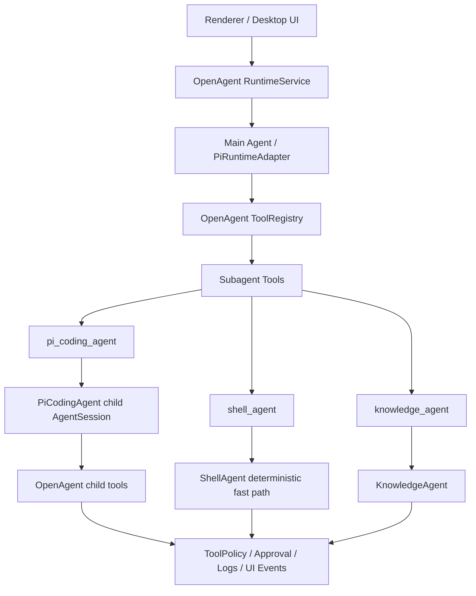

# OpenAgent 子 Agent 架构与开发规划

> 本文沉淀当前对子 agent 的架构决策：`shell_agent`、`knowledge_agent`、`pi_coding_agent` 位于同一 runtime subagents 层；`pi_coding_agent` 不替代所有子 agent，而承担通用编码、脚本执行和复杂产物生成任务。

## 1. 背景

当前 OpenAgent 已有：

- `shell_agent`：OpenAgent 自己实现的只读 shell 型子 agent，支持文件统计、文件查找、文件名+内容查找。
- `knowledge_agent`：OpenAgent 自己实现的知识库型子 agent，支持 system wiki / knowledge base 查询、写入、编译等。
- `PiRuntimeAdapter`：主 agent loop，嵌入 `@mariozechner/pi-coding-agent` 的 `createAgentSession()`。

近期问题暴露出两个边界混淆：

1. `shell_agent` 不是 `pi-coding-agent`，它只是确定性只读命令封装，不能写程序、执行脚本或安装依赖。
2. 主 Agent 需要一个“通用执行型子 agent”来承接写代码、写脚本、运行脚本、修复错误、生成复杂文件等任务，而不是把这些任务压给 `shell_agent` 或零散的 `write_file` / `shell_exec`。

因此新增 `pi_coding_agent`，与 `shell_agent`、`knowledge_agent` 平级。

## 2. 总体架构



核心原则：

- 子 agent 是 runtime 能力单元，统一由 `SubagentService` 管理。
- 不是所有子 agent 都必须使用 Pi；Pi 只是 `pi_coding_agent` 的内部实现选择。
- 所有子 agent 暴露给主 Agent 时都应是 OpenAgent `RuntimeTool`，必须走 `ToolExecutor`、`ToolPolicy`、审批、日志和 UI event。
- Renderer 不直接感知 Pi SDK 或子 agent 内部实现。

## 3. 子 Agent 职责边界

| 子 agent | 内部实现 | 主要职责 | 不应该做 |
| --- | --- | --- | --- |
| `shell_agent` | 确定性 bash/read-only 命令封装 | 快速统计文件、查找文件、按文件名+内容搜索 | 写文件、执行用户脚本、安装依赖、多步修错 |
| `knowledge_agent` | OpenAgent KnowledgeService | 查询、写入、编译、检查 system wiki / knowledge base | 处理普通代码执行、绕过 knowledge policy |
| `pi_coding_agent` | 子级 `@mariozechner/pi-coding-agent` AgentSession | 写代码、写脚本、运行脚本、调用 API、生成复杂文件、根据错误迭代修复 | 绕过 OpenAgent tools/policy；调用自身形成递归 |

### 3.1 为什么不合并 `shell_agent` 和 `pi_coding_agent`

可以在能力上互补，但不建议物理合并：

- `shell_agent` 的优势是确定性、快、低成本，适合 `find/grep/wc` 这类无需推理的任务。
- `pi_coding_agent` 的优势是多步推理、写程序、执行和修复，适合复杂任务。
- 完全把搜索统计交给 Pi 会变慢、变贵，也更难审计。
- 完全暴露多个底层工具会增加主 Agent 选错工具的概率，因此需要清晰路由规则。

## 4. 主 Agent 路由规则

主 Agent 的工具选择应遵循：

| 用户任务类型 | 首选子 agent / tool | 说明 |
| --- | --- | --- |
| 简单文件读取 | `read` / `read_file` | 单文件读取不需要子 agent。 |
| 简单目录列举 | `ls` / `list_directory` | 确定性只读工具即可。 |
| 文件数量统计、按文件名查找、文件名+内容搜索 | `shell_agent` | 走确定性只读 fast path。 |
| 知识库查询、保存、编译、lint、graph | `knowledge_agent` | knowledge 能力统一入口。 |
| 创建/修改单个文本文件 | `write_file` 或 `pi_coding_agent` | 简单写入可直接 `write_file`；需要设计内容则委托 `pi_coding_agent`。如果当前任务处于 selected skill，优先走该 skill 的 `skill_resource` / `skill_script` / `write_file` 约束路径。 |
| 写程序并执行程序 | `pi_coding_agent` 或 selected skill 的 `skill_script` | 通用写/跑/修交给 `pi_coding_agent`；已选 skill 且 declared script 可满足任务时，先走 `skill_script`，不能用 `pi_coding_agent` 绕过 skill。 |
| 生成 docx/xlsx/pdf/ppt 等复杂产物 | `pi_coding_agent` | 通过脚本或专用工具生成，并验证产物。 |
| HTTP/API 抓取、实时行情/新闻/数据获取 | `pi_coding_agent` | 可写脚本、执行请求、解析结果。 |
| 依赖安装 | `pi_coding_agent` 发起，`shell_exec` 审批 | 必须展示包名、命令、安装位置和联网风险。 |
| 多文件代码修改、运行测试、根据失败修复 | `pi_coding_agent` | 子 agent 执行多轮 coding loop。 |

原则：

- `shell_agent` 只处理“确定性只读文件检索”。
- `pi_coding_agent` 处理“需要推理 + 写/跑/修”的执行型任务。
- 主 Agent 不应把写文件、运行脚本、安装依赖任务交给 `shell_agent`。

## 5. `pi_coding_agent` 工具契约草案

建议新增对外工具名：

```text
pi_coding_agent
```

建议 schema：

```ts
interface PiCodingAgentTask {
  task: string;
  mode?: 'inspect' | 'edit' | 'execute' | 'generate';
  allowedTools?: string[];
  outputExpectation?: string;
  workingDirectory?: string;
  maxIterations?: number;
}
```

字段说明：

- `task`：给子 agent 的完整目标，必须自包含，不能只写“继续”。
- `mode`：
  - `inspect`：只读分析；默认不写不执行。
  - `edit`：允许写文件，但不默认执行 shell。
  - `execute`：允许写文件和执行命令，shell 仍走审批。
  - `generate`：生成复杂产物，如 docx/xlsx/pdf。
- `allowedTools`：运行时允许的 OpenAgent tools 子集，例如 `read`、`grep`、`write_file`、`shell_exec`。
- `outputExpectation`：要求子 agent 返回什么，例如“给出最终数据表和脚本路径”。
- `workingDirectory`：默认使用当前 agent workspace。
- `maxIterations`：防止子 agent 无限循环。

## 6. `pi_coding_agent` 内部执行模型

`pi_coding_agent` 应启动一个 child Pi AgentSession：

```text
Main run
└── pi_coding_agent tool call
    └── child Pi AgentSession
        ├── write_file
        ├── read / grep / find
        ├── shell_exec
        └── final summary
```

执行约束：

1. child session 仍使用 `@mariozechner/pi-coding-agent/createAgentSession()`。
2. child session 的 `tools` 必须传空数组，避免启用 Pi 内置 `bash/write/edit/read`。
3. child session 只能通过 `customTools` 使用 OpenAgent 注入的 tools。
4. child tools 不能包含 `pi_coding_agent` 本身，避免递归。
5. child session 需要独立 transcript 文件，落在当前 parent session 旁的子目录：

```text
~/.openagent/agents/<agentId>/sessions/<threadId>/subagents/pi-coding/<parentRunId>-<toolCallId>.jsonl
```

6. 父 run 的 `AbortSignal` 必须传入 child session；用户点击停止时，child session 要尽快中止。
7. child session 的 tool start/update/end/fail 必须进入父 run 的 UI event stream，并带上 `subagentId`、`parentToolCallId`。
8. child session 的最终摘要作为 `pi_coding_agent` tool result 返回给主 Agent。
9. `workingDirectory` 必须在 child tools 层生效：缺省 `path` / `cwd` 按该目录解析，而不是只写进 prompt。
10. `maxIterations` 必须是 runtime 硬限制，不仅是提示词建议。

## 7. 权限与审批策略

`pi_coding_agent` 不是权限绕过口。

| 行为 | 默认策略 |
| --- | --- |
| workspace 内新建文本文件 | 可由 `write_file` 执行并记录日志。 |
| 覆盖已有文件 | 需要 `overwrite=true`，并触发审批。 |
| workspace 外写入 | 必须 `file.write` 审批。 |
| 运行脚本 / shell 命令 | 必须 `shell.exec` 审批。 |
| 安装依赖 | 必须 `shell.exec` 审批，审批文案标明包名、命令、安装位置、联网风险。 |
| destructive 命令 | 高风险审批；必要时直接拒绝。 |
| git commit / push | 必须显式用户要求或审批。 |

推荐依赖安装策略：

1. 优先使用标准库或已有依赖。
2. 如必须安装，优先项目级 `.venv` 或 workspace-local 环境。
3. 不默认污染系统 Python 或全局 Node 环境。
4. 安装前通过审批面板展示命令和影响范围。

## 8. UI 与日志展示

第一版可以复用现有事件：

- `tool.started`
- `tool.completed`
- `tool.failed`
- `runtime.activity`
- `terminal.delta`
- `approval.required`
- `approval.resolved`

建议在 payload meta 中增加：

```ts
{
  subagentId: 'pi_coding_agent',
  parentToolCallId: string,
  childRunId?: string,
  childSessionFile?: string
}
```

UI 展示建议：

- 右侧 Plan / Task 面板展示“Running pi_coding_agent”。
- 展开后可看到 child tool activity：写了哪些文件、执行了哪些命令、审批了什么。
- 最终摘要展示子 agent 的产物、验证结果和失败原因。

## 9. Prompt 约束

主 Agent prompt 应明确：

- `shell_agent` 只用于只读文件搜索/统计。
- `pi_coding_agent` 用于通用写程序、运行程序、生成复杂文件、API 请求、代码修改和测试修复。
- selected skill 是更窄的执行上下文：如果已选 skill 声明了可满足当前任务的脚本，先走 `skill_script`；`skill-creator` scaffold 场景应走 runtime 轻量 Tool Invocation 快路径，而不是委托 `pi_coding_agent`。
- 不要把 `call:xxx{...}<tool_call|>` 文本当成工具执行；必须使用结构化 tool call。
- 如果工具被 policy 拒绝，应报告真实拒绝原因，不要伪造已经执行。

`pi_coding_agent` child prompt 应保持 minimal：

- 当前任务。
- workspace / working directory。
- 可用 tools 和审批边界。
- 输出格式要求。
- 禁止调用自身、禁止绕过 OpenAgent tool policy。

## 10. 开发规划

### Phase 1：文档和契约

- 新增本文，明确子 agent 架构和职责边界。
- 更新 `docs/pi.md`，把 `pi_coding_agent` 定义为 `shell_agent` / `knowledge_agent` 平级的 Pi child session。
- 更新 `agents.md` 的文档入口和任务路由。
- 在 `subagent-types.ts` 增加 `PiCodingAgentTask` 和 `SystemSubagentId = 'shell' | 'knowledge' | 'pi_coding'`。

验收：文档能回答“什么时候用 shell_agent，什么时候用 pi_coding_agent”。

### Phase 2：最小 `pi_coding_agent` 子 agent

- 新增 `apps/desktop/src/main/runtime/subagents/pi-coding-agent.ts`。
- 新增 `apps/desktop/src/main/runtime/subagents/pi-coding-agent-tool.ts`。
- `SubagentService` 注册 `pi_coding`。
- `RuntimeService` 注册 `createPiCodingAgentTool(...)`。
- child session 使用 Pi SDK，复用 `PiRuntimeAdapter` 的 model/auth/session/tool adapter 能力，但不让 Pi SDK 类型泄漏到 renderer/shared。
- child tools 初版只允许：`read`、`grep`、`find`、`write_file`、`shell_exec`。
- child tools 不包含 `pi_coding_agent`。
- `workingDirectory` 在 child tool wrapper 层生效，自动补齐缺省 `path` / `cwd`。
- `maxIterations` 传入 `PiRuntimeAdapter`，用于限制 child Pi loop。

验收：用户请求“写一个 Python 脚本获取新浪财经三花智控行情并执行”，主 Agent 可以委托 `pi_coding_agent` 完成，执行 shell 时出现审批。

### Phase 3：工具策略与 prompt 路由

- 更新 `prompt-builder.ts`：明确 `pi_coding_agent` 路由规则。
- 更新 `plan-llm.ts`：Plan step 对编码/脚本/API/复杂产物任务应允许 `pi_coding_agent` 或 `tool-executor`。
- 更新 `tool-policy.ts`：支持 `allowedTools` 中的 `coding` / `pi-coding` 分组。
- 保留 `shell_agent`，但从“通用 shell 能力”降级为“只读 fast path”。

验收：简单文件搜索仍走 `shell_agent`；写程序/执行脚本任务优先走 `pi_coding_agent`。

### Phase 4：可观测性与停止

- child session 事件映射到父 run。
- runtime activity 增加 `subagent` 或复用 `tool`/`command` 并带 meta。
- 停止按钮能中止 child Pi session 和正在运行的 child shell_exec。
- 日志里能看到 parent tool call、child session、child tools 的关联链路。

验收：用户点击停止后，`pi_coding_agent` 及其内部脚本执行能尽快停止；UI 不再显示伪完成。

### Phase 5：依赖安装与复杂产物

- 对 pip/npm 等依赖安装增加识别和审批文案优化。
- 支持 workspace-local `.venv` / 临时脚本目录策略。
- 增加 docx/xlsx/pdf 等复杂产物生成示例。
- 增加结果验证流程：文件存在性、脚本 exit code、产物摘要。

验收：可完成“生成 docx”“抓 API 数据并输出 Markdown/CSV”“写脚本失败后自动修复再执行”等任务。

## 11. 不做事项

- 不删除 `shell_agent`。
- 不把 `shell_agent` 和 `pi_coding_agent` 物理合并成一个 agent。
- 不让 `pi_coding_agent` 使用 Pi 内置 bash/write/edit 绕过 OpenAgent。
- 不允许 `pi_coding_agent` 调用自身形成递归。
- 不把所有任务都交给 `pi_coding_agent`，简单确定性只读任务仍走直接工具或 `shell_agent`。
